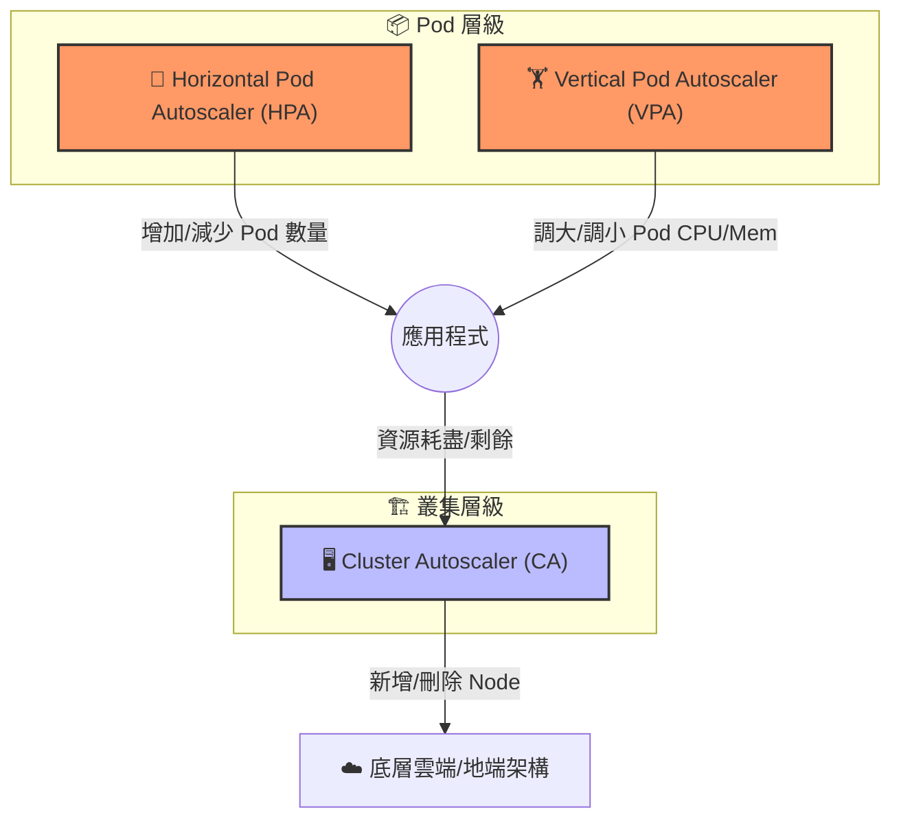

# 122. Introduction to Autoscaling 筆記

## 1. 🏷️ 課程定位
- **章節編號與名稱**：第 5 節：Application Lifecycle Management
- **影片標題**：122. (2025 Updates) Introduction to Autoscaling

## 2. 📌 核心概念摘要
自動擴縮容 (Autoscaling) 的目標是在「資源利用率優化」與「服務高可用性」之間取得平衡。Kubernetes 透過監控指標（如 CPU、Memory 使用率），自動決定增加 Pod 數量（水平擴展）、調整 Pod 規格（垂直擴展），或是在資源枯竭時自動擴充底層節點（Node）。

## 3. 📊 三大自動擴縮容機制對照 (Mermaid)



---

## 4. 🔑 知識點擷取 (Detailed Notes)

### 1. Horizontal Pod Autoscaler (HPA) - 水平擴縮
- **動作**：改變副本數 (`Replicas`)。
- **觸發條件**：當 CPU 或 Memory 使用率超過設定閾值（如 > 80%）時增加 Pod；壓力降低時則縮減。
- **適用情境**：無狀態服務（Stateless Apps），如 Web Server、API Gateway。

### 2. Vertical Pod Autoscaler (VPA) - 垂直擴縮
- **動作**：改變資源請求與限制 (`Requests/Limits`)。
- **觸發條件**：監控 Pod 的長期使用模式，自動調整資源配置（如從 `500m` 調升至 `1000m`）。
- **適用情境**：有狀態服務（Stateful Apps）或難以水平擴展的單體應用程式。
- **注意**：傳統 VPA 在調整資源時通常會導致 Pod **重啟**。

### 3. Cluster Autoscaler (CA) - 叢集層級擴縮
- **動作**：管理工作節點 (`Node`) 數量。
- **觸發條件**：
  - **擴充**：當 Pod 因為節點資源不足而處於 `Pending` 狀態時。
  - **縮減**：當某個 Node 長期低負載且其上的 Pod 可以安全遷移至其他節點時。

---

## 5. 💻 CKA 必備實作概念 (Metrics Server)

自動擴縮容的核心前提是叢集內必須安裝 **Metrics Server**，否則 K8s 無法獲取數據。

```bash
# 1. 檢查叢集是否能獲取資源使用數據
kubectl top nodes
kubectl top pods

# 2. 2025 更新提醒：
# 考試中若 HPA 無法運作，優先檢查 Pod 是否設定了 "resources.requests"！
# 這是 HPA 計算「使用百分比」的基準。
```

---

## 6. 🚀 CKA 考試延伸與 Troubleshooting

### 💡 考試情境預測
**題目：** 建立一個 HPA 監控名為 `php-apache` 的 Deployment，當 CPU 超過 50% 時，擴展 Pod 數量介於 1 到 10 之間。

**快速指令：**
```bash
kubectl autoscale deployment php-apache --cpu-percent=50 --min=1 --max=10
```

### ⚠️ 避坑指南 (重要更新)
- **HPA 與 VPA 的衝突**：千萬不要在**同一個指標**（如 CPU 使用率）上同時開啟 HPA 和 VPA。這會導致兩者產生邏輯衝突：VPA 想把 Pod 變大，HPA 卻想把 Pod 變多，最終導致叢集劇烈震盪。
- **靜態資源限制**：如果 Pod YAML 沒有定義 `resources.requests`，HPA 將永遠顯示為 `<unknown>` 並失效。

### 🔍 Troubleshooting
若 HPA 沒有反應或失效：
1. **檢查狀態**：`kubectl get hpa` 觀察 `TARGETS` 是否顯示正確數值而非 `<unknown>`。
2. **描述詳情**：`kubectl describe hpa` 查看 `Events`，檢查是否出現「找不到 metrics.k8s.io API」的錯誤。
3. **確認負載**：確認應用程式是否真的產生了足夠觸發閾值的負載。
