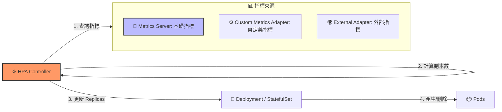

# 123. Horizontal Pod Autoscaler (HPA) 筆記

## 1. 🏷️ 課程定位
- **章節編號與名稱**：第 5 節：Application Lifecycle Management
- **影片標題**：123. (2025 Updates) Horizontal Pod Autoscaler (HPA)

## 2. 📌 核心概念摘要
HPA (Horizontal Pod Autoscaler) 是一個**控制迴圈 (Control Loop)**。它定期（預設每 15 秒）查詢 Metrics Server 以獲取 Pod 的資源利用率。當平均利用率超過預設目標時，HPA 會自動計算所需的副本數並更新 Deployment 或 StatefulSet 的 `replicas` 欄位。

## 3. 📊 HPA 運作架構與指標來源 (Mermaid)



---

## 4. 🔑 知識點擷取 (Detailed Notes)

### 1. 指標的三大來源 (Metrics Sources)
- **Internal (內置指標)**：透過 Metrics Server 獲取，主要是 CPU 和 Memory 使用率。
- **Custom Metrics (自定義指標)**：透過特定 Adapter 獲取，如 RPS (Requests Per Second)。
- **External Metrics (外部指標)**：獲取叢集外部的數據，如雲端負載均衡器或 Datadog/NewRelic 的數值。

### 2. HPA 計算公式 (核心原理)
HPA 使用以下公式決定新的副本數：
$$\text{所需副本數} = \lceil \text{目前副本數} \times \frac{\text{目前指標值}}{\text{目標指標值}} \rceil$$
*(結果會向上取整)*

### 3. 2025 考試核心前提：Resources Requests
HPA 必須依賴 Pod 定義中的 `resources.requests` 才能計算百分比。
- **原因**：如果沒設定 Requests，K8s 就不知道「100%」的基準值是多少。
- **結果**：若未設定，HPA 狀態會顯示為 `<unknown>`，自動擴容將完全失效。

---

## 5. 💻 CKA 必備實作指令 (Imperative Commands)

考試中強烈建議使用命令行建立 HPA，避免手寫繁瑣的 YAML：

```bash
# 1. 建立 HPA：當 CPU 超過 50% 時擴展 1~10 個副本
kubectl autoscale deployment php-apache --cpu-percent=50 --min=1 --max=10

# 2. 檢查 HPA 狀態
# 重點觀察 TARGETS 欄位，若顯示 <unknown> 代表 Pod 沒設 requests
kubectl get hpa

# 3. 查看詳細事件與擴容紀錄 (用於排錯)
kubectl describe hpa php-apache

# 4. 刪除 HPA
kubectl delete hpa php-apache
```

---

## 6. 🚀 CKA 考試延伸與 Troubleshooting

### 💡 考試情境預測
**要求：** 為 `nginx-deploy` 建立 HPA，目標 CPU 為 80%，副本數 3 到 5。
1. **先檢查**：`kubectl get deploy nginx-deploy -o yaml` 確認是否有 `resources.requests`。若無，先 `kubectl edit` 補上。
2. **執行**：`kubectl autoscale deployment nginx-deploy --cpu-percent=80 --min=3 --max=5`。

### ⚠️ 避坑指南
- **Unknown Metrics**：若 `TARGETS` 顯示 `<unknown>/50%`，先確認 Metrics Server 是否運行（`kubectl top pod` 有無數據），再確認 Pod 有無設定 `requests`。
- **冷卻時間 (Cooldown Period)**：為了防止震盪（抖動），HPA 在擴容後會有一段觀察期（預設 5 分鐘）才會進行縮容，測試時需耐心等待。

### 🔍 Troubleshooting
若 Pod 數量沒有增加：
- 檢查 Node 資源是否已滿（Pod 可能卡在 `Pending`）。
- 檢查 Deployment 的 `selector` 是否與 Pod 標籤正確對應。
- 確認 `kubectl top pod` 顯示的數據確實已超過設定的閾值。
