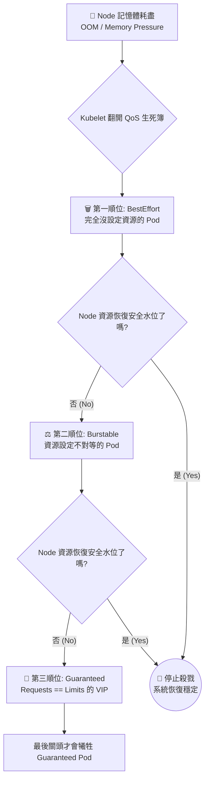

# 126-1. 什麼是 QoS (Quality of Service)？

在 Kubernetes 中，QoS 中文稱為「服務品質」。你可以把它想像成是系統發給 Pod 的 「救生艇優先搭乘等級 (VIP 級別)」。

在完美的狀態下，Node (節點) 資源充足，所有的 Pod 都能和平共處。但現實往往很殘酷，當 Node 上運行的應用程式突然流量暴增，導致整台 Node 的 記憶體 (Memory) 或是磁碟空間即將耗盡 (Node Under Pressure) 時，作業系統為了自保，必須啟動「殺戮機制 (OOM Killer)」或「驅逐機制 (Eviction)」。

這時候，Kubelet 就會看每個 Pod 的 QoS 等級，來決定「誰該先被犧牲丟下船，誰是 VIP 必須保護到最後」。

## 🧠 QoS 的三大核心觀念

- **它是「算」出來的，不是「寫」出來的**：
  在撰寫 YAML 檔時，你找不到 `qosClass` 這個欄位讓你直接填寫。QoS 是 Kubelet 根據你在 `spec.containers.resources` 中設定的 requests (保證最低配額) 與 limits (最高限制) 自動計算並賦予的。

- **它是針對「不可壓縮資源」的保護傘**：
  如同前面提到的，CPU 不夠頂多降速 (Throttling)，但記憶體不夠程式就會崩潰。QoS 主要就是在解決記憶體耗盡時的生存權問題。

- **它決定了被殺的優先順序 (Eviction Priority)**：
  這也是它最重要的實質作用。

## 📊 視覺化：Kubelet 的驅逐與 OOM 生死簿

當 Node 記憶體拉警報時，系統會按照以下流程無情地清理 Pod：

*(備註：在同一個 QoS 等級中，系統會優先殺掉「當前記憶體使用量」超出「Requests 基準」最多的那個 Pod。)*

## 🏗️ 實務與架構師觀點

- **為什麼資料庫通常必須是 Guaranteed？**
  對於像 MySQL、Redis 這種不允許隨便中斷的核心基礎設施，我們在設定 YAML 時，一定會強制把 CPU 和 Memory 的 requests 與 limits 設為完全相等，讓它拿到 Guaranteed 標籤，確保它在風暴中活到最後一刻。

- **為什麼測試環境多為 Burstable 或 BestEffort？**
  為了極致壓縮硬體成本，測試環境的應用通常只設定很低的 requests 甚至不設定，讓它們互相搶奪閒置資源。雖然被殺的機率極高，但這在非生產環境中是可接受的權衡 (Trade-off)。

這就是為什麼在 In-Place Resize 功能中，API Server 嚴禁你隨意改變 QoS 等級——因為這等同於你在不重啟應用的情況下，偷偷竄改了系統的「逃生優先順序」，這會導致 Node 的資源保護機制大亂！

講到這邊，你對 Kubernetes 如何透過資源設定來決定 Pod 的生死應該有很具體的畫面了。

> **💡 思考題：**
> 既然我們聊到了資源不足時 Pod 會面臨 OOMKilled，除了手動去修改 YAML 或使用 In-Place Resize 調高資源外，你知道 Kubernetes 官方有推出哪個進階元件，可以「自動」幫我們偵測 Pod 的資源使用率，並自動把 Limits 與 Requests 調高嗎？ (提示：它也是本次課程影片清單 127 節即將介紹的主題！)
