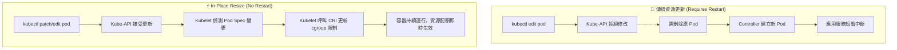

# 126. (2025 Updates) In-Place Resize of Pods

## 1. 🏷️ 課程定位
- **章節編號與名稱**：第 5 節：Application Lifecycle Management
- **影片標題**：126. (2025 Updates) In-Place Resize of Pods?

## 2. 📌 核心概念摘要
**In-Place Resize of Pods (Pod 資源就地調整)** 是一項在 Kubernetes 新版本中引入的重大更新。它允許管理者在 「不重啟 Pod 或 Container 的情況下」，直接動態修改運行中容器的 CPU 與 Memory 的 Requests 與 Limits 數值。這徹底改變了過去必須重建 Pod 才能調整資源的限制，大幅降低關鍵應用的服務中斷時間。

## 3. 📊 流程圖與視覺化重現 (ASCII / Mermaid)
以下比較傳統更新資源與 In-Place Resize 的底層運作差異：



## 4. 🔑 知識點擷取 (Detailed Notes)
根據影片中提到的 Limitations (限制條件)，這是考試中最容易出錯的考點：

- **僅限核心資源**：目前 只允許修改 CPU 和 Memory 資源 (Only CPU and memory resources can be changed)。
- **QoS 類別鎖定**：修改資源後，Pod QoS Class (服務品質類別) 不允許發生改變。例如不能因為修改資源數值，讓 Pod 從 Burstable 變成 Guaranteed (Pod QoS Class cannot change)。
- **容器類型限制**：Init containers (初始化容器) 和 Ephemeral Containers (臨時容器) 不支援就地調整大小。
- **不可移除限制**：一旦設定了 Resource requests 和 limits，不可將其移除 (Resource requests and limits cannot be removed once set)，只能修改數值。
- **記憶體縮減的安全機制**：容器的記憶體 Limit 不能設定得比當前實際使用量還低。如果強制設定為低於當前使用量，該修改操作 (resize) 會一直停留在 "InProgress" 狀態，直到容器釋放記憶體達到目標值為止。
- **作業系統限制**：目前 Windows pods 不支援 此功能。

## 5. 💻 CKA 必備實作指令 (Imperative Commands)
在 CKA 考試中，遇到需要 In-Place Resize 的題目，最快的方法是使用 `kubectl patch`，或者直接 `kubectl edit`。

```bash
# 💡 技巧 1：使用 kubectl edit (最直觀，適合考試)
# 尋找 spec.containers.resources 區塊直接修改 CPU/Memory 數值並存檔。
kubectl edit pod <pod-name> -n <namespace>

# 💡 技巧 2：使用 kubectl patch (速度最快，無需進入編輯器)
# 情境：將 nginx 容器的 cpu request 修改為 500m，limit 修改為 1
kubectl patch pod my-pod --patch '{"spec":{"containers":[{"name":"nginx","resources":{"requests":{"cpu":"500m"},"limits":{"cpu":"1"}}}]}}'

# 💡 技巧 3：確認 Resize 是否成功生效
# 考試時務必檢查 status 中的 resize 狀態
kubectl get pod my-pod -o jsonpath='{.status.resize}'
```

## 6. 🚀 CKA 考試延伸與 Troubleshooting
🎯 **考試情境預測**：
> 題目範例：「叢集中有一個名為 `data-processor` 的 Pod 遇到 OOMKilled 風險。請在 **不重啟該 Pod 的前提下**，將其 CPU limit 提升至 2，Memory limit 提升至 1Gi。」
> **解題關鍵**：這正是考驗 In-Place Resize 的特性，直接 Edit Pod 修改資源即可，千萬不要刪除 Pod 或是匯出成 YAML 重建，這會導致服務中斷並失分。

🛑 **避坑指南**：
> **QoS 衝突**：如果在考試時，你修改了 Limit，但忘記修改 Request，導致該 Pod 原本的 QoS 發生改變，API Server 會直接報錯拒絕。請確保修改前後的 Request/Limit 比例維持原本的 QoS 屬性。

🔧 **Troubleshooting (除錯方向)**：
1. 若修改後發現資源沒生效，優先執行 `kubectl describe pod <pod-name>`。
2. 向下捲動查看 Events 區塊，尋找與 Resize 或 Kubelet 相關的事件紀錄。
3. 若看到記憶體 Resize 遲遲未完成，請檢查是否觸發了上述的第 5 點限制（設定的 limit 低於當前 usage）。
