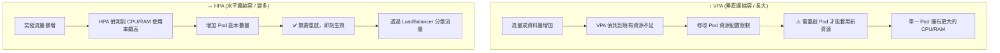

# 127. (2025 Updates) Vertical Pod Autoscaling (VPA)

## 1. 🏷️ 課程定位
- **章節編號與名稱**：第 5 節：Application Lifecycle Management
- **影片標題**：127. (2025 Updates) Vertical Pod Autoscaling (VPA)?

## 2. 📌 核心概念摘要
VPA (Vertical Pod Autoscaler，垂直 Pod 自動擴縮容) 是一種能根據容器實際的資源使用歷史與現況，自動調整 Pod 的 CPU 與 Memory 需求 (Requests/Limits) 的控制器。它解決了人類手動「瞎猜」資源配額的痛點，特別適用於無法輕易水平擴展的有狀態應用 (Stateful Apps) 與重度運算負載。

## 3. 📊 流程圖與視覺化重現 (ASCII / Mermaid)
這張圖完美重現了簡報中 VPA 與 HPA 的核心運作差異：



## 4. 🔑 知識點擷取 (Detailed Notes)
根據影片簡報 (Key Differences) 與底層架構，考點拆解如下：

- **擴縮容方式 (Scaling Method)**：
  - **VPA**：直接「增加或減少」現有 Pod 內的 CPU 與 Memory 數值。
  - **HPA**：根據負載，動態「增加或減少」Pod 的數量 (Replicas)。

- **Pod 生命週期行為 (Pod Behavior)**：
  - **VPA 致命傷**：在標準運作模式下，VPA 必須 重啟 Pod (Restarts Pods) 才能讓新的資源配額生效。
  - **HPA 優勢**：保持現有 Pod 持續運行，直接在一旁啟動全新的 Pod。

- **應對突發流量 (Handles Traffic Spikes?)**：
  - **VPA**：❌ 不適合。因為擴容需要重啟 Pod，重啟期間會導致服務短暫中斷或延遲。
  - **HPA**：✅ 非常適合。能瞬間長出新的 Pod 來消化海量請求。

- **最佳適用情境與案例 (Best for & Use Cases)**：
  - **VPA**：適合有狀態工作負載 (Stateful workloads)、CPU/記憶體吃重的應用。例如：資料庫 (MySQL, PostgreSQL)、JVM 應用、AI/機器學習運算。
  - **HPA**：適合無狀態服務 (Stateless services)、Web 應用。例如：Nginx 網頁伺服器、API 服務、Message Queues。

## 5. 💻 CKA 必備實作指令 (Imperative Commands)
雖然 VPA 是透過 Custom Resource Definition (CRD) 額外安裝的控制器，但在新版 CKA 考試中，若考題環境已預先裝好 VPA，你需要會以下指令：

```bash
# 💡 技巧 1：檢查叢集內的 VPA 狀態與提供的「建議值 (Recommendations)」
kubectl get vpa -n <namespace>

# 💡 技巧 2：查看 VPA 提供的詳細資源修改建議
# 重點看底下的 Target (目標值)、LowerBound (下限) 與 UpperBound (上限)
kubectl describe vpa <vpa-name>

# 💡 技巧 3：手動建立一個 VPA 物件的骨架 (若考試允許查官方文件，直接複製最快)
# 但這類 CRD 資源通常無法使用 kubectl create --dry-run 直接產生
# 請熟記它的 apiVersion 是 autoscaling.k8s.io/v1
```

## 6. 🚀 CKA 考試延伸與 Troubleshooting
🎯 **考試情境預測**：
> 題目可能會給你一個吃重資源的 Deployment，並要求你建立一個 VPA 去監控它，模式設定為 Off (僅提供建議但不自動重啟)，然後要求你根據 VPA 的建議值，手動去 `kubectl edit` 該 Deployment 的資源。

🛑 **避坑指南 (實務最嚴重的雷區)**：
> **VPA 與 HPA 打架**：絕對不要 在同一個應用程式上，同時對「CPU 或 Memory」啟用 VPA 和 HPA！HPA 看到 CPU 飆高會瘋狂生出新 Pod，而 VPA 看到 CPU 飆高會瘋狂重啟 Pod 增加資源。這會導致叢集陷入「無窮盡的擴展與重啟震盪 (Thrashing)」。

🔧 **Troubleshooting (除錯方向)**：
1. 如果 VPA 沒給出建議，或是不會自動重啟 Pod，請先檢查 VPA 的三個核心元件是否正常存活：Recommender (計算建議值)、Updater (負責踢掉舊 Pod)、Admission Controller (負責在新 Pod 建立時攔截並注入新資源)。

---
> **💡 導師的隨堂測驗：**
> 既然我們剛學完上一堂課的 「In-Place Resize (就地調整資源)」，而這堂課提到 VPA 目前的缺點是 「必須重啟 Pod」。
> 你認為在未來的 Kubernetes 架構中，有沒有可能將 VPA 與 In-Place Resize 這兩項技術結合起來？如果結合了，能解決上述的什麼痛點呢？
