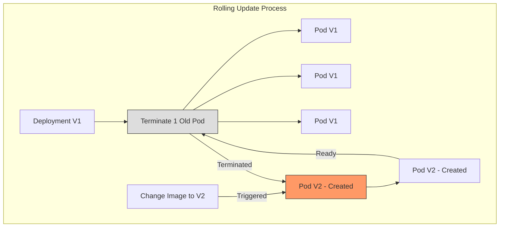

# 96. Rolling Updates and Rollbacks

## 1. 🏷️ 課程定位
- **章節編號與名稱**：第 5 節：Application Lifecycle Management
- **影片標題**：96. Rolling Updates and Rollbacks

## 2. 📌 核心概念摘要
本影片聚焦於 Kubernetes 如何實現應用的無間斷更新 (Zero Downtime Update)。透過 Deployment 資源自動化管理多個 ReplicaSets，協調 Pod 的新舊交替，確保在升級版本或變更配置時，服務始終可用。

## 3. 📊 流程圖與視覺化重現 (Mermaid)


## 4. 🔑 知識點擷取 (Detailed Notes)
### 更新策略 (Strategy Type)
- **RollingUpdate (預設)**：逐一替換 Pod。包含兩個關鍵參數 `maxUnavailable` (最大不可用數) 與 `maxSurge` (最大超額數)。
- **Recreate**：先刪除所有舊 Pod，再建立新 Pod（會導致服務中斷，適用於不支持多版本共存的應用）。

### 底層對象變化
- 當 Deployment 更新時，K8s 會建立一個新的 ReplicaSet。
- 新 RS 開始增加 Pod 副本數，舊 RS 同步減少副本數。
- **Rollback 邏輯**：回滾時，K8s 只是將舊 RS 的副本數調升，並將現有 RS 調降。舊的 RS 定義會被保留（預設保留 10 個歷史版本）。

### 觸發機制
- 只有修改 Deployment 的 **Pod Template** (如 Image, Labels, Env) 才會觸發 Rollout。
- 僅修改副本數 (Replicas) 不會觸發更新流程。

## 5. 💻 CKA 必備實作指令 (Imperative Commands)
```bash
# 1. 更新 Deployment 的映像檔 (考試最常用)
kubectl set image deployment/myapp-deployment nginx=nginx:1.19.1 --record

# 2. 查看更新進度狀態
kubectl rollout status deployment/myapp-deployment

# 3. 查看版本演進歷史
kubectl rollout history deployment/myapp-deployment

# 4. 快速回滾到上一個版本
kubectl rollout undo deployment/myapp-deployment

# 5. 回滾到特定版本 (需配合 history 查看 revision)
kubectl rollout undo deployment/myapp-deployment --to-revision=2

# 6. 建立部署範本 (考試快速起手式)
kubectl create deployment my-deploy --image=nginx:1.16 --replicas=3 --dry-run=client -o yaml > deploy.yaml
```

## 6. 🚀 CKA 考試延伸與 Troubleshooting
### 💡 考試情境預測
- **題目 A**：將名為 `frontend` 的 Deployment 映像檔更新為 `nginx:1.17`，並確保更新過程記錄在 history 中。
- **題目 B**：發現更新後的應用程式崩潰，請立即回滾到先前的穩定版本。

### ⚠️ 避坑指南
- **--record 旗標**：在較舊版本 K8s 考試中，建議加上 `--record` 才能在 `rollout history` 的 `CHANGE-CAUSE` 欄位看到指令內容（註：新版 K8s 已逐漸廢棄此旗標，但在考試中若題目要求「記錄原因」，請務必檢查 yaml 中的 annotation）。
- **Liveness/Readiness Probes**：若新 Pod 啟動但 Readiness Probe 失敗，Rolling Update 會卡住，不會繼續替換剩餘的舊 Pod。這在考試中常被設為故障點。

### 🛠️ Troubleshooting
若更新卡住 (Progressing)，請依序執行：
1. `kubectl rollout status deploy <name>`：確認目前卡在哪個階段。
2. `kubectl get pods`：觀察是否有 Pod 處於 `ImagePullBackOff` 或 `CrashLoopBackOff`。
3. `kubectl describe pod <pod-name>`：查看 Event，通常是 Image 名字寫錯或私有倉庫權限問題。
4. `kubectl describe deploy <name>`：查看 Deployment 控制器的事件，確認 RS 是否成功建立。
