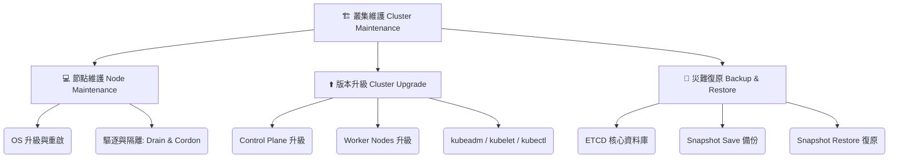

# 130. Cluster Maintenance - Section Introduction

## 1. 🏷️ 課程定位
- **章節編號與名稱**：第 6 節：Cluster Maintenance (叢集維護)
- **影片標題**：130. Cluster Maintenance - Section Introduction

## 2. 📌 核心概念摘要
叢集維護 (Cluster Maintenance) 是確保 Kubernetes 叢集在面對「底層 OS 升級」、「K8s 版本迭代」以及「災難性毀損」時，能夠維持高可用性 (High Availability) 與資料安全的核心技能。本節的終極運作目標就是：在不影響現有服務運作的前提下，完成叢集基礎設施的維護與更新。

## 3. 📊 流程圖與視覺化重現 (ASCII / Mermaid)
接下來的課程中，你將面對三大叢集維護支柱，這也是 CKA 考試的必考題型分佈：



## 4. 🔑 知識點擷取 (Detailed Notes)
根據本章節的學習路徑，以下是你接下來必須徹底掌握的三大技術細節預覽：

1. **節點維護 (Node Maintenance)**：
   - **觸發機制**：當底層機器（如 Ubuntu/CentOS）需要重啟或升級內核時。
   - **底層變化**：必須先將 Node 標記為 `SchedulingDisabled` (不可調度)，接著將上面運行的 Pod 優雅地驅逐 (Evict) 到其他健康的 Node 上，確保服務零中斷。

2. **叢集升級 (Kubernetes Cluster Upgrades)**：
   - **規則定義**：K8s 的升級必須循序漸進，強烈建議一次只升級一個次要版本 (例如從 v1.31 升級到 v1.32)，不可跳級。
   - **執行順序**：永遠是先升級 Control Plane (控制節點)，確認穩定後，再逐一升級 Worker Nodes (工作節點)。

3. **備份與復原 (ETCD Backup & Restore)**：
   - **定義**：etcd 是 K8s 的大腦，存放所有叢集的狀態與 Secret 數據。
   - **觸發機制**：定期備份，或在叢集崩潰前進行搶救。必須透過專屬工具 `etcdctl` 來操作，且必須精準帶入憑證 (Certificates)。

## 5. 💻 CKA 必備實作指令 (Imperative Commands)
這裡先為你預告本章節最核心的幾個指令，建議現在就開始熟悉它們：

```bash
# 💡 考點 1：驅逐節點上的 Pod 以進行維護 (會自動執行 cordon)
# 考試必加參數：忽略 DaemonSet (因為它們無法被輕易驅逐) 且強制移除本機資料
kubectl drain <node-name> --ignore-daemonsets --delete-emptydir-data

# 💡 考點 2：僅將節點標示為不可調度 (不會踢掉現有的 Pod)
kubectl cordon <node-name>

# 💡 考點 3：維護完成，解除隔離，允許 Pod 重新調度上來
kubectl uncordon <node-name>

# 💡 考點 4：ETCD 備份 (前置預覽)
# 考試時必須查閱官方文件，帶入 endpoints, cacert, cert, key 四大參數
ETCDCTL_API=3 etcdctl snapshot save /path/to/backup.db \
  --endpoints=https://127.0.0.1:2379 \
  --cacert=/etc/kubernetes/pki/etcd/ca.crt \
  --cert=/etc/kubernetes/pki/etcd/server.crt \
  --key=/etc/kubernetes/pki/etcd/server.key
```

## 6. 🚀 CKA 考試延伸與 Troubleshooting
🎯 **考試情境預測**：
> 「叢集中有一個名為 `node-01` 的節點需要進行硬體維護。請將所有運行中的 Pod 安全地驅逐，並確保不會有新的 Pod 被調度到該節點上。完成後，請將狀態記錄在指定文件中。」
> 「請將考場中的 Kubernetes 叢集從 v1.31 升級至 v1.32，必須包含 kubeadm、kubelet 與 kubectl 的升級，並確保 Control Plane 正常運作。」

🛑 **避坑指南**：
> **Drain 的地雷**：考試時執行 `kubectl drain` 如果卡住報錯，99% 是因為該節點上有 DaemonSet 管理的 Pod，或是掛載了 `emptyDir` 的 Pod。務必記得加上 `--ignore-daemonsets` 與 `--delete-emptydir-data` 參數！

🔧 **Troubleshooting**：
> 叢集升級失敗時，最容易出錯的地方是 kubelet 版本與 kubeadm 版本不匹配，導致節點顯示為 `NotReady`。此時必須 `systemctl status kubelet` 或使用 `journalctl -u kubelet` 來查看核心報錯訊息。
