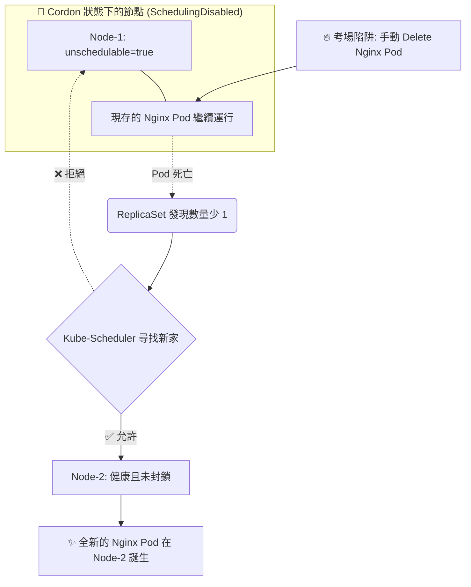

# 131-1. [補充教材] Cordon、Drain 與 Uncordon 深度解析與調度陷阱

## 1. 🏷️ 課程定位
- **章節編號與名稱**：第 6 節：Cluster Maintenance (叢集維護)
- **影片標題**：131-1. [補充教材] Cordon、Drain 與 Uncordon 深度解析與調度陷阱

## 2. 📌 核心概念摘要
在 Kubernetes 叢集維護中，精準掌握 cordon (封鎖)、drain (驅逐) 與 uncordon (解封) 的底層差異，是確保「服務零中斷」的關鍵。這三個指令決定了 Kube-Scheduler (調度器) 該如何對待該節點上的「現有工作負載」與「未來調度請求」。

## 3. 📊 流程圖與視覺化重現 (ASCII / Mermaid)
以下為考場中最容易搞混的情境：「在已 Cordon (封鎖) 的節點上，Pod 被意外刪除後，ReplicaSet 的重建行為」。



## 4. 🔑 知識點擷取 (Detailed Notes)
這三大指令的底層運作邏輯（大樓租屋管理模型）：

- **🛑 Cordon (封鎖 / 不再招租)**：
  - **底層變化**：API Server 會在 Node 屬性加上 `unschedulable: true` 的標記。
  - **對現有 Pod 的影響**：完全無影響。原有的 Pod 會繼續在該節點上穩定運行，不會斷線。
  - **對新 Pod 的影響**：嚴格拒絕。即使是 ReplicaSet 為了遞補該節點上死掉的 Pod 而創建的「新 Pod」，也會被視為全新調度請求，直接被轉發到其他健康節點。

- **🌪️ Drain (驅逐 / 強制都更)**：
  - **底層變化**：這是一個組合技。它會先在背景自動執行 cordon，接著開始對節點上的所有 Pod 發送 `SIGTERM` 訊號。
  - **對現有 Pod 的影響**：優雅驅逐 (Graceful Eviction)。Pod 會被要求收拾包袱，並由 Controller 負責在其他節點重建。
  - **例外狀況**：預設會卡在 DaemonSet 與具有 `emptyDir` (本機暫存) 的 Pod 上，必須透過參數強制覆蓋。

- **✅ Uncordon (解封 / 重新招租)**：
  - **底層變化**：移除 Node 身上的 `unschedulable: true` 標記。
  - **破除迷思**：解封後，之前被趕走的 Pod 「絕對不會」自動搬回來。Kubernetes 不會主動重新平衡 (Rebalance) 已經穩定運行的 Pod。該節點一開始會是空的，直到有新的擴容需求出現。

## 5. 💻 CKA 必備實作指令 (Imperative Commands)
```bash
# 💡 實戰技巧 1：安全無痛的封鎖 (適合輕微異常、需要先觀察的節點)
kubectl cordon <node-name>

# 💡 實戰技巧 2：暴力但安全的驅逐 (考試時 Drain 遇到錯誤卡住，直接貼上這串)
# --ignore-daemonsets: 忽略無法被趕走的 DaemonSet
# --delete-emptydir-data: 強制清除 Pod 的本機暫存資料
# --force: 強制移除沒有 Controller 管理的裸奔 Pod
kubectl drain <node-name> --ignore-daemonsets --delete-emptydir-data --force

# 💡 實戰技巧 3：解封節點
kubectl uncordon <node-name>
```

## 6. 🚀 CKA 考試延伸與 Troubleshooting
🎯 **考試情境預測 (Troubleshooting 題型)**：
> **情境**：你剛接手一個叢集，發現某個 Deployment 雖然設定了 `replicas=3`，但一直只有 2 個 Pod 處於 Running，另一個一直卡在 Pending 狀態。
> **除錯方向**：優先使用 `kubectl get nodes` 檢查是否有節點被前一個人設定成了 SchedulingDisabled (Cordon 狀態)，導致資源雖然足夠，但調度器不願意把 Pod 放進去。

🛑 **避坑指南：PDB (Pod Disruption Budget) 阻擋 Drain**：
> 在生產環境（或較難的考題中），開發團隊可能會為應用設定 PDB，要求「最少必須有 2 個 Pod 同時存活」。
> 如果你執行 drain 時，剛好會讓該服務的存活 Pod 數量低於 PDB 的設定，drain 指令就會卡住並報錯（顯示 `Cannot evict pod as it would violate PodDisruptionBudget`）。此時必須先修改 PDB 或擴容該服務，才能順利清空節點。
