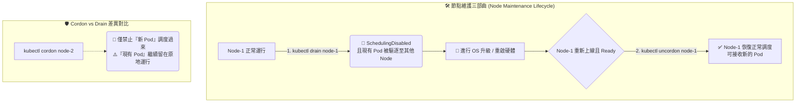

# 131. OS Upgrades (作業系統升級與節點維護)

## 1. 🏷️ 課程定位
- **章節編號與名稱**：第 6 節：Cluster Maintenance (叢集維護)
- **影片標題**：131. OS Upgrades (作業系統升級與節點維護)

## 2. 📌 核心概念摘要
當底層節點 (Node) 需要進行作業系統升級、重啟或硬體維護時，為了達到「服務零中斷 (Zero Downtime)」，我們必須優雅地封鎖該節點，並將其上方運行中的工作負載 (Pods) 安全地驅逐並轉移到叢集內其他健康的節點上。

## 3. 📊 流程圖與視覺化重現 (ASCII / Mermaid)
根據影片畫面中的節點操作，以下是標準的節點維護生命週期：



## 4. 🔑 知識點擷取 (Detailed Notes)
這堂課的底層邏輯與名詞定義是考場上的致勝關鍵：

- **Node 失聯的等待期 (Pod Eviction Timeout)**：
  如果節點突然當機 (Crash)，Kube-Controller-Manager 預設會等待 5 分鐘 (`--pod-eviction-timeout=5m0s`)。若 5 分鐘後節點仍未恢復，才會將該節點上的 Pod 標記為 Dead，並在其他節點重建。為了避免這 5 分鐘的服務中斷，我們必須「主動」進行維護操作。

- **Cordon (封鎖/隔離)**：
  - **觸發機制**：執行 `kubectl cordon`。
  - **底層變化**：會在 Node 的設定中加上 `unschedulable: true` 的標籤（狀態顯示為 SchedulingDisabled）。
  - **行為**：新的 Pod 絕對不會被派發到這個節點上；但原本就已經在上面運行的 Pod 完全不受影響，會繼續快樂地活著。

- **Drain (驅逐/抽乾)**：
  - **觸發機制**：執行 `kubectl drain`。
  - **底層變化**：它包含了兩個動作：先自動對該節點執行 cordon，接著開始優雅地終止 (Graceful Termination) 該節點上所有的 Pod。
  - **行為**：被終止的 Pod 如果是由 Deployment 或 ReplicaSet 管理的，Controller 會立刻在其他健康的節點上「重建」這些 Pod。

- **Uncordon (解除封鎖)**：
  - **觸發機制**：維護完成後執行 `kubectl uncordon`。
  - **行為**：移除 `unschedulable: true` 標籤。
  - **⚠️ 重要觀念**：解封後，當初被趕走的 Pod 「不會」自動跑回來！除非有新的 Pod 被建立，Scheduler 才會重新考慮將其分配到這個剛修好的節點上。

## 5. 💻 CKA 必備實作指令 (Imperative Commands)
*(考試時這幾個指令必須練到像呼吸一樣自然)*

```bash
# 💡 指令 1：安全驅逐 Node-1 上的所有 Pod 以進行維護 (考試必考大全配)
# 加上以下三個參數可以破解 99% 的 drain 失敗狀況
kubectl drain node-1 --ignore-daemonsets --delete-emptydir-data --force

# 💡 指令 2：僅將 Node-2 標記為不可調度 (不影響現有 Pod)
kubectl cordon node-2

# 💡 指令 3：Node-1 維護完成，重新開放調度
kubectl uncordon node-1

# 💡 指令 4：檢查叢集中所有 Node 的調度狀態
kubectl get nodes
# (注意看 STATUS 欄位是否顯示 Ready,SchedulingDisabled)
```

## 6. 🚀 CKA 考試延伸與 Troubleshooting
🎯 **考試情境預測**：
> **經典考題**：「請將節點 `ek8s-node-1` 設為不可調度，並將上面所有的 Pod 重新分配到其他節點。確保此操作不會影響到叢集中的 DaemonSet。」
> **解法**：直接下達 `kubectl drain ek8s-node-1 --ignore-daemonsets` 即可拿分。

🛑 **避坑指南 (Drain 的三大報錯地雷)**：
在考試中直接下 `kubectl drain <node>` 幾乎 100% 會報錯卡住，因為系統有保護機制：
> 1. **地雷 1：有 DaemonSet 存在**。系統無法趕走 DaemonSet 管理的 Pod。**解法**：加上 `--ignore-daemonsets` 讓它忽略這些特定的 Pod。
> 2. **地雷 2：Pod 有掛載本機暫存空間 (emptyDir)**。趕走 Pod 會導致暫存資料遺失。**解法**：加上 `--delete-emptydir-data` 霸氣宣告「我不在乎資料不見，給我刪」。
> 3. **地雷 3：有「無管理者」的裸奔 Pod (Standalone Pods)**。該 Pod 沒有 Deployment 保護，刪除就真的消失了。**解法**：加上 `--force` 強制刪除。

🔧 **Troubleshooting (除錯方向)**：
> 如果下達 drain 後畫面一直卡在 `evicting pod...` 無法結束，通常是因為某個 Pod 有設定 PodDisruptionBudget (PDB)，導致 Kubernetes 為了維持最低可用數量而不允許你殺掉這個 Pod。考試時若遇到，請開另一個終端機檢查該 Namespace 下的 PDB 設定。

---
> **💡 導師的隨堂測驗：**
> 針對剛才提到的觀念，如果今天有一個由 Deployment (Replicas=3) 管理的 Nginx 服務。當你對運行著其中一個 Nginx Pod 的節點執行 `kubectl cordon` 後，接著你手動用 `kubectl delete pod` 刪除了這個節點上的 Nginx Pod。
> 請問：ReplicaSet 會自動補齊一個新的 Pod，但這個新的 Pod 「有可能」會再次被建立在這個剛被你 Cordon 的節點上嗎？為什麼？
