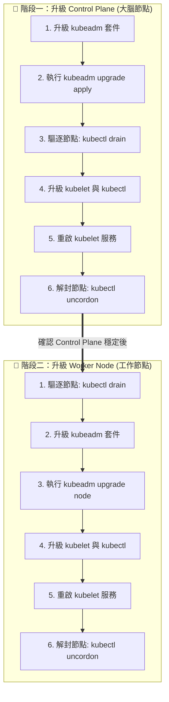

# 136. Demo - Cluster upgrade (實作展示：使用 kubeadm 升級叢集)

## 1. 🏷️ 課程定位
- **章節編號與名稱**：第 6 節：Cluster Maintenance (叢集維護)
- **影片標題**：136. Demo - Cluster upgrade (實作展示：使用 kubeadm 升級叢集)

## 2. 📌 核心概念摘要
叢集升級是一項高風險的系統工程。本節實作的核心目標是透過官方工具 `kubeadm`，在 「遵守單次只升級一個 Minor 版本」 且 「確保服務盡可能不中斷 (Zero Downtime)」 的前提下，依序完成 Control Plane (控制節點) 與 Worker Nodes (工作節點) 的底層元件升級。

## 3. 📊 流程圖與視覺化重現 (ASCII / Mermaid)
請將這張「標準升級 S.O.P」深深烙印在腦海中，考試時就是按表操課：



## 4. 🔑 知識點擷取 (Detailed Notes)
在影片的示範中，有幾個決定升級成敗的底層邏輯與官方文件使用技巧：

- **官方文件是唯一信仰**：
  考試時，千萬不要死背指令！請直接在官方文件中搜尋 `Upgrading kubeadm clusters`。裡面有針對 Ubuntu/Debian 系統的完整指令可以複製貼上。

- **套件鎖定機制 (Package Hold/Unhold)**：
  - **觸發機制**：為了防止系統平常自動更新不小心把 K8s 升級壞掉，Ubuntu 環境下通常會將 `kubeadm`, `kubelet`, `kubectl` 標記為 hold (鎖定)。
  - **操作**：升級前必須先 `apt-mark unhold` 解鎖，安裝新版本後，再立刻 `apt-mark hold` 鎖回去。

- **upgrade apply vs upgrade node 的關鍵差異**：
  - `kubeadm upgrade apply <version>`：只在叢集的「第一台」Control Plane 上執行。 它會負責更新整個叢集的狀態、憑證，並升級 API Server、etcd 等核心元件。
  - `kubeadm upgrade node`：在「其他」的 Control Plane 或是所有的 Worker Nodes 上執行。它只是告訴該節點：「請套用最新的叢集組態」。

## 5. 💻 CKA 必備實作指令 (Imperative Commands)
*(以下為考場上實際操作的精華指令，建議搭配官方文件服用)*

```bash
# ==========================================
# 🛑 準備動作 (確認可用版本)
# ==========================================
# 找出系統中有哪些可用的 kubeadm 版本
apt-cache madison kubeadm

# ==========================================
# 🧠 升級 Control Plane (登入主節點執行)
# ==========================================
# 1. 解除套件鎖定並安裝指定版本的 kubeadm
apt-mark unhold kubeadm && apt-get update && apt-get install -y kubeadm=1.29.0-1.1 && apt-mark hold kubeadm

# 2. 讓 kubeadm 檢查升級計畫 (確認無誤後再執行下一步)
kubeadm upgrade plan

# 3. 套用升級 (升級 API Server 等核心元件)
kubeadm upgrade apply v1.29.0

# 4. 安全驅逐 Control Plane 上的 Pod
kubectl drain <cp-node-name> --ignore-daemonsets

# 5. 升級底層小工頭 kubelet 與遙控器 kubectl
apt-mark unhold kubelet kubectl && apt-get install -y kubelet=1.29.0-1.1 kubectl=1.29.0-1.1 && apt-mark hold kubelet kubectl

# 6. 重新載入設定並重啟 kubelet 服務，隨後解封節點
systemctl daemon-reload
systemctl restart kubelet
kubectl uncordon <cp-node-name>

# ==========================================
# 🦾 升級 Worker Node (登入工作節點執行)
# ==========================================
# 注意：Drain 動作請在「擁有 kubectl 的控制節點」上預先執行！
# 升級流程與上述類似，但第 3 步的指令改為：
kubeadm upgrade node
```

## 6. 🚀 CKA 考試延伸與 Troubleshooting
🎯 **考試情境預測**：
> **經典魔王題**：題目會給你一個現有的叢集，要求將一個 Control Plane 和一個 Worker Node 從 v1.30.1 升級到 v1.31.0。這題配分極高 (通常佔 7%~10%)，只要跟著官方文件一步一步複製貼上就能穩穩拿分。

🛑 **避坑指南 (學員最常犯的致命錯誤)**：
> - **忘記重啟 Kubelet**：升級完 kubelet 套件後，如果你沒有執行 `systemctl daemon-reload` 和 `systemctl restart kubelet`，該節點的狀態永遠不會變成新版本。這會導致整題直接零分！
> - **Drain 錯地方**：`kubectl drain` 這個指令必須要在「有管理權限的節點（通常是 Control Plane 或跳板機）」上執行。不要 SSH 登入 Worker Node 後才傻傻地打 kubectl drain，那裡通常沒有管理員憑證。

🔧 **Troubleshooting (除錯方向)**：
> - 升級中途若不小心斷線或報錯，可以重新執行 `kubeadm upgrade apply`。它是冪等的 (Idempotent)，可以安全重試。
> - 如果節點升級後一直處於 `NotReady`，請第一時間檢查日誌：`journalctl -u kubelet -f`，通常是因為版本不匹配、設定檔未正確載入，或是你真的忘記 restart 了。
