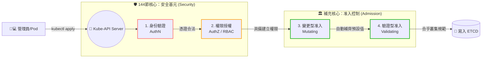

# 144-1. [補充教材] 安全基元 (Security) vs 准入控制 (Admission Control) 深度對比

## 1. 🏷️ 課程定位
- **章節編號與名稱**：第 7 節：Security (安全性)
- **影片標題**：144-1. [補充教材] 安全基元 (Security) vs 准入控制 (Admission Control) 深度對比

## 2. 📌 核心概念摘要
在 Kubernetes 的 API 請求生命週期中，「安全基元 (AuthN/AuthZ)」 是警衛，負責確認你的身分與基本權限；而 「准入控制 (Admission Control)」 則是內部的營運審查委員會，負責在資料寫入 ETCD 前，進行 YAML 內容的自動補齊 (Mutating) 與合規性最終驗證 (Validating)。

## 3. 📊 流程圖與視覺化重現 (ASCII / Mermaid)
這張圖完美拆解了 Kube-API Server 的「請求攔截漏斗」，請務必理解這四個關卡的先後順序：



## 4. 🔑 知識點擷取 (Detailed Notes)
在考場與實務上，我們必須精準區分這兩者的職責：

| 比較維度 | 🛡️ 安全基元 (Security Primitives) | 🏛️ 准入控制 (Admission Control) |
| :--- | :--- | :--- |
| **防守階段** | 請求生命週期的最前端。 | 請求生命週期的最後端（寫入 ETCD 前）。 |
| **核心提問** | 「你是誰？」、「你有權利操作這個 API 嗎？」 | 「你的 YAML 內容符合我們公司的規定嗎？」 |
| **常見技術** | TLS 憑證、ServiceAccount、RBAC。 | LimitRanger、ResourceQuota、Pod Security。 |
| **行為特性** | **唯讀判斷**：只會回答 Yes 或 No。 | **具備修改能力**：Mutating 控制器會主動竄改你的 YAML（例如自動幫你加上 CPU Limit）。 |
| **報錯特徵** | 通常回應 `401 Unauthorized` 或 `403 Forbidden`。 | 請求已被接受，但回傳具體的阻擋原因（例如：`Forbidden: exceeded quota`）。 |

## 5. 💻 CKA 必備實作指令 (Imperative Commands)
在 CKA 考試中，如果你想知道叢集到底啟動了哪些「准入控制審查委員會」，你必須直接去查看大腦 (API Server) 的設定檔：

```bash
# 💡 考點 1：檢查 API Server 啟用了哪些 Admission Plugins
# 注意看 --enable-admission-plugins 後面接的參數陣列
cat /etc/kubernetes/manifests/kube-apiserver.yaml | grep enable-admission-plugins

# 💡 考點 2：檢查是否有資源配額 (Quota) 相關的准入控制器在運作
# 如果有 ResourceQuota，即使你有 RBAC 權限，只要超過資源上限一樣會被 Admission 擋下
kubectl get resourcequota -n <namespace>

# 💡 考點 3：檢查是否有自動補齊資源限制 (LimitRanger) 的准入控制器
kubectl get limitrange -n <namespace>
```

## 6. 🚀 CKA 考試延伸與 Troubleshooting
🎯 **考試情境預測 (Troubleshooting 魔王題)**：
> **情境**：你透過 RBAC 給了開發者 `create pods` 的權限，他測試 `kubectl auth can-i create pods` 也回傳 `yes`。但是當他真正執行 `kubectl apply -f pod.yaml` 時，卻一直報錯無法建立。
> **解題關鍵**：這就是典型的「過了 Security 防線，卻死在 Admission 防線」。這時候千萬不要再去查 RBAC 了，請立刻檢查該 Namespace 是否有 `ResourceQuota` 滿載，或是該 Pod 觸發了 `PodSecurity` 的安全限制。

🛑 **避坑指南**：
> **修改 API Server 設定檔的極高風險**：如果考題要求你開啟某個 Admission Plugin（例如 `NodeRestriction`），在修改 `/etc/kubernetes/manifests/kube-apiserver.yaml` 時，只要打錯一個字母或縮排錯誤，API Server 就會永遠起不來。修改前務必先備份這個 YAML 檔！

🔧 **Troubleshooting (除錯方向)**：
> 當 ReplicaSet 無法順利產生 Pod，且狀態一直卡住時，請優先使用 `kubectl describe replicaset <name>` 查看 Events 底下的訊息。如果是被 Admission Controller 擋下，這裡通常會留下非常明確的犯罪現場紀錄（例如：`Error creating: pods "xxx" is forbidden: failed quota...`）。
