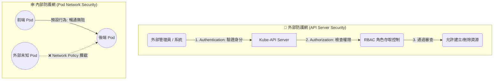

# 144. Kubernetes Security Primitives (Kubernetes 安全基元總覽)

## 1. 🏷️ 課程定位
- **章節編號與名稱**：第 7 節：Security (安全性)
- **影片標題**：144. Kubernetes Security Primitives (Kubernetes 安全基元總覽)

## 2. 📌 核心概念摘要
Kubernetes 的安全性並非單一的開關，而是分為 「外部叢集存取防護 (誰能控制大腦)」 與 「內部應用通訊防護 (誰能連線服務)」 兩大維度。本節透過宏觀視角，帶出身份驗證 (AuthN)、授權 (AuthZ) 以及利用 Network Policy 打破 Pod 預設「全開放通訊」的安全框架。

## 3. 📊 流程圖與視覺化重現 (ASCII / Mermaid)
根據影片概念與畫面截圖，這就是 Kubernetes 叢集從外到內的「雙層防護網」：



## 4. 🔑 知識點擷取 (Detailed Notes)
這堂課確立了我們接下來要面對的四大安全戰場：

- **主機/節點安全 (Node Security)**：
  - **定義**：保護底層的實體機或虛擬機（例如關閉 Root 密碼登入、限制 SSH 存取）。雖然這通常超出 K8s 的原生管理範圍，但如果主機被駭，K8s 再安全也沒用。

- **Kube-API Server 存取控制 (Access Control)**：
  - **Authentication (你是誰)**：K8s API Server 是叢集的唯一入口。它可以透過 TLS 憑證 (Certificates)、靜態密碼檔、Token 或外部第三方認證系統 (如 LDAP) 來驗證來訪者的身分。
  - **Authorization (你能做什麼)**：確認身分後，K8s 主要依賴 RBAC (Role-Based Access Control) 來決定該帳號是否具備讀取 (get) 或修改 (create/delete) 特定資源的權限。

- **Pod 的預設網路行為 (Default Network Behavior)**：
  - **定義**：在 Kubernetes 中，預設情況下，叢集內部所有的 Pod 都可以互相通訊 (All-to-All Communication)。這在微服務初期很方便，但存在極大的橫向越權風險。

- **網路策略 (Network Policies)**：
  - **觸發機制**：如同您畫面上展示的，一旦您建立了一個 NetworkPolicy 物件並透過 Label 選中了某個 Pod，該 Pod 就會立刻進入「預設拒絕 (Default Deny)」模式。
  - **底層邏輯**：它就像是掛載在 Pod 身上的虛擬防火牆，只會放行您在 Policy 中明確寫出允許的流入 (Ingress) 或流出 (Egress) 流量。

## 5. 💻 CKA 必備實作指令 (Imperative Commands)
*(本節為觀念總覽，但以下是針對這兩大防護網，最常用來探查狀態的實務指令)*

```bash
# ==========================================
# 🔐 探查外部防護網 (RBAC 權限測試)
# ==========================================
# 💡 檢查自己是否有權限列出所有的 Network Policy (考試極常用)
kubectl auth can-i list networkpolicies -A

# ==========================================
# 🕸️ 探查內部防護網 (Network Policy)
# ==========================================
# 💡 列出當前 Namespace 下所有生效的網路策略防火牆
kubectl get networkpolicies

# 💡 深入查看某個 Policy 到底擋了誰、放行了誰
kubectl describe networkpolicy <policy-name>
```

## 6. 🚀 CKA 考試延伸與 Troubleshooting
🎯 **考試情境預測**：
> 本章節的觀念將直接對應到 CKA 兩大魔王題型：第一是設定 RBAC 權限綁定；第二是撰寫 YAML 設定 Network Policy 阻擋特定流量。

🛑 **避坑指南 (極易混淆的盲點)**：
> - **以為沒有 Network Policy 就代表安全**：很多人以為 K8s 預設是封閉的。記住，沒有 Policy = 完全裸奔 (全開放)。
> - **混淆 AuthN 與 AuthZ**：如果你的 kubectl 指令跳出 `Unauthorized (401)`，代表是憑證/Token 有問題（你是誰）；如果跳出 `Forbidden (403)`，代表你是合法登入的，只是你沒有這個動作的 RBAC 權限（你能做什麼）。

🔧 **Troubleshooting (除錯方向)**：
> 如果應用程式 A 突然無法連線到資料庫 B，而兩邊的 Pod 都在 Running 狀態。請優先檢查是否有人在資料庫 B 的 Namespace 中套用了 NetworkPolicy。只要有任何一個 Policy 的 `podSelector` 選中了資料庫 B，資料庫 B 就會拒絕所有未被明確放行的連線。
