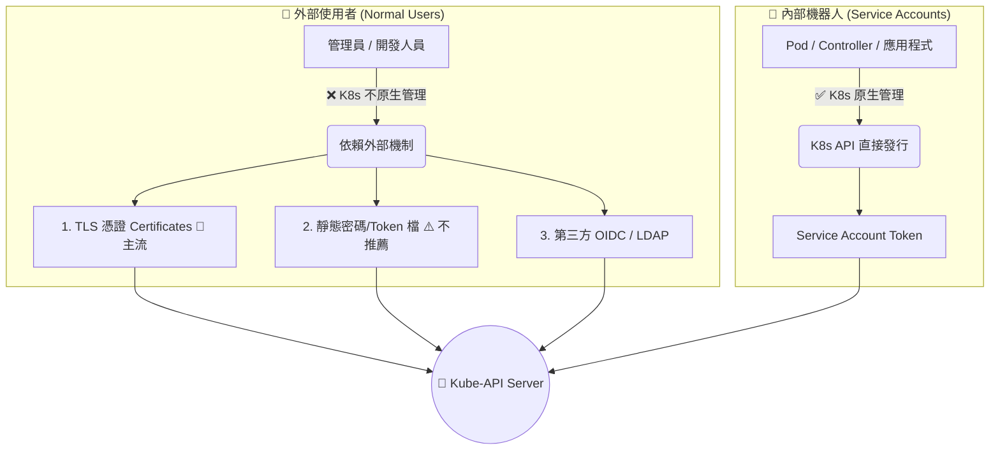

# 145. Authentication (身份驗證機制)

## 1. 🏷️ 課程定位
- **章節編號與名稱**：第 7 節：Security (安全性)
- **影片標題**：145. Authentication (身份驗證機制)

## 2. 📌 核心概念摘要
Kubernetes 是一個高度解耦的系統，它本身「沒有」內建普通使用者的資料庫。Kube-API Server 必須依賴外部機制（如 X.509 憑證、靜態密碼/Token 檔或外部認證服務）來驗證來訪者的身分。其中，使用「靜態密碼檔/Token檔」是最基礎但實務上極度不推薦的作法。

## 3. 📊 流程圖與視覺化重現 (ASCII / Mermaid)
在 K8s 的世界裡，存取 API 的身分被嚴格區分為兩大類別，其驗證方式也截然不同：



## 4. 🔑 知識點擷取 (Detailed Notes)
根據您截圖上的三大 Notes，這正是 CKA 考試中如果你要修改 API Server 設定時，最容易踩坑的底層邏輯：

- **1. 靜態認證機制不被推薦 (This is not a recommended authentication mechanism)**：
  將帳號、密碼、UID 寫死在一個 `.csv` 檔案裡，再交給 API Server 讀取，這在生產環境極度危險且難以管理。因為每次新增或修改使用者，你都必須重新啟動 API Server 才能生效。

- **2. Kubeadm 架構下的 Volume Mount 陷阱 (Consider volume mount while providing the auth file in a kubeadm setup)**：
  🌟 **超級大考點**：在 kubeadm 建立的叢集中，API Server 是一個運作在容器裡的 Static Pod。如果你把 `users.csv` 放在實體機的 `/etc/kubernetes/` 底下，API Server 容器內部是看不到這個檔案的！
  **解法**：你必須在 `kube-apiserver.yaml` 中，不但要加上 `--basic-auth-file` 參數，還要設定 `volumeMounts` 和 `volumes`，把實體機的檔案映射 (Mount) 進容器內。

- **3. 驗證後必須搭配授權 (Set up Role-Based Authorization for new users)**：
  身分驗證 (Authentication) 只是讓你進大門。如果你沒有幫這個新帳號設定 RBAC (Role/RoleBinding)，他登入後依然什麼事都不能做，只會看到滿畫面的 Forbidden。

## 5. 💻 CKA 必備實作指令 (Imperative Commands)
在考試中，如果題目要求你修改 API Server 的啟動參數（例如掛載某個靜態設定檔），你必須極度小心地編輯以下檔案：

```bash
# 💡 實戰技巧 1：編輯 API Server 的 Static Pod 設定檔
# 注意：修改此檔案後，Kubelet 會自動偵測變更並「重啟」API Server 容器。
vi /etc/kubernetes/manifests/kube-apiserver.yaml

# 💡 實戰技巧 2：在修改設定檔「之前」，永遠記得先備份！(防呆神技)
# 如果你 YAML 縮排改錯導致 API Server 死掉，至少還能救回來。
cp /etc/kubernetes/manifests/kube-apiserver.yaml /root/kube-apiserver.yaml.bak

# 💡 實戰技巧 3：觀察 API Server 是否成功重啟
# 如果修改完等了 1 分鐘 kubectl 還是回傳連線拒絕，代表你把設定檔改壞了。
crictl ps -a | grep kube-apiserver
```

## 6. 🚀 CKA 考試延伸與 Troubleshooting
🎯 **考試情境預測**：
> 雖然 CKA 近年越來越少考 Static Password File，但「修改 `kube-apiserver.yaml` 並掛載 HostPath Volume」 的題型依然非常熱門（例如考你掛載 Audit Log 或新的憑證檔）。只要牽涉到讀取本機檔案，就絕對不能忘記 Volume Mounts！

🛑 **避坑指南**：
> **YAML 縮排地獄**：`kube-apiserver.yaml` 非常長，在加上 `volumes` 和 `volumeMounts` 時，縮排只要錯一格，API Server 就會直接崩潰。

🔧 **Troubleshooting (除錯方向)**：
> 修改 API Server 設定後，如果執行任何 kubectl 指令都出現 `The connection to the server <IP>:6443 was refused`。請立刻去檢查 `/etc/kubernetes/manifests/kube-apiserver.yaml` 是不是有語法錯誤。若不確定哪裡錯了，請立刻把備份檔覆蓋回去。

---
> **💡 導師的隨堂測驗：**
> 剛才我們提到，Kubernetes 其實「不原生管理」普通使用者的帳號。
> 那如果在實務上，我們不使用危險的靜態密碼檔，我們通常會發給新進員工什麼樣的「檔案」，讓他的 kubectl 可以安全地與叢集進行身分驗證呢？（提示：這是後續課程的重點之一，也是一把數位鑰匙）
