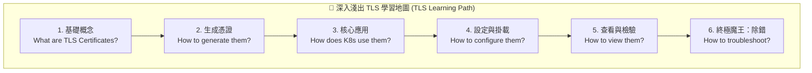

# 146. TLS Introduction (TLS 憑證前導介紹)

## 1. 🏷️ 課程定位
- **章節編號與名稱**：第 7 節：Security (安全性)
- **影片標題**：146. TLS Introduction (TLS 憑證前導介紹)

## 2. 📌 核心概念摘要
在 Kubernetes 叢集中，所有核心元件（API Server、ETCD、Kubelet、Scheduler）之間的溝通，以及外部使用者的登入，預設都必須透過 TLS (傳輸層安全性協定) 進行加密與身分互相驗證。本節確立了接下來的學習目標：我們必須學會如何生成、查看、配置憑證，並具備在考場上解決「憑證過期或不匹配 (x509 errors)」的除錯能力。

## 3. 📊 流程圖與視覺化重現 (ASCII / Mermaid)
根據您畫面上的六大 Goals，這就是我們接下來在 TLS 戰場上的「打怪學習路徑」：



## 4. 🔑 知識點擷取 (Detailed Notes)
這六個學習目標直接對應了 CKA 的考點，您可以先在腦海中建立以下預備知識框架：

- **憑證是什麼與如何生成**：
  - **底層邏輯**：基於非對稱加密（公鑰 `.crt` 加密，私鑰 `.key` 解密）。
  - **工具**：我們將會學到使用原生的 `openssl` 指令，或是 K8s 內建的 Certificates API 來簽發憑證（這就是在 K8s 中建立 User 的標準流程）。

- **K8s 如何使用與設定憑證**：
  - **Client Certificates (客戶端憑證)**：當作「身分證」，例如 kubectl (管理員) 或 kubelet (節點) 拿著它去跟 API Server 證明自己的身分。
  - **Server Certificates (伺服器憑證)**：當作「營業執照」，例如 API Server 或 ETCD 出示給來訪者看，證明自己不是偽造的伺服器。

- **查看與除錯 (Troubleshooting)**：
  這是 CKA 實作題最愛考的題型。憑證是一堆人類看不懂的亂碼 (Base64 或 PEM 格式)，我們必須學會用指令把它「解碼」成人類可讀的文字，藉此檢查它到底過期了沒、核發給誰。

## 5. 💻 CKA 必備實作指令 (Imperative Commands)
*(雖然這是前導課，但強烈建議您現在就把這個「解碼神技」背下來，後面的實作課一定會瘋狂用到！)*

```bash
# 💡 實戰技巧 1：查看 K8s 核心元件憑證的預設存放位置
# 考試時如果找不到憑證，第一時間先來這裡找
ls -l /etc/kubernetes/pki

# 💡 實戰技巧 2：(超級必殺技) 將亂碼憑證解碼成人類可讀內容
# 用來檢查憑證的「有效期限 (Validity)」、「核發對象 (Subject)」、「簽發機構 (Issuer)」
openssl x509 -in /etc/kubernetes/pki/apiserver.crt -text -noout

# 💡 實戰技巧 3：檢查私鑰 (Private Key) 格式是否正確
openssl rsa -in /etc/kubernetes/pki/apiserver.key -check -noout
```

## 6. 🚀 CKA 考試延伸與 Troubleshooting
🎯 **考試情境預測**：
> **除錯題**：「叢集中的 Node 01 突然變成 NotReady 狀態，且無法修復。請找出原因並使其恢復連線。」（通常原因就是該節點的 Kubelet 客戶端憑證過期，或者 API Server 的憑證 IP 填錯了）。

🛑 **避坑指南 (極易搞混的附檔名)**：
> - **`.crt` 或 `.pem`**：這是 Certificate（憑證 / 公鑰），是可以公開給別人看的，也是你要帶在身上證明身分的。
> - **`.key`**：這是 Private Key（私鑰），絕對不可外流。在設定 YAML 時，千萬不要把 `.crt` 和 `.key` 填反了，否則元件絕對起不來。

🔧 **Troubleshooting (致命報錯關鍵字)**：
> 在往後的實作或考試中，只要你下達 kubectl 指令，畫面上噴出 `x509: certificate signed by unknown authority`。不要懷疑，這 100% 代表你現在用的憑證，與伺服器上的 CA (憑證機構) 不匹配，請立刻去檢查 Kubeconfig 裡面的憑證設定！
