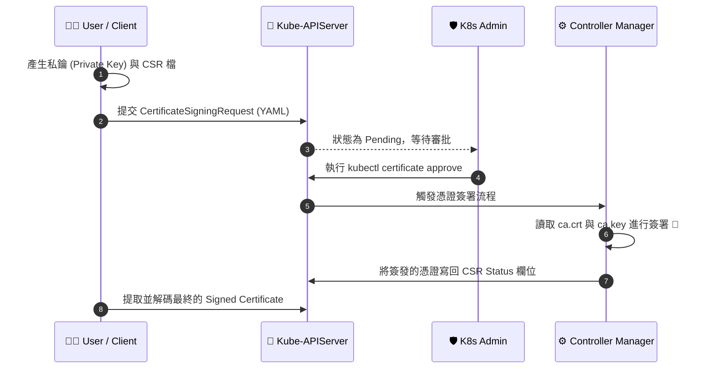

# Certificates API (憑證應用程式介面)

## 📌 核心觀念

將 Kubernetes Certificates API 想像成一個自動化的**「數位身分證核發局」**：
過去，叢集管理員（主管）必須手動拿著「造物主印章（叢集根憑證 `ca.key`）」親自為每個新員工蓋章，一旦印章遺失，整個公司將面臨毀滅性災難。
現在，透過 Certificates API，員工只需提交一份「身分申請書（CSR）」，核發局內部機制（Controller Manager）在獲得管理員的「線上批准（Approve）」後，就會自動在安全的保險箱內完成蓋章並發還憑證，大幅降低了實體金鑰外流的安全風險。

*   **自動化憑證管理**：K8s 內建機制，允許透過建立 `CertificateSigningRequest` (CSR) 物件來統一處理憑證簽發。
*   **幕後簽署者 (Signer)**：真正的簽署動作是由 `kube-controller-manager` 執行。它必須正確掛載 `--cluster-signing-cert-file` 與 `--cluster-signing-key-file`。
*   **權限分離**：任何人都可以提交 CSR，但只有具備特定 RBAC 權限的管理員才能執行審核 (`approve` 或 `deny`)。

## 📊 憑證核發生命週期



## 💻 必考實戰指令

在 CKA 考場上，Base64 的編碼與解碼是處理 CSR 的最大痛點，務必熟記避免換行的參數。

```bash
# 💡 尋找 base64 避免換行的參數 (若考場忘記可用此招)
base64 --help | grep wrap   # 輸出會提示 -w, --wrap=COLS

# 1️⃣ 將 csr 檔案進行 Base64 編碼，並去除換行符號（準備貼入 YAML）
# 方式 A: 使用 tr 刪除換行
cat john.csr | base64 | tr -d "\n"
# 方式 B: 使用 -w 0 停用換行 (推薦)
cat john.csr | base64 -w 0

# 2️⃣ 查看叢集中所有的 CSR 狀態 (Pending / Approved / Issued)
kubectl get csr

# 3️⃣ 考場必考：核准 (Approve) CSR
kubectl certificate approve <csr-name>

# 4️⃣ 拒絕 (Deny) CSR
kubectl certificate deny <csr-name>

# 5️⃣ 考場救命指令：提取簽發後的憑證並解碼存成 crt 檔
kubectl get csr <csr-name> -o jsonpath='{.status.certificate}' | base64 -d > john.crt
```

## 🛡️ 實戰與最佳實踐 SOP

> [!IMPORTANT]
> **YAML 換行陷阱**：預設的 `base64` 指令在輸出超過 76 個字元時會自動斷行。如果在 YAML 的 `request` 欄位中貼入帶有換行的 Base64 字串，API Server 會拒絕該請求。務必使用 `tr -d "\n"` 或 `-w 0` 處理字串。

> [!TIP]
> **Troubleshooting SOP：已核准但憑證為空？**
> 如果執行 `approve` 後，狀態為 Approved 但 `status.certificate` 卻是空的：
> 1. **檢查 Controller Manager**：去 Master Node 檢查 `cat /etc/kubernetes/manifests/kube-controller-manager.yaml`。
> 2. **確認憑證路徑**：確認 `--cluster-signing-cert-file` 和 `--cluster-signing-key-file` 路徑正確且實體檔案確實存在。
> 3. **檢查日誌**：執行 `kubectl logs -n kube-system <kube-controller-manager-pod-name>` 尋找簽署失敗的具體報錯訊息。

> [!WARNING]
> **備份提示**：
> 若在排錯過程中需要修改 `/etc/kubernetes/manifests/kube-controller-manager.yaml`，強烈建議先執行 `cp /etc/kubernetes/manifests/kube-controller-manager.yaml /root/kube-controller-manager.yaml.bak` 進行備份，以免改錯導致組件崩潰。

## 📝 YAML 骨架

標準的 CSR 物件 YAML 範例：

```yaml
apiVersion: certificates.k8s.io/v1
kind: CertificateSigningRequest
metadata:
  name: john-developer    # CSR 的名稱
spec:
  request: <BASE64_ENCODED_CSR>  # 貼上 base64 編碼且無換行的字串
  signerName: kubernetes.io/kube-apiserver-client # 必填：簽署者名稱
  expirationSeconds: 86400  # (選填) 憑證有效時間
  usages:
  - client auth  # 憑證用途
```

## 🧠 自我測驗

<details>
<summary><b>1. CSR 物件 YAML 中，哪一個欄位在 K8s 1.19+ 版本後變成必填，忘記寫會導致 Apply 失敗？</b></summary>
解答：`signerName` 欄位。對於一般的 Client 認證，通常設置為 `kubernetes.io/kube-apiserver-client`。
</details>

<details>
<summary><b>2. 當你 Approve 了一個 CSR，但它遲遲沒有發配憑證（Certificate 欄位為空），最可能負責簽發的哪個核心組件出了問題？</b></summary>
解答：`kube-controller-manager`。因為它是實際讀取 `ca.key` 並執行簽署動作的底層核心組件。
</details>

<details>
<summary><b>3. 如何將名為 `john` 的 CSR 憑證內容匯出，並在解碼後存成 `john.crt`？</b></summary>
解答：執行指令 `kubectl get csr john -o jsonpath='{.status.certificate}' | base64 -d > john.crt`
</details>
