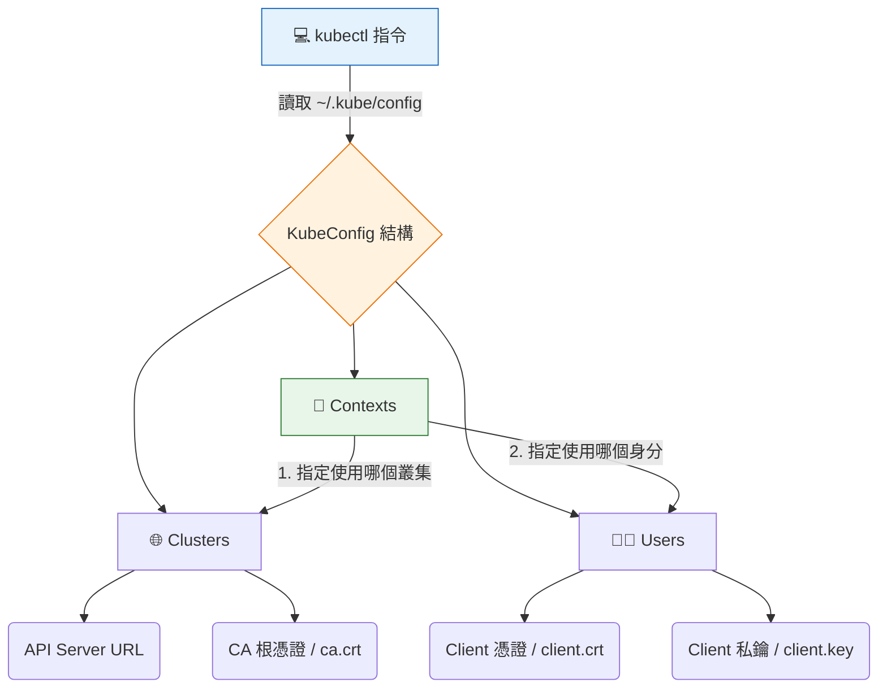

# KubeConfig

## 📌 核心觀念

將 KubeConfig 想像成是一本**「通關護照與簽證大全」**：
當你要進入不同的國家（叢集）時，你需要出示這本護照，裡面記載了你要去哪個國家（Cluster）、你要用什麼身分通關（User），以及將這兩者配對起來的有效簽證（Context）。為了解決護照內頁（憑證檔案）遺失的問題，我們通常會將憑證影本（Base64 編碼）直接「護貝」內嵌在護照中，讓這本護照變成單一檔案走天下。

*   **身分驗證核心**：KubeConfig 是 Kubernetes 客戶端（如 `kubectl`）用來連線與驗證叢集身分的核心設定檔。
*   **三大元件**：由 `Clusters` (去哪裡)、`Users` (我是誰) 與 `Contexts` (將前兩者綁定) 組成。
*   **高可攜性設計**：為避免在不同機器間傳遞設定檔時遺失憑證實體檔案，常將憑證內容進行 Base64 編碼，並以 `-data` 欄位直接內嵌（Embed）在 YAML 之中。

## 📊 KubeConfig 核心架構



## 💻 必考實戰指令

> [!WARNING]
> **講師重點提醒**：考場上通常會提供多個 Cluster 讓你切換，**切換 Context 是每做一題前必做的動作！**

```bash
# 1️⃣ 查看當前正在使用的 KubeConfig 內容 (包含隱藏的憑證細節)
kubectl config view

# 2️⃣ 列出所有可用的 Contexts (考場必備，確認自己在哪個環境)
kubectl config get-contexts

# 3️⃣ 切換 Context (考場每題開頭都會給你這串指令，直接複製貼上)
kubectl config use-context <context-name>

# 4️⃣ 將實體憑證轉為 Base64，準備貼入 kubeconfig 的 -data 欄位
cat /etc/kubernetes/pki/ca.crt | base64 | tr -d "\n"

# 5️⃣ 救命指令：將 kubeconfig 中的 base64 憑證提取出來解碼並查看內容 (Troubleshooting 用)
echo "LS0tLS...bnJ" | base64 --decode
```

## 🛡️ 實戰與最佳實踐 SOP

> [!IMPORTANT]
> **欄位命名規則陷阱 (避坑指南)**：
> - 外部檔案參照：使用 `certificate-authority: /path/to/cert` (放實體路徑)。
> - 內嵌資料：使用 `certificate-authority-data: <Base64-String>`。
> **致命錯誤**：將檔案路徑寫在 `-data` 欄位裡，或把 Base64 字串寫在沒有 `-data` 結尾的欄位裡，會直接導致 `x509: certificate signed by unknown authority` 報錯。

> [!TIP]
> **Troubleshooting SOP：無法連線 API Server？**
> 執行 `kubectl get nodes` 發現卡住或 Connection Refused 時的排查步驟：
> 1. **確認環境**：執行 `kubectl config current-context` 確定自己有沒有切錯叢集。
> 2. **檢查連線資訊**：執行 `kubectl config view` 確認 API Server 的 URL 與 Port 是否正確。
> 3. **開啟終極除錯模式**：加上 `-v=6` 或 `-v=9` 開啟最高層級日誌，例如 `kubectl get nodes -v=9`，它會印出完整的 curl 請求與憑證驗證過程，幫你精準抓出是網路不通還是憑證不對。

## 📝 YAML 骨架

最精簡標準的 KubeConfig 檔案結構：

```yaml
apiVersion: v1
kind: Config
current-context: dev-frontend  # 預設使用的 Context

clusters:
- cluster:
    certificate-authority-data: <BASE64_CA_CERT> # 內嵌 CA 憑證
    server: https://192.168.1.10:6443
  name: dev-cluster

users:
- name: john-developer
  user:
    client-certificate-data: <BASE64_CLIENT_CERT> # 內嵌 Client 憑證
    client-key-data: <BASE64_CLIENT_KEY>          # 內嵌 Client 私鑰

contexts:
- context:
    cluster: dev-cluster    # 綁定上方定義的 cluster
    user: john-developer    # 綁定上方定義的 user
  name: dev-frontend
```

## 🧠 自我測驗

<details>
<summary><b>1. KubeConfig 預設會去哪個路徑讀取設定檔？如果我想臨時指定另一個檔案該怎麼做？</b></summary>
解答：預設路徑為 `~/.kube/config`。可透過執行加上 `--kubeconfig=/path/to/file` 參數的指令，或設定環境變數 `export KUBECONFIG=/path/to/file` 來臨時指定。
</details>

<details>
<summary><b>2. 如果在設定檔中看到 `client-certificate-data` 欄位，裡面的值必須是什麼格式？</b></summary>
解答：必須是經過 Base64 編碼，且**沒有換行符號**的憑證字串。
</details>

<details>
<summary><b>3. 考題情境：發現 KubeConfig 中的 API Port 設定錯誤導致無法連線。你該如何直接檢視目前的設定檔內容找出錯誤？</b></summary>
解答：使用指令 `kubectl config view`，或直接使用 `cat ~/.kube/config` 查看實體檔案內容。
</details>
