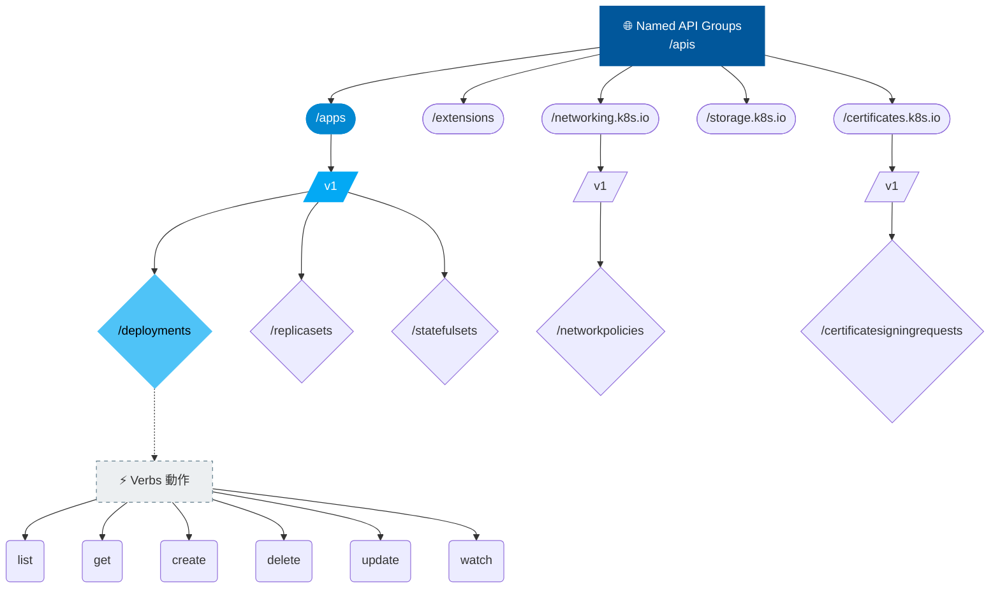

# API Groups

## 📌 核心觀念

將 Kubernetes API Groups 想像成是**「大型圖書館的分類系統」**：
隨著 K8s 掌管的資源越來越多，如果把所有的書（API 資源）都塞在同一個書架上，會極難管理與升級。因此，K8s 將它們分門別類放進不同的「主題館（API Groups）」，例如 `apps` 館專放 Deployment、`networking.k8s.io` 館專放 NetworkPolicy。而圖書館最早期建館的基礎經典（Core Group）則不特別標示館名。理解這個分類邏輯，是精準設定借閱權限（RBAC）時不可或缺的基礎。

*   **高擴充性與版本控制**：將龐大複雜的 REST API 拆分為多個邏輯群組，確保升級時各群組可獨立迭代（例如從 `v1alpha1` 平滑推進到 `v1`）。
*   **兩大核心分類**：
    *   **Core Group (核心群組)**：最早期的基礎資源（如 pods, services, namespaces）。路徑為 `/api/v1`，在 RBAC 設定中 API Group 表示為 `""`（空字串）。
    *   **Named Groups (命名群組)**：為了擴充而生的資源群組（如 apps, networking.k8s.io）。路徑為 `/apis/$GROUP_NAME/$VERSION`。
*   **與 RBAC 強綁定**：在設定權限（Role/ClusterRole）時，必須精確指定目標資源屬於「哪一個 API Group」下的「哪個 Resource」，以及允許的「Verbs 動作」，才能正確授權。

## 📊 API 樹狀結構階層圖



## 💻 必考實戰指令

> [!WARNING]
> **考場求生指南**：考場上絕對不可能背下所有資源屬於哪個 API Group。忘記時，`api-resources` 是你唯一的神器！

```bash
# 1️⃣ 考場神指令：列出叢集中「所有」支援的資源、其所屬的 API Group 與縮寫 (SHORTNAMES)
kubectl api-resources

# 2️⃣ 進階過濾：只看特定 API Group (例如 apps) 底下有哪些資源
kubectl api-resources --api-group=apps

# 3️⃣ 列出叢集目前支援的所有 API 版本 (包含 Group/Version)
kubectl api-versions

# 4️⃣ 實務 Troubleshooting 常用：在本機啟動 Proxy 以繞過憑證驗證，直接探索底層 API
kubectl proxy &
curl http://localhost:8001/apis | grep "name"
```

## 🛡️ 實戰與最佳實踐 SOP

> [!IMPORTANT]
> **RBAC 的致命陷阱 (避坑指南)**：
> 1. **核心群組不可寫字串 "core"**：在寫 Role YAML 時，pods, services 等核心資源的 `apiGroups` 必須寫作 `[""]` (空字串)。寫作 `"core"` 會導致完全無法匹配。
> 2. **資源名稱必須是複數**：在 `resources` 欄位中，資源名稱必須加 s（例如 `pods`, `deployments`）。寫單數 `pod` 權限不會生效。

> [!TIP]
> **Troubleshooting SOP：驗證權限是否生效**
> 寫完 RBAC (Role + RoleBinding) 後，不確定 API Group 或 Verbs 有沒有填錯？善用 `auth can-i` 指令模擬操作來驗證：
> ```bash
> kubectl auth can-i create deployments --as=system:serviceaccount:<namespace>:<sa-name>
> ```
> - 若回傳 `yes`，代表你的 API Groups 觀念與 YAML 設定完全正確。
> - 若回傳 `no`，請立即回去檢查 `kubectl api-resources` 的分類，並確認 YAML 拼寫！

## 📝 YAML 骨架

標準的 Role 物件 YAML 範例（展示如何混搭 Core Group 與 Named Group）：

```yaml
apiVersion: rbac.authorization.k8s.io/v1
kind: Role
metadata:
  namespace: default
  name: pod-and-deploy-manager
rules:
- apiGroups: [""]                # Core Group (核心群組必須是空字串)
  resources: ["pods", "services"] # 資源名稱必須為複數
  verbs: ["get", "list", "watch"]
- apiGroups: ["apps"]            # Named Group
  resources: ["deployments", "statefulsets"]
  verbs: ["create", "update", "delete"]
```

## 🧠 自我測驗

<details>
<summary><b>1. 當你需要給予使用者查詢 `Pod` 與 `Service` 的權限時，在 Role YAML 中的 `apiGroups` 應該填什麼？</b></summary>
解答：應該填寫 `[""]`（空字串）。因為它們屬於早期的 Core Group，絕不能寫成 `"core"`。
</details>

<details>
<summary><b>2. 在 RBAC 的 Role 中，設定 `resources: ["deployment"]` 為什麼是不正確的？</b></summary>
解答：因為 Kubernetes RBAC 設定中的資源名稱必須是複數型態（Plural），正確寫法應為 `["deployments"]`。寫單數會導致權限無效。
</details>

<details>
<summary><b>3. 如果考題要求你找出 `Ingress` 資源屬於哪個 API Group，但你忘記了，該用什麼最快的指令查詢？</b></summary>
解答：使用指令 `kubectl api-resources | grep ingress` 來快速過濾並查詢其對應的 `APIGROUP` 欄位。
</details>
