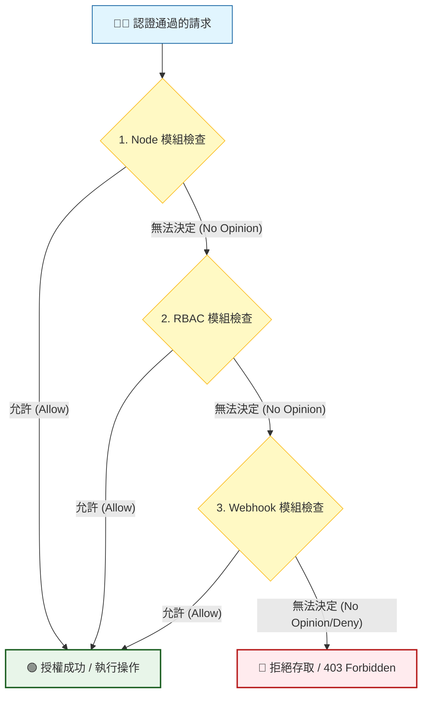

# Authorization (授權機制)

## 📌 核心觀念

將 Kubernetes Authorization（授權）想像成大樓的**「多重門禁安檢通道」**：
當你通過了前台的身分驗證（Authentication，證明你是誰）後，接著要決定你能進入大樓的哪些房間（授權）。K8s 設置了多道安檢門（授權模組，如 Node, RBAC, Webhook），你的請求會依序通過。只要有任何一道門的警衛說「允許（Allow）」，你就能直接通關。如果全部走完都沒有人允許，你就會被擋在門外（403 Forbidden）。

*   **發生時機**：授權發生在認證 (Authentication) 成功之後。決定已驗證的使用者能否對特定資源執行特定操作。
*   **四大授權模式**：
    *   `Node`：專屬 Kubelet 的特殊模式，確保 Kubelet 只能操作自身節點相關的資源（最小權限原則）。
    *   `RBAC`：基於角色的存取控制，透過 Role/ClusterRole 動態設定權限，是 CKA 核心考點。
    *   `Webhook`：將授權決策外包給外部系統 (如 Open Policy Agent)。
    *   `AlwaysAllow` / `AlwaysDeny`：全開或全關，通常僅用於測試。
*   **短路與順序規則**：配置如 `--authorization-mode=Node,RBAC,Webhook`。系統由左至右審查，遇到第一個 `Allow` 即放行。若全數為 `No Opinion` 則最終拒絕。

## 📊 多重授權模組鏈流程圖



## 💻 必考實戰指令

> [!WARNING]
> **講師重點提醒**：在考場上，快速驗證權限以及查看 Control Plane 配置是拿分的關鍵技能。

```bash
# 1️⃣ 考場必背：模擬特定身分驗證權限 (不需切換 Context 的快招)
# 檢查自己能否在當前 Namespace 建立 Pod
kubectl auth can-i create pods

# 檢查特定 ServiceAccount 是否有權限刪除 kube-system 裡面的 Deployment
kubectl auth can-i delete deployments --as=system:serviceaccount:kube-system:bootstrap-sa -n kube-system

# 2️⃣ 查看當前 Master 節點上的 APIServer 授權模式配置
cat /etc/kubernetes/manifests/kube-apiserver.yaml | grep -i "authorization-mode"

# 3️⃣ 救命技巧：如果因為修改 YAML 導致 apiserver 掛掉，用 crictl 檢查容器狀態
crictl ps -a | grep apiserver
```

## 🛡️ 實戰與最佳實踐 SOP

> [!IMPORTANT]
> **靜態 Pod 配置的致命細節 (避坑指南)**：
> 1. **逗號分隔不可有空格**：在修改 `kube-apiserver.yaml` 的 `--authorization-mode=Node,RBAC` 時，千萬不能加空格 (如 `Node, RBAC`)。這會導致 APIServer 解析參數失敗而直接崩潰！
> 2. **重啟延遲**：修改完 `kube-apiserver.yaml` 後，Kubelet 需要約 15 - 30 秒來偵測檔案變更並重啟容器。考場上修改完請耐心等待半分鐘，不要下完指令馬上以為改壞了。

> [!TIP]
> **Troubleshooting SOP：修改授權模式後，kubectl 斷線怎麼辦？**
> 1. **立即 SSH 登入 Master 節點**。
> 2. 由於 APIServer 垮了，`kubectl logs` 將無法使用。此時必須查看底層日誌：
>    - 系統日誌：`journalctl -u kubelet -n 100 --no-pager`
>    - 實體日誌：`tail -n 50 /var/log/pods/kube-system_kube-apiserver-*/kube-apiserver/*.log`
> 3. 若看到 `unknown api-authority` 或 `invalid arguments`，代表你剛才修改的參數拼字或格式有誤（例如多加了空格），將其改回正確格式即可恢復。

> [!CAUTION]
> **備份提醒**：
> 變更 `kube-apiserver.yaml` 這種核心組件前，務必執行 `cp /etc/kubernetes/manifests/kube-apiserver.yaml /root/kube-apiserver.yaml.bak` 進行備份。

## 📝 YAML 骨架

因為授權模式是 API Server 的啟動參數，這裡展示 `kube-apiserver.yaml` 靜態 Pod 中相關的修改區塊：

```yaml
apiVersion: v1
kind: Pod
metadata:
  name: kube-apiserver
  namespace: kube-system
spec:
  containers:
  - command:
    - kube-apiserver
    - --advertise-address=192.168.56.2
    - --allow-privileged=true
    - --authorization-mode=Node,RBAC  # ⚠️ 注意：模組間用逗號相連，絕對不能有空格！
    - --client-ca-file=/etc/kubernetes/pki/ca.crt
```

## 🧠 自我測驗

<details>
<summary><b>1. 授權模組的檢查順序為何？如果某個模組回傳 `No Opinion` 會發生什麼事？</b></summary>
解答：順序是由參數配置的由左至右（如 `Node,RBAC,Webhook`）。若模組回傳 `No Opinion`，請求會繼續傳遞給下一個模組檢查；如果所有模組都回傳 `No Opinion`，則最終將拒絕該請求 (403 Forbidden)。
</details>

<details>
<summary><b>2. 若考題要求檢查名為 `dev-sa` 的 ServiceAccount 是否能在 `frontend` namespace 刪除 `pods`，該使用什麼指令？</b></summary>
解答：執行指令 `kubectl auth can-i delete pods --as=system:serviceaccount:frontend:dev-sa -n frontend`
</details>

<details>
<summary><b>3. Kubelet 只允許讀寫自己節點上的 Pod，這是受惠於哪一個授權模組的功勞？</b></summary>
解答：`Node` 授權模組。它專門為 Kubelet 實施最小權限原則，防止單一節點被攻破後危及全叢集。
</details>
