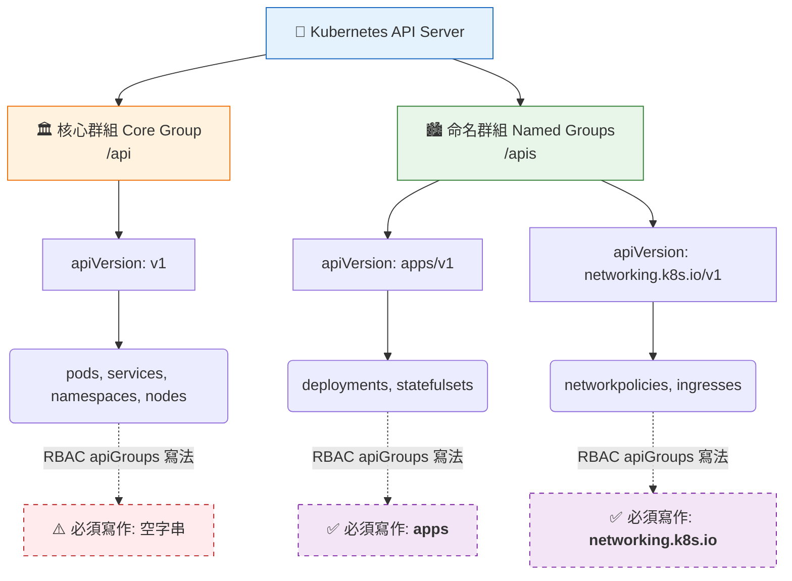

# 補充精華：API Groups 核心差異 (/api vs /apis)

## 📌 核心觀念

Kubernetes 將 API 網址端點分為兩大類：「核心群組 (Core Group)」與為了模組化擴充而生的「命名群組 (Named Groups)」。在 CKA 考場中，精準區分這兩者的歸屬，是撰寫 RBAC (Role/ClusterRole) 權限規則時，正確設定 `apiGroups` 欄位的絕對關鍵。

*   **🏛️ /api (Core Group 核心群組)**：
    *   K8s 最早期、最基礎的元件聚集地（如 Pods, Services, ConfigMaps）。
    *   YAML 的 `apiVersion` 欄位沒有前綴，直接寫版本號（如 `v1`）。
    *   **RBAC 寫法**：`apiGroups` 必須填寫為 `[""]` (空字串)。
*   **🏙️ /apis (Named Groups 命名群組)**：
    *   為解決系統臃腫設計的模組化群組（如網路 `networking.k8s.io`、應用程式 `apps`）。
    *   YAML 的 `apiVersion` 包含群組與版本號（如 `apps/v1`）。
    *   **RBAC 寫法**：`apiGroups` 必須精準填入斜線前方的群組名稱（如 `["apps"]`）。

## 📊 路由分類與 RBAC 映射關係圖



## 💻 必考實戰指令

> [!WARNING]
> **講師重點提醒**：考場上不要浪費大腦記憶體去背誦資源屬於哪個 Group，這一個指令就是你的神兵利器！

```bash
# 1️⃣ 考場唯一神指令：列出所有資源及其所屬的 API Group (查看 APIGROUP 這一欄)
# 如果 APIGROUP 是空的，RBAC 就寫 [""]；如果有字 (如 apps)，RBAC 就照抄。
kubectl api-resources

# 2️⃣ 忘記 Ingress 屬於哪個 API Group 怎麼辦？搭配 grep 秒殺
kubectl api-resources | grep ingress

# 3️⃣ 利用 Imperative Command 自動產出正確的 API Group 寫法
# 建立操作 pods (Core Group) 的 Role，觀察產出的 YAML
kubectl create role pod-reader --verb=get,list --resource=pods --dry-run=client -o yaml

# 建立操作 deployments (Named Group) 的 Role，觀察產出的 YAML
kubectl create role deploy-reader --verb=get,list --resource=deployments --dry-run=client -o yaml
```

## 🛡️ 實戰與最佳實踐 SOP

> [!IMPORTANT]
> **自作聰明的 Core (避坑指南)**：
> 很多考生在寫 Core Group 的權限時，會直覺地把 `apiGroups` 寫成 `["core"]` 或 `["v1"]`。這會讓評分系統直接判定權限無效！請死記：核心資源的 API Group 就是**空字串 `[""]`**。

> [!TIP]
> **Troubleshooting SOP：RBAC 權限被拒絕 (Forbidden)**
> 設定完 RoleBinding 後，執行 `kubectl get deployments` 卻顯示 Forbidden？
> 1. 立即使用 `kubectl auth can-i get deployments --as=system:serviceaccount:<namespace>:<sa-name>` 確認權限狀態。
> 2. 如果顯示 `no`，請打開你的 Role YAML 檔。
> 3. 執行 `kubectl api-resources | grep deployments`，比對輸出結果的 `APIGROUP` (`apps`)，是否與你 YAML 中 `rules.apiGroups` 的設定完全一模一樣。大小寫與拼字錯誤是發生 Forbidden 最常見的原因。

## 📝 YAML 骨架

考題要求建立一個 Role，允許**同時操作 `pods` 與 `deployments`** 的標準寫法：
（因為它們屬於不同的 API Groups，必須拆分成兩個不同的 `rules` 區塊，千萬不能混在同一個清單裡）

```yaml
apiVersion: rbac.authorization.k8s.io/v1
kind: Role
metadata:
  namespace: default
  name: multi-resource-manager
rules:
- apiGroups: [""]           # ⚠️ Pods 屬於 Core Group，必須獨立出來寫空字串
  resources: ["pods"]
  verbs: ["get", "list"]
- apiGroups: ["apps"]       # ⚠️ Deployments 屬於 Named Group (apps)
  resources: ["deployments"]
  verbs: ["get", "list"]
```

## 🧠 自我測驗

<details>
<summary><b>1. 當資源屬於 Core Group 時，我們在撰寫 YAML 建立該資源時（例如建立一個 Pod），它的 `apiVersion` 應該怎麼寫？</b></summary>
解答：直接寫 `v1` 即可（不需帶有群組前綴）。
</details>

<details>
<summary><b>2. 在 RBAC 的 Role 設定中，如果把 Core Group 的 `apiGroups` 誤寫成了 `["core"]`，`kubectl apply` 時會報錯嗎？</b></summary>
解答：不會報錯。`kubectl apply` 依舊會成功套用，但因為 API Server 內部並沒有名為 "core" 的 group，導致權限配對失敗，使用者在操作資源時依然會得到 403 Forbidden 拒絕存取。
</details>

<details>
<summary><b>3. 如果考題要求你將 `secrets` 與 `statefulsets` 放進同一個 Role 中授權，你可以在 `rules` 下只寫一個 `- apiGroups: ["", "apps"]` 然後 `resources: ["secrets", "statefulsets"]` 嗎？</b></summary>
解答：語法上不會報錯，但**邏輯是危險且錯誤的**。這會導致授予了交叉的多餘權限。正確的做法是將它們乾淨地拆分成兩個獨立的 `- apiGroups` 陣列區塊。
</details>
