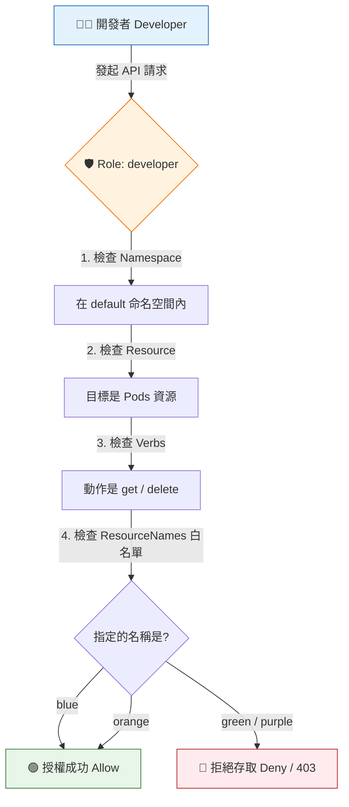

# Role Based Access Controls (角色基礎存取控制)

## 📌 核心觀念

將 RBAC 中的 `resourceNames` 想像成是**「VIP 專屬通行證上的白名單」**：
平常我們發放通行證（Role），通常是允許某人進入整個房間（例如 Namespace 下的「所有」Pods）。但為了實施「最小權限原則」，我們有時只希望他能觸碰房間裡的「特定幾張桌子」（特定的 Pod 實體，如 blue 與 orange）。這時我們就會在通行證上加註 `resourceNames` 白名單，將權限精確縮小到單一或多個指定的資源實體上。

*   **定義**：`resourceNames` 是一個字串陣列，用於 RBAC 規則中，將權限範圍從「整個資源集合」精準限縮到「指定名稱的資源實體」。
*   **與 Namespace 的差異**：
    *   `Namespace`：定義在 Role 的 `metadata.namespace` 裡，決定這個 Role 管轄哪個空間（房間）。
    *   `ResourceNames`：定義在 Role 的 `rules` 裡，決定這個 Role 能碰觸該空間內的哪些具體物件（桌子）。
*   **底層限制 (致命細節)**：
    *   **不支援 list 操作**：列出資源（List）是對整個集合的操作。如果在 `verbs` 寫了 `list` 且設定了 `resourceNames`，這個 list 權限將毫無作用，K8s 難以只 list 出特定名稱的資源。
    *   **不支援 create 操作**：無法透過名稱限制 `create`，因為在 API 授權當下，物件尚未建立，K8s 無法提前攔截名稱。通常搭配 `get`, `update`, `patch`, `delete` 使用。

## 📊 資源名稱過濾邏輯流程圖



## 💻 必考實戰指令

> [!WARNING]
> **講師重點提醒**：考場上遇到綁定特定名稱資源的題目，直接用指令加上 `--resource-name` 參數，能幫你省下大量手寫 YAML 及排錯的時間！

```bash
# 1️⃣ 考場神指令：直接建立一個只允許 get 和 delete "blue" 與 "orange" Pod 的 Role
kubectl create role developer \
  --verb=get,delete \
  --resource=pods \
  --resource-name=blue \
  --resource-name=orange \
  --dry-run=client -o yaml > developer-role.yaml

# 2️⃣ 查看產出的 YAML 確認欄位結構
cat developer-role.yaml

# 3️⃣ 考場驗證神技：驗證能否對「特定名稱」的資源執行動作
# 注意這裡資源名稱的寫法是 "pods/blue"
kubectl auth can-i delete pods/blue --as=system:serviceaccount:default:dev-sa
```

## 🛡️ 實戰與最佳實踐 SOP

> [!IMPORTANT]
> **YAML 撰寫陷阱 (避坑指南)**：
> 1. **大小寫與拼字**：欄位名稱是 `resourceNames`（大寫 N，且結尾有 s）。不小心寫成 `resourceName` 會導致 `kubectl apply` 報錯。
> 2. **必須是陣列格式**：它必須是一個陣列格式 `["name1", "name2"]`。即使只有一個資源，也必須寫成 `["database-config"]`。

> [!TIP]
> **Troubleshooting SOP：為什麼能 `get pod blue`，卻無法 `get pods`？**
> 如果套用了含有 `resourceNames` 的 RoleBinding，使用者反映下達 `kubectl get pods` 會跳出 Forbidden，這是完全正常的！
> **排查方向**：因為 `kubectl get pods` 底層呼叫的是 `list` 操作，而 `resourceNames` 不支援 list。使用者必須精確下達 `kubectl get pod blue`（單體 get 操作）才能通過授權。

## 📝 YAML 骨架

展示使用 `resourceNames` 白名單的精準 Role 寫法：

```yaml
apiVersion: rbac.authorization.k8s.io/v1
kind: Role
metadata:
  namespace: default
  name: config-editor
rules:
- apiGroups: [""]
  resources: ["configmaps"]
  resourceNames: ["database-config"]  # ⚠️ 精準限縮：只允許操作這個 ConfigMap
  verbs: ["get", "update", "patch"]   # ⚠️ 注意：不應包含 list 或 create
```

## 🧠 自我測驗

<details>
<summary><b>1. 若在 Role 中配置了 `resourceNames: ["nginx"]` 且 verbs 包含 `["list", "get"]`，當使用者執行 `kubectl get pods` (列出所有 Pod) 時會發生什麼事？</b></summary>
解答：會被拒絕 (Forbidden)。因為 `kubectl get pods` 底層是 `list` 操作，而 `resourceNames` 無法作用於 list，因此使用者不具備 list 整個集合的權限。
</details>

<details>
<summary><b>2. 在使用 `kubectl create role` 指令時，要如何指定特定資源的名稱？</b></summary>
解答：使用 `--resource-name` 參數，例如 `--resource-name=blue`。若有多個資源需要指定，可重複使用該參數。
</details>

<details>
<summary><b>3. 考題要求你寫一個 Role 來限制只能建立名叫 `special-pod` 的 Pod，這在 K8s 中可行嗎？</b></summary>
解答：不可行。`resourceNames` 無法用於限制 `create` 操作，因為在 API 授權階段物件尚未建立，無法透過名稱攔截。此類需求需透過 Admission Controllers（如 OPA Gatekeeper）來達成。
</details>
