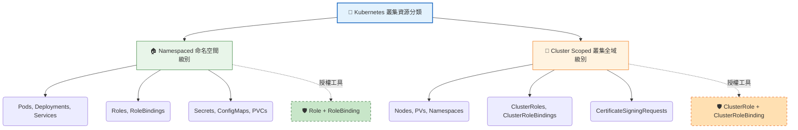

# Cluster Roles (叢集角色)

## 📌 核心觀念

Kubernetes 的資源嚴格分為「命名空間級別 (Namespaced)」與「叢集全域級別 (Cluster Scoped)」。
可以把 Namespaced 想像成「個別部門的專屬財產」（如行銷部的印表機 Pod），而 Cluster Scoped 則是「整棟公司的基礎設施」（如大樓的電梯 Node、公用水塔 PV）。`ClusterRole` 就是專門發放給警衛或總管的「全域通用鑰匙」，用來授權存取大樓的基礎設施，或者讓他能一鍵巡視所有部門的狀況。

*   **資源的兩大分類**：
    *   **Namespaced (區域)**：資源必須存在於特定的 Namespace 中（如 Pods, Deployments, Secrets）。
    *   **Cluster Scoped (全域)**：資源屬於整個叢集，不依附於任何 Namespace（如 Nodes, PersistentVolumes, Namespaces 本身）。
*   **ClusterRole 的三大應用情境**：
    1.  **管理全域資源**：讀寫 Nodes, PVs, Namespaces 等。
    2.  **管理非資源型 API**：授權存取 API Server 的底層健康檢查端點（如 `/healthz`）。
    3.  **跨命名空間授權**：賦予管理員一鍵查看叢集內「所有」命名空間中特定資源的權限（例如查看所有 Pods）。
*   **綁定機制的連鎖反應 (特殊用法)**：
    *   `ClusterRole + ClusterRoleBinding` = 權限作用於整個叢集 (所有 Namespaces)。
    *   `ClusterRole + RoleBinding` = **權限降級**！這會讓 ClusterRole 的權限被限縮在該 RoleBinding 所在的單一 Namespace 中（常用於多個 Namespace 想共用同一份角色定義，避免重複撰寫相同的 Role）。

## 📊 叢集資源分類與授權映射圖



## 💻 必考實戰指令

> [!WARNING]
> **講師重點提醒**：考場上如果分不清某個資源到底是 Namespaced 還是 Cluster Scoped，請立刻使用 `--namespaced` 參數進行過濾！

```bash
# 1️⃣ 考場神指令：過濾出所有「不屬於」Namespace 的全域資源 (Cluster Scoped)
kubectl api-resources --namespaced=false

# 2️⃣ 過濾出所有「屬於」Namespace 的區域資源 (Namespaced)
kubectl api-resources --namespaced=true

# 3️⃣ 快速建立一個具有讀取 Nodes 權限的 ClusterRole
kubectl create clusterrole node-reader --verb=get,list,watch --resource=nodes

# 4️⃣ 將上述的 ClusterRole 綁定給使用者 john (使其成為叢集級別生效)
kubectl create clusterrolebinding node-reader-binding \
  --clusterrole=node-reader \
  --user=john
```

## 🛡️ 實戰與最佳實踐 SOP

> [!IMPORTANT]
> **無效的 Namespace 參數 (避坑指南)**：
> 在建立 ClusterRole 或是 ClusterRoleBinding 時，千萬不要加上 `-n` 或 `--namespace` 參數！它們是全域資源，加上 Namespace 參數會導致指令報錯，或者在 YAML 中寫了 `metadata.namespace` 也會被 API Server 直接忽略。

> [!TIP]
> **Troubleshooting SOP：PV 或 Node 權限不生效？**
> 情境題：考題要求你建立權限讓某個 SA 可以刪除 PersistentVolumes (PVs)。
> **排查方向**：
> 1. 敏銳察覺 PV 是 Cluster Scoped 資源。
> 2. 如果你用 `Role` 與 `RoleBinding` 去解題，權限絕對不會生效。
> 3. 必須使用 `ClusterRole` 與 `ClusterRoleBinding` 組合。若仍有問題，請執行 `kubectl auth can-i delete pv --as=<user>` 驗證綁定名稱是否有拼寫錯誤。

## 📝 YAML 骨架

標準的 ClusterRole 與 ClusterRoleBinding 組合：

```yaml
---
apiVersion: rbac.authorization.k8s.io/v1
kind: ClusterRole
metadata:
  name: node-reader
  # ⚠️ 注意：這裡絕對不能出現 namespace 欄位
rules:
- apiGroups: [""]
  resources: ["nodes"]
  verbs: ["get", "list", "watch"]

---
apiVersion: rbac.authorization.k8s.io/v1
kind: ClusterRoleBinding
metadata:
  name: read-nodes-global
  # ⚠️ 注意：這裡絕對不能出現 namespace 欄位
subjects:
- kind: User
  name: john
  apiGroup: rbac.authorization.k8s.io
roleRef:
  kind: ClusterRole
  name: node-reader
  apiGroup: rbac.authorization.k8s.io
```

## 🧠 自我測驗

<details>
<summary><b>1. 考場上如果忘記 `PersistentVolume` (PV) 是否有 Namespace 的限制，該用什麼指令快速查詢？</b></summary>
解答：執行 `kubectl api-resources | grep persistentvolumes` 觀察 NAMESPACED 欄位是 true 還是 false。或者直接下 `kubectl api-resources --namespaced=false` 看它有沒有在輸出的全域資源名單內。
</details>

<details>
<summary><b>2. 將一個 `ClusterRole` 透過普通的 `RoleBinding` 綁定給使用者，會發生什麼事？</b></summary>
解答：這是被允許的合法操作。這會讓該 ClusterRole 的權限發生「降級」，該使用者只能在 `RoleBinding` 所在的那個 Namespace 內行使這些權限，而無法跨命名空間操作。
</details>

<details>
<summary><b>3. 在撰寫 `ClusterRoleBinding` 的 YAML 時，如果在 metadata 下方加上了 `namespace: default`，會導致套用失敗嗎？</b></summary>
解答：不一定會報錯失敗，但 Kubernetes API Server 會直接忽略這個 `namespace` 欄位，因為 ClusterRoleBinding 是全域資源，不受 Namespace 限制。但在考場上寫出這個欄位顯示觀念不清楚，應極力避免。
</details>
