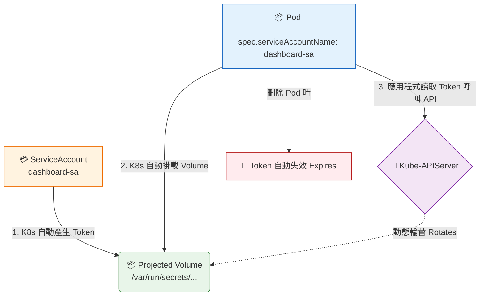

# Service Accounts (服務帳戶)

## 📌 核心觀念

將 Service Account (SA) 想像成是發給 Kubernetes 內部應用程式的**「專屬工作證」**：
平常我們（人類管理員）會拿著 KubeConfig（憑證）對 K8s 下指令；而當 Pod 內部的應用程式需要跟 Kube-APIServer 溝通時（例如 Dashboard 需要讀取叢集狀態），它就需要這張專屬工作證（Service Account）。結合 RBAC 權限設定，我們可以限制這張工作證只能讀取特定的資源，實現叢集內部的安全權限隔離。

*   **內部身分憑證**：發給 K8s 內部應用程式（Pod）使用的專屬身分，用以與 Kube-APIServer 安全溝通。
*   **預設行為**：每個 Namespace 預設都會有一個名為 `default` 的 Service Account。若建立 Pod 時未指定，K8s 會自動掛載這個 `default` SA。
*   **Token 生命週期與自動掛載**：
    *   K8s 透過 Projected Volume 機制，將 Token 自動注入容器內的檔案系統（`/var/run/secrets/kubernetes.io/serviceaccount` 路徑下）。
    *   系統會在背景動態輪替 (Rotates) Token 以維持高安全性。
    *   當 Pod 被刪除時，該次掛載的 Token 也會隨之自動失效 (Expires)。

## 📊 Token 自動掛載與生命週期



## 💻 必考實戰指令

> [!WARNING]
> **講師重點提醒**：在考場上能少寫一行 YAML 就是賺到，善用 `kubectl set` 或是 `--dry-run` 來產出與修改設定檔。

```bash
# 1️⃣ 建立一個新的 Service Account (縮寫為 sa)
kubectl create sa dashboard-sa

# 2️⃣ 查看叢集內的 SA 列表
kubectl get sa

# 3️⃣ 考場必備：建立 Deployment 並直接綁定 SA (不用手寫 YAML)
kubectl create deployment my-deploy --image=nginx --dry-run=client -o yaml > deploy.yaml
# 直接使用 kubectl set 修改 YAML 檔案內的 serviceaccount 設定
kubectl set serviceaccount -f deploy.yaml dashboard-sa --local -o yaml > final-deploy.yaml
kubectl apply -f final-deploy.yaml

# 4️⃣ 1.24+ 版本救命指令：手動生成 SA 的短期 Token (用於解題或 Debug)
kubectl create token dashboard-sa
```

## 🛡️ 實戰與最佳實踐 SOP

> [!CAUTION]
> **Pod 欄位不可變陷阱 (致命細節)**：
> Pod 的 `serviceAccountName` 欄位是**不可變的 (Immutable)**。一旦 Pod 建立並運行，絕對無法透過 `kubectl edit pod` 去修改它的 SA。
> **正確修改 SOP**：
> 1. `kubectl get pod <name> -o yaml > pod.yaml` 匯出備份
> 2. `kubectl delete pod <name> --force` (強制刪除原 Pod)
> 3. 用 vim 修改 `pod.yaml` 內的 `spec.serviceAccountName`。
> 4. `kubectl apply -f pod.yaml` 重新建立。

> [!IMPORTANT]
> **欄位拼寫陷阱**：
> 在 YAML 中，綁定的欄位名稱是 `serviceAccountName`（駝峰式命名，大寫 A 和 N）。很多學員在考場緊張會寫成 `serviceAccount` 導致報錯無法運行。

> [!TIP]
> **Troubleshooting SOP：應用程式無法連線 K8s API？**
> 1. 執行 `kubectl get pod <pod-name> -o yaml`，往下滑找到 `volumes:` 區塊。
> 2. 檢查 K8s 是否有成功為這個 Pod 掛載 `kube-api-access` 開頭的 projected volume。
> 3. 如果沒有，請檢查該 Pod 配置是否有人誤設了 `automountServiceAccountToken: false`。

## 📝 YAML 骨架

展示如何在 Pod 結構中綁定自訂的 Service Account：

```yaml
apiVersion: v1
kind: Pod
metadata:
  name: my-dashboard-pod
spec:
  serviceAccountName: dashboard-sa  # ⚠️ 必考：駝峰式命名，大寫 A 和 N
  containers:
  - name: dashboard
    image: my-dashboard-app:v1
```

## 🧠 自我測驗

<details>
<summary><b>1. 如果你在建立 Pod 時忘記在 YAML 中指定 `serviceAccountName`，會發生什麼事？</b></summary>
解答：K8s 會自動將該 Pod 所在 Namespace 的預設 Service Account（名稱就叫 `default`）掛載給這個 Pod。
</details>

<details>
<summary><b>2. 考場情境：有一個正在運行的 Pod，其 SA 被設定錯誤導致沒有權限，你嘗試下達 `kubectl edit pod` 修改 SA 卻發現無法存檔。為什麼？該如何正確解決？</b></summary>
解答：因為 Pod 的 `serviceAccountName` 屬於 Immutable（不可變）欄位，建立後無法熱更新。解決方法是先將該 Pod 的 YAML 匯出，強制刪除原 Pod，修改 YAML 中的欄位後，再重新套用建立新 Pod。
</details>

<details>
<summary><b>3. 考題要求你獲取某個 SA 產生的 Token 內容以供外部系統測試，在 K8s 1.24+ 版本中，最快獲取 Token 的指令是什麼？</b></summary>
解答：執行 `kubectl create token <sa-name>` 即可立刻在終端機輸出一個動態生成的短期安全 Token。
</details>
