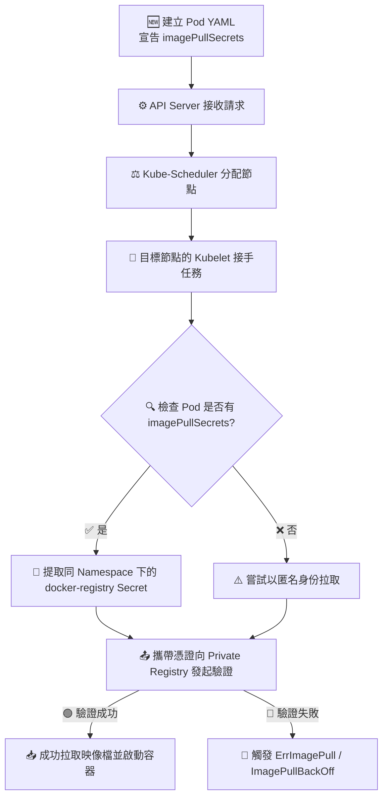

# Image Security (映像檔安全)

## 📌 核心觀念

將 Image Security 的運作想像成**「為送貨員準備的專屬通行證」**：
當你要從「私人金庫（私有映像檔庫，Private Registry）」提領貨物（映像檔）時，如果你不給送貨員（Kubelet）通行證密碼，他就會被擋在門外無法提貨。因此，我們必須把帳號密碼封裝成一個特殊的信封（`docker-registry` 類型的 Secret），並在送貨單（Pod YAML 中的 `imagePullSecrets`）上註明信封的名稱，Kubelet 就能拿著它順利把貨提回來。

*   **核心目標**：透過 Kubernetes 的 Secret 安全地儲存並傳遞帳號密碼給 Kubelet，確保 Kubelet 擁有合法授權，能夠為 Pod 拉取受保護的容器映像檔。
*   **關鍵元件**：必須建立一個類型為 `kubernetes.io/dockerconfigjson` (使用 `kubectl` 建立時類型為 `docker-registry`) 的 Secret。
*   **底層運作機制**：Kubelet 在建立容器前會讀取 Pod spec 中的 `imagePullSecrets`，並將解碼後的憑證資訊轉化為 `.docker/config.json` 格式，與遠端 Registry 進行登入交握。
*   **命名空間限制**：Secret 屬於 Namespace 級別資源，Pod 只能參照「同一個」Namespace 下的 Secret。

## 📊 私有庫拉取驗證生命週期



## 💻 必考實戰指令

> [!WARNING]
> **講師重點提醒**：考場上這題千萬不要手寫 YAML 去建立 Secret，請務必使用 Imperative Command 一行指令搞定！

```bash
# 1️⃣ 考場快速建立 Docker Registry Secret (將參數替換為題目提供的值)
kubectl create secret docker-registry my-registry-secret \
  --docker-server=private-registry.io \
  --docker-username=cka-user \
  --docker-password=supersecret \
  --docker-email=cka-user@example.com

# 2️⃣ 考場快速生成 Pod YAML，準備手動掛載 Secret
kubectl run private-pod --image=private-registry.io/my-app:v1 --dry-run=client -o yaml > pod.yaml

# 3️⃣ 編輯 pod.yaml，加入 imagePullSecrets (注意縮排位置)
# ...請參考下方 YAML 骨架...
```

## 🛡️ 實戰與最佳實踐 SOP

> [!IMPORTANT]
> **YAML 縮排與格式致命陷阱 (避坑指南)**：
> 1. **縮排層級錯誤**：`imagePullSecrets` 是屬於 `spec` 層級的屬性，必須與 `containers` **齊平**！無數考生在考場上把它縮排寫在 `containers` 裡面，導致 API Server 報錯無法 Apply。
> 2. **陣列格式遺漏**：`imagePullSecrets` 接受的是一個陣列（List），所以底下的 `- name: <secret名稱>` 前面一定要有減號 `-`。

> [!TIP]
> **Troubleshooting SOP：Pod 卡在 ImagePullBackOff？**
> 第一反應立刻敲指令：`kubectl describe pod <pod-name>`，滑到最下方的 **Events** 區塊看具體報錯：
> - **`pull access denied` 或 `unauthorized`**：代表 Secret 沒掛載成功、忘記寫 `imagePullSecrets`，或是 Secret 內的帳號密碼根本打錯了。
> - **`rpc error: code = Unknown` 或 `not found`**：代表 Registry URL 拼錯，或是私有庫裡根本沒有這個 image tag，也可能是 Pod 內的 `image` 欄位沒有寫完整網址（導致 Kubelet 預設跑去 Docker Hub 找了）。

## 📝 YAML 骨架

標準掛載私有映像檔 Secret 的 Pod YAML：

```yaml
apiVersion: v1
kind: Pod
metadata:
  name: private-pod
spec:
  containers:
  - name: private-pod
    image: private-registry.io/my-app:v1 # ⚠️ 必須寫上完整的 Registry 網址
  imagePullSecrets:              # ⚠️ 注意縮排：必須與 containers 同層級
  - name: my-registry-secret     # ⚠️ 注意格式：必須是陣列格式 (有減號)
```

## 🧠 自我測驗

<details>
<summary><b>1. 考題要求你從自建的 Registry 抓取 Image，你用 Imperative Command 建立了 Secret，在指令中這種類型的 Secret 稱為什麼？</b></summary>
解答：在建立指令中稱為 `docker-registry`（即 `kubectl create secret docker-registry...`）。其在 K8s 底層產生的資源類型實際上是 `kubernetes.io/dockerconfigjson`。
</details>

<details>
<summary><b>2. 如果有多個 Pod 都需要從同一個 Private Registry 拉取映像檔，有沒有比每個 Pod YAML 都寫一次 `imagePullSecrets` 更方便的做法？</b></summary>
解答：有的。實務上更常見的做法是，將這個 `docker-registry` 類型的 Secret 綁定到該 Namespace 的 `ServiceAccount` 上。這樣一來，所有使用該 SA 的 Pod 就會自動具備拉取該私有庫的權限，不需在每個 Pod YAML 內重複宣告。
</details>

<details>
<summary><b>3. 考場情境：你設定好了一切，但 Pod 一直卡在 ErrImagePull。你用 `describe pod` 查看 Events 發現錯誤是 `not found`，這通常代表什麼問題？</b></summary>
解答：這通常代表驗證已通過（否則會報 `unauthorized`），但是 Kubelet 在該 Registry 找不到你指定的 Image。最常見的原因是 `image` 欄位的網址或 Tag 拼錯了，或者是忘記寫完整的 Registry URL 導致 Kubelet 跑去預設的 Docker Hub 尋找。
</details>
