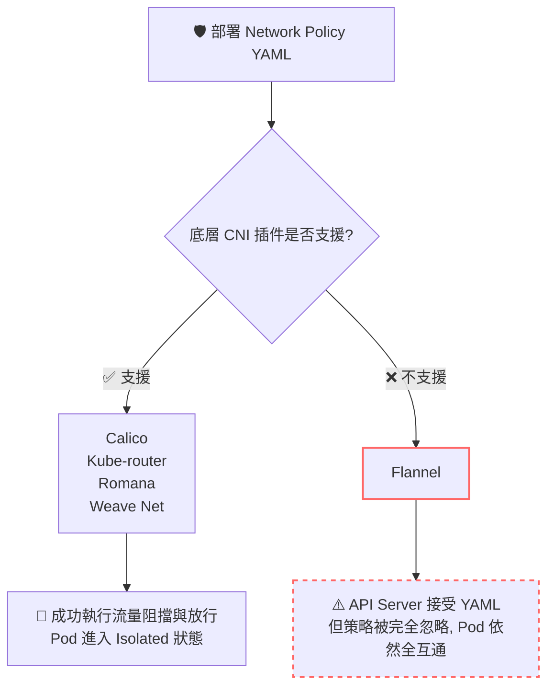

# 179. Network Policy (網路策略)

## 1. 🏷️ 課程定位
- **章節編號與名稱：** 第 7 節：Security (安全)
- **影片標題：** 179. Network Policy (網路策略)

## 2. 📌 核心概念摘要
Network Policy（網路策略） 相當於 Kubernetes 叢集內的「分散式虛擬防火牆」，用於控制 Pod 之間的 Ingress (流入) 與 Egress (流出) 流量。然而，Kubernetes 本身不負責實作這個防火牆機制，它完全依賴底層的 CNI (Container Network Interface) 網路插件來執行，若選錯 CNI，你的安全策略將形同虛設。

## 3. 📊 流程圖與視覺化重現
根據您截圖的重點，我們用架構圖來釐清 Network Policy 與 CNI 插件之間的生死依存關係：



## 4. 🔑 知識點擷取 (Detailed Notes)
- **預設行為 (Default Non-isolated)：** 在未套用任何 Network Policy 之前，Kubernetes 叢集內的所有 Pod 預設都是全互通的（可以接收來自任何地方的流量）。

- **觸發隔離 (Isolation Trigger)：** 一旦某個 Pod 被 Network Policy 的 `podSelector` 選中，它就會立刻變成 Isolated (隔離) 狀態。此時，除了 Policy 中明確 Allow 的流量外，其餘流量會被全數 Deny。

- **致命限制條件 (CNI Limitations)：**
  - 這正是截圖的考點：如果你在叢集中使用了 **Flannel** 作為網路套件，你可以成功 `kubectl apply` 一個 Network Policy（不會跳錯），但它絕對不會生效。
  - 要讓 Network Policy 運作，必須依賴如 Calico 或 Kube-router 這種具備完整路由與防火牆管控能力的進階 CNI 解決方案。

## 5. 💻 CKA 必備實作指令 (Imperative Commands)
在 Kubernetes 中，Network Policy 沒有直接好用的 `kubectl create networkpolicy` 快捷指令。考場上最快的做法是「善用文件複製」或「透過 explain 查閱結構」。

```bash
# 💡 CKA 考試技巧：查詢叢集中現有的 Network Policy
kubectl get netpol -A

# 💡 考場救命指令：當你忘記 YAML 結構，又不想查網頁文件時，可以直接用 explain 看架構
kubectl explain networkpolicy.spec.ingress

# 💡 網路測試神器：在考場上驗證 Policy 是否生效，開一個暫時的 busybox 敲 wget 測試
# --rm 代表退出後立刻刪除，不留垃圾；--timeout=3 避免考場卡死
kubectl run test-pod --image=busybox:1.28 --rm -it -- wget --spider --timeout=3 http://<target-pod-ip>
```

## 6. 🚀 CKA 考試延伸與 Troubleshooting
### 🎯 考試情境預測：
- **必考題型：** 題目會要求你在特定的 Namespace (e.g., `internal`) 建立一個 Network Policy，規定只有帶有標籤 `role=api-gateway` 的 Pod 可以透過 Port 8080 存取帶有標籤 `role=db` 的 Pod，其餘流量一律阻斷。考驗你對 `namespaceSelector` 與 `podSelector` 的掌握度。

### 🛑 避坑指南 (YAML 陣列邏輯陷阱)：
在定義 `ingress.from` 時，「橫槓 `-` 的位置決定了是 AND 還是 OR」：
- 如果 `namespaceSelector` 和 `podSelector` 寫在 **同一個** `-` 之下，代表「必須同時符合這兩個條件」(AND)。
- 如果它們寫在 **不同的** `-` 之下，代表「符合其中一個條件即可」(OR)。這是考生最常死的不冤枉的坑！

### 🔧 Troubleshooting：
- **Policy 沒生效？ 先確認兩件事：**
  1. 用 `kubectl describe netpol <name>` 檢查 PodSelector 是否真的有選中目標 Pod。
  2. 回想這張截圖的重點：檢查叢集到底是用哪套 CNI！如果考場環境是 Flannel，那你可能搞錯了題目的要求，或是題目本身就是個陷阱題。
