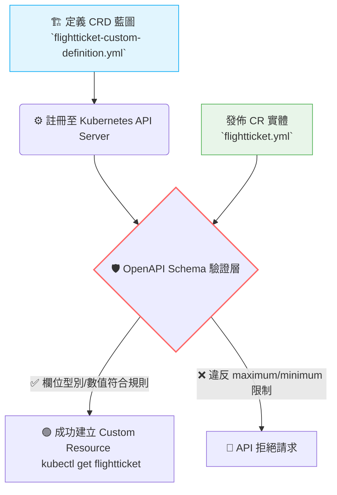

# 184. (2025 Updates) Custorm Resource Definition (CRD)

## 1. 🏷️ 課程定位
- **章節編號與名稱：** 第 7 節：Security (附屬進階主題 / 2025 Updates)
- **影片標題：** 184. (2025 Updates)Custorm Resource Definition (CRD)

## 2. 📌 核心概念摘要
Custom Resource Definition (CRD) 是 Kubernetes 賦予使用者的「API 擴充能力」。它允許你建立原生的 Kubernetes 所沒有的資源類型（例如截圖中的 `FlightTicket`），讓你可以像管理 Pod 或 Service 一樣，使用 `kubectl` 來管理專屬於你業務邏輯的物件與狀態。

## 3. 📊 流程圖與視覺化重現
根據截圖中的 YAML 與終端機指令邏輯，我們將 CRD 的運作機制視覺化如下：



## 4. 🔑 知識點擷取 (Detailed Notes)
根據截圖中左右兩側的 YAML 對照，以下是必須掌握的底層解析：

- **CRD (藍圖) vs. CR (實體)：**
  - **CRD (CustomResourceDefinition)：** 右側的 YAML。用於向 API Server 註冊新的 kind (如 `FlightTicket`)、版本 (`v1`)、以及自定義縮寫 (`shortNames: ft`)。
  - **CR (Custom Resource)：** 左上角的 YAML。這是基於 CRD 建立出來的實際資料物件。其 `apiVersion` 必須與 CRD 定義的 API 群組匹配（如 `flights.com/v1`）。

- **結構化驗證 (`openAPIV3Schema`)：**
  這是 CRD 最核心的防護機制。它透過定義 `properties` 來強制規範 CR 實體的欄位格式。
  - **型別限制：** 例如規定 `from` 必須是 `string`，`number` 必須是 `integer`。
  - **範圍限制：** 例如設定 `minimum: 1` 與 `maximum: 10`，若使用者建立 CR 時輸入 `number: 15`，API Server 將會直接報錯拒絕。

- **⚠️ 致命限制條件 (Limitations)：**
  在沒有撰寫或部署 Custom Controller (自定義控制器) 的情況下，CRD 僅能做為「資料存儲與驗證」的中心，建立出來的物件只會處於 `Pending` 或靜態狀態（如截圖左下角的 `STATUS: Pending`），不會有任何實際的底層運算邏輯被觸發。

## 5. 💻 CKA 必備實作指令 (Imperative Commands)
在操作 CRD 時，最重要的是善用你定義的 `shortNames` 來加速查詢。

```bash
# 💡 考場技巧：先建立 CRD (藍圖)，才能建立 CR (實體)
kubectl apply -f flightticket-custom-definition.yml
kubectl apply -f flightticket.yml

# 💡 查詢自定義資源 (可以使用全名、複數名或 CRD 中定義的短名稱)
kubectl get flightticket
kubectl get flighttickets
kubectl get ft  # 推薦使用短名稱，節省考場打字時間

# 💡 檢視 CRD 驗證規則是否正確套用
kubectl describe crd flighttickets.flights.com
```

## 6. 🚀 CKA 考試延伸與 Troubleshooting
### 🎯 考試情境預測：
考題可能會提供一個寫好一半的 CRD YAML 與一個 CR YAML，要求你補齊 CRD 中的 `openAPIV3Schema` 區塊，確保某個特定欄位（如 `spec.replicas`）被限制在特定的數值範圍內，並成功部署兩者。

### 🛑 避坑指南 (縮排地獄與層級陷阱)：
- **OpenAPI 結構極深：** YAML 必須嚴格按照 `schema` -> `openAPIV3Schema` -> `type: object` -> `properties` 的層級往下寫。只要縮排錯一個空格，整個 CRD 就會建立失敗。
- **群組名稱不匹配：** 建立 CR 實體時，`apiVersion` 必須是 `[API Group]/[Version]`。如果 CRD 叫做 `flights.com`，你的 CR 就必須寫 `apiVersion: flights.com/v1`，千萬不要寫成預設的 `v1`。

### 🔧 Troubleshooting：
- **如果執行 `kubectl create -f flightticket.yml` 失敗：**
  - 確認錯誤訊息。若是 `the server could not find the requested resource`，代表你的 CRD 根本還沒註冊成功，或是你的 `apiVersion` 拼錯了。
  - 若錯誤訊息包含 `validation failure`，請對照 CRD 的 `openAPIV3Schema`，檢查你輸入的 `number` 是否超出了 `maximum` 限制，或是 `string` 給成了 `integer`。
