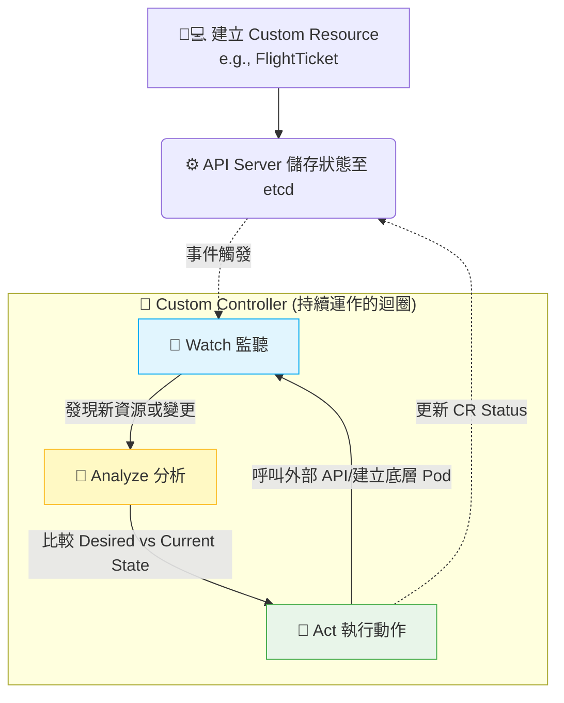

# 186. (2025 Updates) Custom Controllers (自定義控制器)

## 1. 🏷️ 課程定位
- **章節編號與名稱：** 第 7 節：Security (附屬進階主題 / 2025 Updates)
- **影片標題：** 186. (2025 Updates) Custom Controllers (自定義控制器)

## 2. 📌 核心概念摘要
如果說 CRD (自定義資源) 只是定義了資料的「靜態格式」，那麼 Custom Controllers (自定義控制器) 就是賦予這些資料生命力的「運算大腦」。它透過持續監控 (Watch) Kubernetes API，比較「期望狀態 (Desired State)」與「當前狀態 (Current State)」，並主動執行業務邏輯來弭平兩者的差異，這正是 Kubernetes 自動化的核心靈魂。

## 3. 📊 流程圖與視覺化重現
為了讓您秒懂 CRD 與 Controller 之間的合作關係，我們用以下架構圖重現 Kubernetes 的 Reconciliation Loop (調諧迴圈) 機制：



## 4. 🔑 知識點擷取 (Detailed Notes)
- **Control Loop (控制迴圈)：** Controller 是一個永不休止的後台進程 (通常跑在一個 Pod 裡)，它不斷執行 `Watch -> Analyze -> Act` 的循環。

- **與 CRD 的分工合作：**
  - **CRD：** 只負責向 API Server 註冊新的 API 結構與驗證規則。
  - **Controller：** 負責看懂這個結構，並去執行真實的動作（例如：你去建立一個 FlightTicket 的 CR，Controller 偵測到後，去呼叫航空公司的真實 API 幫你訂票）。

- **⚠️ 致命限制條件 (Limitations)：**
  - Controller 本身沒有特權，它與 API Server 溝通時必須具備足夠的 RBAC 權限 (Role/RoleBinding)。如果權限不足，它將無法監聽 (Watch) 或修改 (Update) 你的自定義資源。
  - 單純建立 CRD 不會產生任何實際動作，必須有對應的 Controller 在叢集中運行，狀態才會改變。

## 5. 💻 CKA 必備實作指令 (Imperative Commands)
在 CKA 考試中，通常不會要求你「從頭寫一個 Go 語言的 Controller」（這是開發者的範疇），但絕對會考你如何部署與除錯一個 Controller。

```bash
# 💡 考場技巧：尋找並確認 Controller 是否正常運行
# Controller 通常會作為一個 Deployment 部署在特定的 Namespace 中 (如 kube-system 或自定義的 namespace)
kubectl get pods -n <controller-namespace>

# 💡 考場救命指令：當你的 Custom Resource 狀態一直卡住 (如 pending) 時，第一時間去查 Controller 的日誌！
kubectl logs -f <controller-pod-name> -n <controller-namespace>

# 💡 檢查 Controller 的 ServiceAccount 是否具備足夠權限 (利用 auth can-i 驗證)
kubectl auth can-i create flighttickets --as=system:serviceaccount:<namespace>:<controller-sa-name>
```

## 6. 🚀 CKA 考試延伸與 Troubleshooting
### 🎯 考試情境預測：
- **情境：** 考題提供了一個 CRD 與一個對應的 Controller Deployment YAML。要求你將它們部署起來，並建立一個 CR。
- **考點陷阱：** Controller 啟動後立刻 Crash，或者 CR 建立後沒有任何反應。考驗你是否知道要去看 Controller Pod 的 logs。

### 🛑 避坑指南 (RBAC 權限地獄)：
Controller 運行失敗最常見的原因是 ServiceAccount 權限不足。請務必檢查綁定給 Controller 的 ClusterRole 是否包含了你自定義資源 (如 `flighttickets`) 的 `get, list, watch, create, update, patch, delete` 權限。

### 🔧 Troubleshooting：
- **現象：建立 CR 後，狀態 (Status) 毫無變化。**
  - **解法 3 步驟：**
    1. 執行 `kubectl get pods` 確定 Controller Pod 是 Running 狀態。
    2. 執行 `kubectl logs <controller-pod>`，看看是否出現 Forbidden 或 Unauthorized 錯誤（代表 RBAC 沒設定好）。
    3. 如果日誌顯示連線被拒絕，請檢查 Controller 是否無法連到 Kubernetes API，或是被 Network Policy 擋住了。
