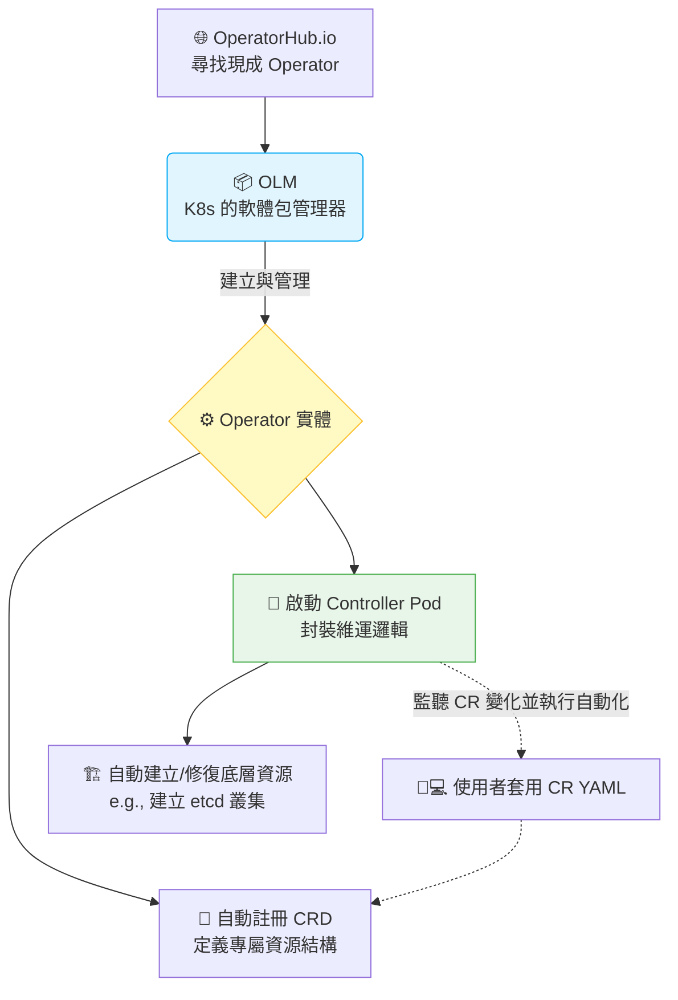

# 187. (2025 Updates) Operator Framework

## 1. 🏷️ 課程定位
- **章節編號與名稱：** 第 7 節：Security (附屬進階主題 / 2025 Updates)
- **影片標題：** 187. (2025 Updates) Operator Framework

## 2. 📌 核心概念摘要
Operator Framework 是一套用來打包、部署和管理 Kubernetes 原生應用的工具包。簡單來說，它就是 **「CRD + Custom Controller + 人類維運經驗」** 的結合體。它能將資深工程師的日常維運知識（如資料庫備份、升級、故障轉移）寫成程式碼，讓 Kubernetes 能夠自動管理那些複雜的有狀態應用（Stateful Applications，如 etcd、Prometheus、資料庫等）。

## 3. 📊 流程圖與視覺化重現
根據您的截圖，實務上我們通常會透過 OLM (Operator Lifecycle Manager) 從 OperatorHub 安裝 Operator，其底層運作架構如下：



## 4. 🔑 知識點擷取 (Detailed Notes)
根據截圖中的安裝步驟，以下是您必須掌握的核心術語與底層概念：

- **OperatorHub：** Kubernetes 的「App Store」。社群與企業會將寫好的 Operator 發佈在這裡供大家下載使用（如截圖中的 etcd operator）。
- **OLM (Operator Lifecycle Manager)：** Kubernetes 的「套件管理員」。要安裝 OperatorHub 上的工具，叢集必須先安裝 OLM，由它來負責解決 Operator 版本的升級、依賴關係與 RBAC 權限設定。

- **CSV (ClusterServiceVersion)：**
  - **定義：** 這是 OLM 引入的一個特殊 CRD。用來記錄某個 Operator 的版本資訊、它需要哪些權限，以及它包含了哪些 CRD。
  - **觸發機制：** 當你執行 `kubectl create -f etcd.yaml` (安裝 Operator) 時，OLM 會解析並生成對應的 CSV，隨後啟動 Operator 的 Controller Pod。

- **⚠️ 限制條件 (Limitations)：**
  Operator 通常被設計為特定 Namespace 級別或 Cluster 級別。截圖中特別註明了 `usable from this namespace only`，這意味著該 Operator 只能監控與管理部署在 `my-etcd` namespace 下的自定義資源。

## 5. 💻 CKA 必備實作指令 (Imperative Commands)
在 CKA 考場中，如果題目已經部署好了 Operator，你必須知道如何檢查它的狀態。截圖中的第三步指令非常關鍵：

```bash
# 💡 檢查 Operator 是否成功安裝與啟動 (查看 CSV 狀態)
# 當 STATUS 顯示為 "Succeeded" 時，代表 Operator 已經準備好接收你的 CR 了
kubectl get csv -n my-etcd

# 💡 考場技巧：查看這個 Operator 到底幫我們註冊了哪些新的 API 資源 (CRD)
kubectl get crd | grep etcd

# 💡 檢查 Operator 的大腦 (Controller Pod) 是否正常運行
kubectl get pods -n my-etcd
```

## 6. 🚀 CKA 考試延伸與 Troubleshooting
### 🎯 考試情境預測：
- **CKA 考試極少要求你從無到有安裝 OLM 或 Operator**（這偏向架構師實務）。
- **常見考法：** 考題環境已經裝好了某個 Operator（例如網路插件 Calico 的 Operator），要求你直接建立一個對應的 Custom Resource (CR) 來觸發特定功能。重點在於考驗你對 CRD 與 YAML 結構的熟悉度。

### 🛑 避坑指南 (Namespace 隔離陷阱)：
許多考生在實務上安裝了 Operator，卻發現建立 CR 後沒有任何反應。最常見的原因是 **Namespace 不匹配**。如果 Operator 被限制在 `my-etcd` 監聽，但你把 CR 建立在 `default` namespace，Controller 是絕對不會理你的。

### 🔧 Troubleshooting：
- **如果 Operator 沒有照預期運作：**
  1. 執行 `kubectl get csv -n <namespace>`，檢查 PHASE 是否卡在 `Pending` 或 `Failed`。
  2. 如果 CSV 正常，但資源沒建立出來，請去抓 Operator Controller Pod 的日誌：`kubectl logs <operator-pod-name> -n <namespace>`，通常能直接看到是否因為 RBAC 權限不足或 CR 的 YAML 寫錯而導致的錯誤。
