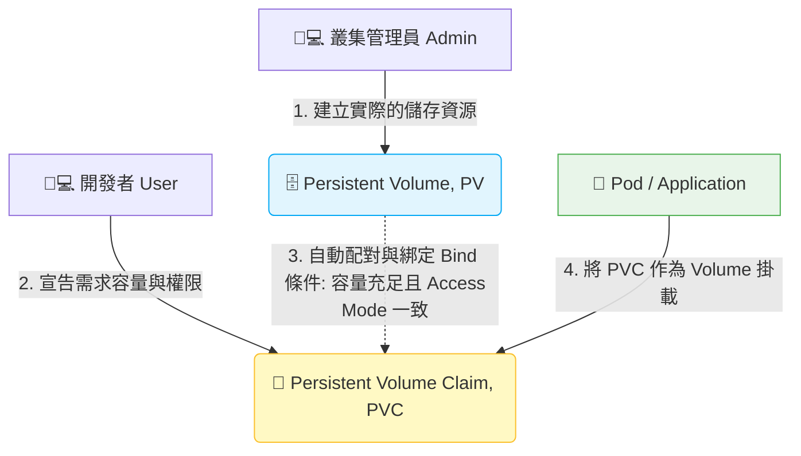

# 188. Storage - Section Introduction (儲存機制 - 章節介紹)

## 1. 🏷️ 課程定位
- **章節編號與名稱：** 第 8 節：Storage (儲存)
- **影片標題：** 188. Storage - Section Introduction (儲存機制 - 章節介紹)

## 2. 📌 核心概念摘要
Kubernetes 預設的容器檔案系統是「短暫的 (Ephemeral)」，Pod 一旦被刪除或重啟，資料就會隨之灰飛煙滅。Storage (儲存) 章節的核心目標，就是學習如何將「資料的生命週期」與「Pod 的生命週期」徹底脫鉤。 透過 PV 與 PVC 的抽象層設計，確保應用程式的資料能夠持久化保存，不受叢集調度或容器崩潰的影響。

## 3. 📊 流程圖與視覺化重現
根據截圖中的課程目標，我們將 Kubernetes 儲存機制的核心物件與綁定流程視覺化如下：



## 4. 🔑 知識點擷取 (Detailed Notes)
根據您截圖中標記的藍色圈圈 (Course Objectives)，以下是您接下來必須掌握的核心物件：

- **Persistent Volumes (PV)：**
  - **定義：** 叢集層級 (Cluster-level) 的儲存資源。它是由管理員預先開好的「實體硬碟空間」（例如 NFS、AWS EBS 或本地端主機路徑 hostPath）。

- **Persistent Volume Claims (PVC)：**
  - **定義：** 命名空間層級 (Namespace-level) 的資源。這是開發者向叢集遞交的「儲存請求單」，用來申請特定大小與存取模式的空間。

- **Access Modes for Volumes (存取模式)：**
  - **限制條件：** 定義了這個 Volume 可以被多少個 Node 掛載以及讀寫權限。最常考的三種：
    - `ReadWriteOnce (RWO)`：只能被「單一 Node」以讀寫模式掛載。
    - `ReadOnlyMany (ROX)`：可以被「多個 Node」以唯讀模式掛載。
    - `ReadWriteMany (RWX)`：可以被「多個 Node」以讀寫模式掛載。

- **Configure Applications with Persistent Storage：**
  - **底層對象變化：** 在 Pod 的 YAML 中，必須先在 `spec.volumes` 宣告使用哪個 PVC，接著在 `spec.containers[].volumeMounts` 指定要將該空間掛載到容器內的哪個目錄（如 `/var/www/html`）。

## 5. 💻 CKA 必備實作指令 (Imperative Commands)
雖然 PV 和 PVC 大多需要透過 YAML 建立，但在考場上，你必須具備快速查修儲存狀態的能力：

```bash
# 💡 考場技巧：快速檢視當前叢集中的 PV 與 PVC 綁定狀態
# 注意 STATUS 欄位，正常應該要是 "Bound"
kubectl get pv,pvc

# 💡 快速查詢特定 PVC 無法綁定 (處於 Pending 狀態) 的原因
kubectl describe pvc <pvc-name>

# 💡 在考場上若忘記 Pod 掛載 PVC 的 YAML 結構，可以用 explain 查詢
kubectl explain pod.spec.volumes.persistentVolumeClaim
```

## 6. 🚀 CKA 考試延伸與 Troubleshooting
### 🎯 考試情境預測：
**100% 必考題型：** 題目會要求你建立一個容量為 1Gi、存取模式為 `ReadWriteOnce`、類型為 `hostPath` (路徑 `/opt/data`) 的 PV。接著要求你建立一個 PVC 去綁定它，最後部署一個 Nginx Pod，將該 PVC 掛載到容器內的 `/usr/share/nginx/html`。這是一條龍的考法，少一個步驟都拿不到分。

### 🛑 避坑指南 (綁定失敗的三大鐵律)：
PVC 建立後一直卡在 `Pending` 怎麼辦？請檢查 PV 與 PVC 的以下三個屬性是否匹配：
1. **Capacity (容量)：** PV 的容量必須 **大於或等於** PVC 請求的容量。
2. **Access Modes (存取模式)：** PV 與 PVC 設定的存取模式必須 **完全一致**。
3. **StorageClassName：** 如果有設定此欄位，兩邊的字串必須一模一樣；若無特別指定，可兩邊都留空（或設為 `""`）。

### 🔧 Troubleshooting：
- **如果 Pod 狀態卡在 ContainerCreating，且執行 `kubectl describe pod` 看到最下方的 Events 顯示 FailedMount 或 volume node affinity conflict：**
  這通常發生在使用 `hostPath` 類型的 PV 時。因為 `hostPath` 是綁死在「特定 Node」上的本地目錄，如果你的 PV 建立在 Node A，但 Kubernetes 把 Pod 排程到了 Node B，Pod 就會因為找不到資料夾而掛載失敗。
