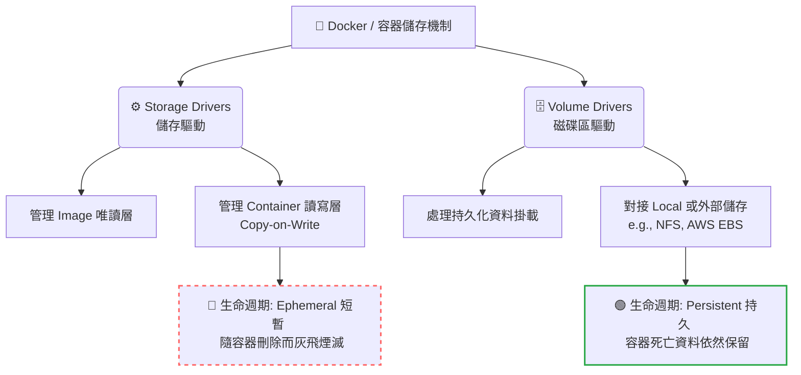

# 189. Docker Storage - Introduction (Docker 儲存機制介紹)

## 1. 🏷️ 課程定位
- **章節編號與名稱：** 第 8 節：Storage (儲存)
- **影片標題：** 189. Docker Storage - Introduction (Docker 儲存機制介紹)

## 2. 📌 核心概念摘要
要精通 Kubernetes 的持久化儲存，必須先理解底層容器引擎（如 Docker 或 containerd）處理資料的兩大核心機制。本節的重點在於區別：「管理容器檔案系統與暫存層」的 **Storage Drivers**，以及「負責資料持久化與外部掛載」的 **Volume Drivers**。搞懂這兩者的職責，你才會明白為什麼容器重啟會導致資料遺失。

## 3. 📊 流程圖與視覺化重現
根據截圖中的兩大區塊，我們將其職責與生命週期視覺化如下：



## 4. 🔑 知識點擷取 (Detailed Notes)
這張簡報看似簡單，但背後隱含了以下實務上的致命邏輯：

- **Storage Drivers (儲存驅動)：**
  - **定義與作用：** 負責將 Image 的層級 (Layers) 與 Container 的可寫層 (Writable Layer) 疊加在一起，組成容器的根目錄檔案系統（例如 `/`）。
  - **常見技術：** `overlay2` (目前最主流)、`aufs`、`btrfs`。
  - **⚠️ 限制條件 (效能陷阱)：** 寫入資料到可寫層時，使用的是 Copy-on-Write (CoW) 機制，這會消耗較多的 CPU 且 I/O 效能極差。**絕對不要**把需要頻繁讀寫的資料（如資料庫檔案）放在這裡。

- **Volume Drivers (磁碟區驅動)：**
  - **定義與作用：** 允許使用者建立「獨立於容器生命週期之外」的儲存空間。資料寫入 Volume 時會繞過 Storage Driver 的 CoW 機制，直接以原生的磁碟 I/O 寫入宿主機或外部設備。
  - **常見技術：** `local` (預設的本地掛載)、或各種第三方儲存插件 (Plugins)。

## 5. 💻 CKA 必備實作指令 (Imperative Commands)
雖然 CKA 考試環境已經全面轉向 containerd，但了解如何在 Node (宿主機) 層級檢查儲存驅動與掛載狀態，是架構師除錯的必備技能：

```bash
# 💡 考場技巧：當 Node 的磁碟空間不足時，檢查底層容器引擎使用的是哪種 Storage Driver 及其佔用的根目錄
# (若考場提供 docker 環境可用)
docker info | grep -i "Storage Driver"

# 💡 檢查 Kubernetes Node 上 kubelet 的根目錄位置 (通常 Storage Driver 會將資料存在這裡)
# 如果這個目錄被塞爆，Pod 會遭到 Evicted (驅逐)
df -h /var/lib/kubelet

# 💡 檢查特定 Pod 是否有使用 Volume (繞過 Storage Driver)
kubectl get pod <pod-name> -o custom-columns="NAME:.metadata.name,VOLUMES:.spec.volumes[*].name"
```

## 6. 🚀 CKA 考試延伸與 Troubleshooting
### 🎯 考試情境預測：
- CKA 不會直接考 Docker 指令，但它會考你這個觀念的延伸：`emptyDir` 與 `hostPath`。
- 題目通常會要求你建一個 Pod 寫入資料，如果你不給它掛載 Volume (這等同於依賴 Volume Drivers)，資料就會寫入 Storage Drivers 層，閱卷腳本一旦重啟你的 Pod 驗證，你這題就直接 0 分。

### 🛑 避坑指南 (容器內的資料遺失)：
新手最常犯的錯，就是啟動了一個 MySQL Pod，卻沒有在 YAML 的 `spec.volumes` 中宣告儲存空間。請記住這張簡報的教訓：**沒有特別宣告 Volume，所有的寫入都在 Storage Driver，容器一掛，資料就沒了。**

### 🔧 Troubleshooting：
- **如果 Node 的狀態出現 `DiskPressure`：**
  - 通常是因為某個 Pod 的應用程式瘋狂寫入 Log 或暫存檔到容器的根目錄下（也就是 Storage Driver 的可寫層被塞爆了）。
  - **解決方法**是找出該 Pod，並透過 Volume 機制將其 Log 導出到外部，或是設定 Resource Limit 來限制它的暫存空間 (`ephemeral-storage`)。
