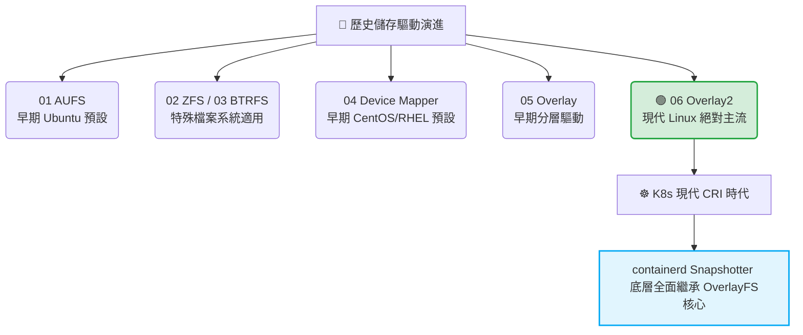

# 190. Storage in Docker (Docker 中的儲存驅動)

## 1. 🏷️ 課程定位
- **章節編號與名稱：** 第 8 節：Storage (儲存)
- **影片標題：** 190. Storage in Docker (Docker 中的儲存驅動)

## 2. 📌 核心概念摘要
本節的核心重點在於剖析 Docker 底層各種 **Storage Drivers（儲存驅動）** 的技術演進。其底層運作目標是透過「聯合檔案系統（Union File System）」與「寫時複製（Copy-on-Write）」機制，將多個唯讀的鏡像層（Image Layers）與一個可寫的容器層（Container Layer）疊加在一起，從而決定容器根目錄檔案系統的 I/O 效能與空間利用率。

## 3. 📊 流程圖與視覺化重現
根據影片中列出的 6 大儲存驅動，我們將其技術演進與現代 Kubernetes（含 containerd 時代）的繼承關係視覺化：



## 4. 🔑 知識點擷取 (Detailed Notes)
- **六大 Storage Drivers 關鍵特性：**
  - **AUFS / Overlay / Overlay2：** 皆屬於聯合檔案系統（UnionFS）。Overlay2 是目前 Linux 核心原生支援最好、頁面快取（Page Cache）共享效率最高、也是生產環境與 CKA 考場環境的預設首選。
  - **Device Mapper：** 基於區塊層級（Block-level）的儲存技術，早期在 RHEL 系列常見，但因效能與記憶體開銷較大，已被現代版本淘汰。
  - **ZFS / BTRFS：** 需要宿主機作業系統本身就格式化為對應的檔案系統，具備強大的快照與池化管理能力，但非通用標準。

- **寫時複製 (Copy-on-Write, CoW) 運作機制：**
  - 當容器內部的進程試圖修改某個屬於鏡像層（唯讀）的檔案時，Storage Driver 會在背景將該檔案複製一份到最上層的容器層（可寫），然後才進行修改。

- **⚠️ 致命限制條件 (Limitations)：**
  - **I/O 效能瓶頸：** 由於 CoW 機制在第一次寫入時需要跨層複製檔案，這會導致顯著的磁碟 I/O 延遲。因此，**任何具有高吞吐量、高併發寫入需求的應用（如資料庫、日誌系統），絕對禁止直接寫在 Storage Driver 負責的容器層中。**

## 5. 💻 CKA 必備實作指令 (Imperative Commands)
雖然目前的 CKA 考場（v1.31+ 之後）已全面移除 Docker 引擎改用 containerd，但底層追蹤磁碟空間的邏輯完全一致。你必須學會如何在 Node 上檢查分層儲存與快照狀態：

```bash
# 💡 CKA 考試除錯技巧：在 Node 層級檢查 containerd 當前使用的快照驅動 (相當於 Storage Driver)
# 通常會看到 overlayfs 
ctr plugins list | grep snapshotter

# 💡 考場實務：當節點磁碟爆滿，快速查詢是哪個容器層 (Writable Layer) 佔用了大量空間
# containerd 預設的儲存根目錄如下
du -h --max-depth=1 /var/lib/containerd/io.containerd.snapshotter.v1.overlayfs/snapshots/

# 💡 快速清理 Node 上殘留、未被任何 Pod 使用的無效鏡像，釋放儲存驅動空間
crictl rmi --prune
```

## 6. 🚀 CKA 考試延伸與 Troubleshooting
### 🎯 考試情境預測：
- 考題不會直接考你「如何切換到 AUFS」，這太偏向運作維護。
- **真實考法（結合故障排除）：** 叢集內某台 Node 出現 `DiskPressure` 警報，導致該節點上的 Pod 瘋狂變成 `Evicted`（被驅逐）狀態。這通常是因為某個寫錯的應用程式，將大量暫存檔直接塞進了容器層（Storage Driver），考驗你定位該 Pod 並將其清除的能力。

### 🛑 避坑指南：
- **觀念混淆：** 考試時如果題目要求「資料在 Pod 重啟後必須保留」，請立刻聯想到 Volume 驅動（PV/PVC）；如果題目要求的是「容器運行期間的暫存目錄（如臨時快取）」，才能使用容器層或 `emptyDir`。

### 🔧 Troubleshooting：
- **現象：Pod 狀態顯示 `Evicted`，原因為 `The node had condition: [DiskPressure]`。**
  - **架構師排查 3 步驟：**
    1. 透過 `kubectl get node -o yaml` 檢查是哪台 Node 的磁碟空間低於安全水位（通常是少於 10%）。
    2. SSH 進入該 Node，利用 `df -h` 檢查 `/var/lib/containerd`（或舊環境的 `/var/lib/docker`）是否被塞爆。
    3. 利用 `crictl ps -a` 與 `crictl stats` 找出是哪一個容器正在瘋狂消耗非持久化的磁碟空間，並使用 `kubectl delete` 徹底重建該 Pod 釋放 Storage Driver 的空間。
