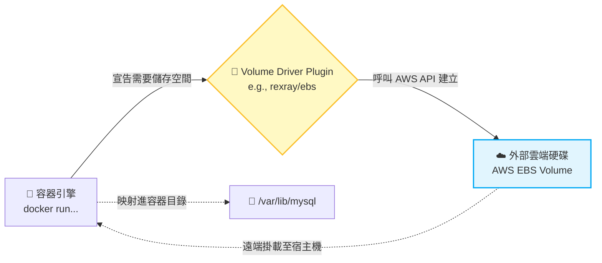

# 191. Volume Driver Plugins in Docker (Docker 的磁碟區外掛驅動)

## 1. 🏷️ 課程定位
- **章節編號與名稱：** 第 8 節：Storage (儲存)
- **影片標題：** 191. Volume Driver Plugins in Docker (Docker 的磁碟區外掛驅動)

## 2. 📌 核心概念摘要
預設情況下，容器的 Volume 只能建立在「當前這台宿主機」的本地硬碟上。Volume Driver Plugins (磁碟區外掛驅動) 的目標，就是為容器引擎接上「外部大腦」，讓容器能夠直接呼叫雲端供應商 (如 AWS EBS、GCP PD) 或網路儲存 (如 NFS) 的 API，實現真正的跨節點資料持久化與動態分配。

## 3. 📊 流程圖與視覺化重現
根據截圖中 `rexray/ebs` 的指令架構，我們將這個外部掛載機制視覺化：



## 4. 🔑 知識點擷取 (Detailed Notes)
- **Local Driver (預設的致命傷)：** 在沒有指定驅動程式時，預設使用的是 `local` driver。一旦這台 Node 當機，Pod 被 Kubernetes 調度到另一台 Node，新的 Node 上根本沒有這個 Local Volume，資料等同斷線。

- **Volume Plugins (外掛機制)：** 如截圖中的 `rexray`（這是一個早期非常有名的開源外掛項目），它允許你在啟動容器時，動態向 AWS 申請一塊 EBS (Elastic Block Store) 雲端硬碟並掛載進來。

- **從 Docker 到 Kubernetes 的演進 (架構師視角)：**
  - 在 Docker 時代，我們用 `--volume-driver` 參數。
  - 在現代 Kubernetes 時代，這個機制演變成了 **CSI (Container Storage Interface) 搭配 StorageClass**。Kubernetes 不再將各家廠商的程式碼寫死在核心中，而是讓各家儲存廠商自己寫 CSI Plugin 掛載到叢集裡。

## 5. 💻 CKA 必備實作指令 (Imperative Commands)
在 CKA 考場中，你不需要打 Docker 指令，但你必須知道如何查詢 Kubernetes 叢集目前安裝了哪些「對應的儲存驅動 (Provisioner)」。

```bash
# 💡 截圖中的 Docker 指令邏輯：
# docker run -it --name mysql --volume-driver rexray/ebs --mount src=ebs-vol,target=/var/lib/mysql mysql

# 💡 CKA 考場對應實戰：查詢叢集內負責對接外部儲存的「驅動類別 (StorageClass)」
kubectl get storageclass
kubectl get sc   # 簡寫

# 💡 深入查看該 StorageClass 底層到底是呼叫哪個外掛驅動 (Provisioner)
# 例如你可能會看到 provisioner: ebs.csi.aws.com
kubectl describe sc <storageclass-name> | grep Provisioner
```

## 6. 🚀 CKA 考試延伸與 Troubleshooting
### 🎯 考試情境預測：
- CKA 考試不會叫你從頭安裝 CSI 驅動。
- **必考題型：** 題目會要求你建立一個 PVC，並明確規定它必須使用名為 `fast-storage` 的 StorageClass。這就是在考驗你是否知道如何透過 Kubernetes 的 API，去觸發底層的 Volume Driver 幫你跟雲端要硬碟。

### 🛑 避坑指南 (StorageClass 拼寫陷阱)：
建立 PVC YAML 時，屬性叫做 `storageClassName`（注意大小寫與駝峰命名）。如果叢集中沒有你指定的 StorageClass，或者你拼錯了名字，PVC 就永遠不會被 Bound。

### 🔧 Troubleshooting：
- **現象：建立 PVC 後狀態一直卡在 Pending。**
  - **檢查指令：** `kubectl describe pvc <pvc-name>`
  - **解讀：** 如果 Events 顯示 `waiting for a volume to be created, either by external provisioner "ebs.csi.aws.com" or manually created by system administrator`，這代表 API Server 有收到請求，但外掛驅動 (Volume Driver) 遲遲無法在雲端建立出實體硬碟。這通常發生在模擬考場中，原因可能是驅動的 Pod 當機了，或是權限不足導致無法呼叫 AWS/GCP 的 API。
