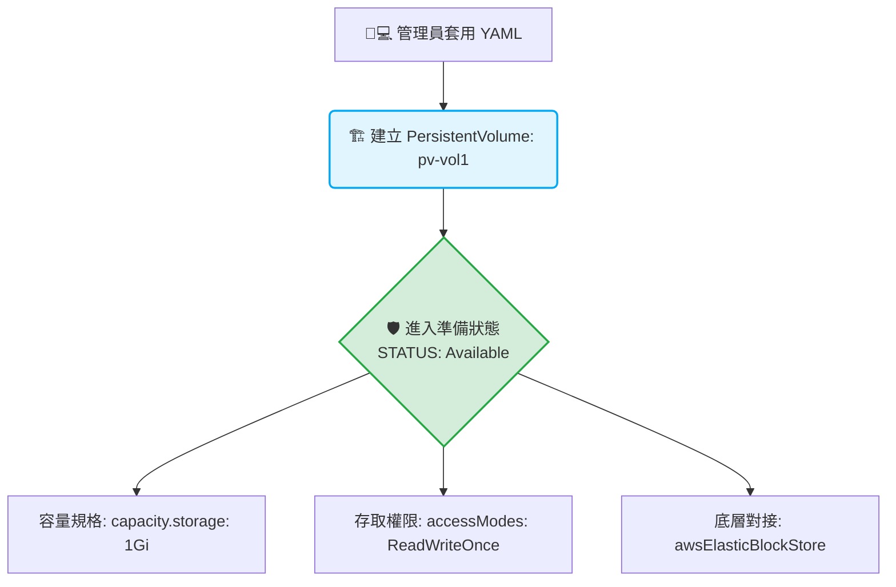

# 194. Persistent Volumes (持久化磁碟區)

## 1. 🏷️ 課程定位
- **章節編號與名稱：** 第 8 節：Storage (儲存)
- **影片標題：** 194. Persistent Volumes (持久化磁碟區)

## 2. 📌 核心概念摘要
Persistent Volume (PV) 是由叢集管理員（Cluster Administrator）預先建立好的「叢集層級儲存資源池」。它將底層實體儲存（如影片中的 AWS EBS）進行抽象化封裝。它的底層運作目標是脫離命名空間（Namespace）與 Pod 的限制，成為叢集中的公共基礎設施，靜靜等待開發者遞交申請單（PVC）來綁定使用。

## 3. 📊 流程圖與視覺化重現
根據畫面中的 `pv-definition.yaml` 與 `kubectl get` 輸出，PV 的生命週期與屬性架構如下：



## 4. 🔑 知識點擷取 (Detailed Notes)
從畫面中展示的完整 YAML，我們來剖析三個 CKA 必考的底層欄位：

- **容量宣告 (`spec.capacity.storage: 1Gi`)：**
  管理員明確指定這塊 PV 實體切出來的大小。未來只有「申請容量小於或等於 1Gi」的 PVC 才能成功與它配對。

- **存取模式選擇 (`spec.accessModes`)：**
  畫面右側列出了三大模式，這在考場上一定要看清題目要求：
  - `ReadWriteOnce (RWO)`：只能被單一 Node 掛載為讀寫（畫面中使用的模式）。
  - `ReadOnlyMany (ROX)`：可被多台 Node 掛載為唯讀。
  - `ReadWriteMany (RWX)`：可被多台 Node 掛載為讀寫（通常需要 NFS 或 Ceph 支援）。

- **回收策略 (`spec.persistentVolumeReclaimPolicy`)：**
  雖然畫面中的 `kubectl get` 顯示預設為 `Retain`（保留）。這代表未來如果開發者把申請單（PVC）刪除了，這塊 PV 依然會保留在原處，但狀態會變成 `Released`，不會自動清空資料，必須由管理員手動介入清理。

## 5. 💻 CKA 必備實作指令 (Imperative Commands)
在 CKA 考試中，PV 絕對無法透過 `kubectl create` 加上參數快速生成，你必須手動寫 YAML。但你可以利用 `explain` 來確保欄位沒有拼錯：

```bash
# 💡 CKA 考試技巧：當場查詢 PV 的 YAML 結構，避免駝峰命名寫錯 (如 awsElasticBlockStore)
kubectl explain pv.spec

# 💡 檢查實體硬碟底層的支援參數 (例如想查 hostPath 或 nfs 的寫法)
kubectl explain pv.spec.hostPath

# 💡 考場核心檢查：觀察 STATUS 是否為 "Available" (代表還沒有被任何人綁定，可以正常被申請)
kubectl get pv
```

## 6. 🚀 CKA 考試延伸與 Troubleshooting
### 🎯 考試情境預測：
- **標準考法：** 題目會命令你：「建立一個名為 `custom-pv` 的 PersistentVolume，容量為 `2Gi`，存取模式為 `ReadWriteOnce`，回收策略為 `Retain`，底層使用本地路徑 `hostPath: /mnt/data`」。
- **重要提醒：** PV 是 Cluster-level (叢集級別) 的資源，所以在寫 PV 的 YAML 時，**絕對不可以寫 `metadata.namespace`**！如果寫了 Namespace，API Server 會直接拒絕建立。

### 🛑 避坑指南：
- **AccessModes 是一個陣列：** 在 YAML 中，`- ReadWriteOnce` 前面必須有橫槓 `-`，因為它在底層設計上允許同時支援多種模式。
- **容量單位：** Kubernetes 標準單位是 `Gi` (Gibibyte) 或 `Mi` (Mebibyte)，寫成大寫的 `G` 或 `M` 雖然有時會通，但嚴格來說是不標準的，考場上一律照著題目給的 `Gi` 寫。

### 🔧 Troubleshooting：
- **現象：建立 PVC 後，明明有一塊容量夠大的 PV，但兩者就是無法綁定（PVC 一直 Pending）。**
  - **排查心法：** 立刻執行 `kubectl get pv` 檢查該 PV 的 ACCESS MODES。如果 PV 寫 `RWO`，但開發者的 PVC 申請單上寫 `RWX`（ReadWriteMany），即使容量再大，Kubernetes 也絕對不會把它們配對在一起！**兩邊的 Access Modes 必須完美匹配**。

---
*恭喜你順利看完 194 節！現在管理員（你）已經把硬碟準備好（Available）了。接下來的 195. Persistent Volume Claims 就是要站在開發者的角度，寫一張「申請單」來把這塊 pv-vol1 給搶過來。準備好拿這張申請單了嗎？*
