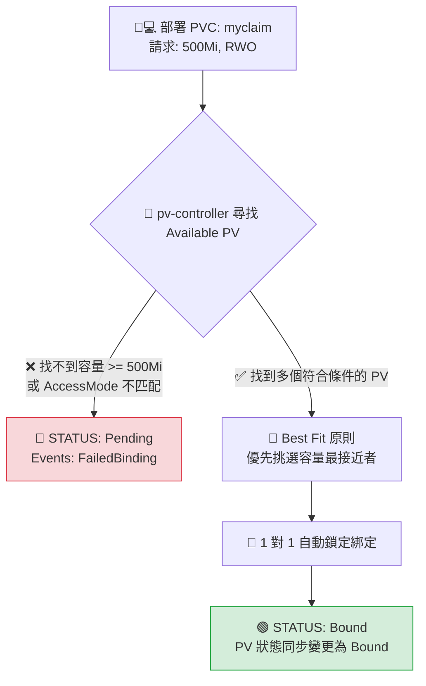

# 195. Persistent Volume Claims (持久化磁碟區申請)

## 1. 🏷️ 課程定位
- **章節編號與名稱：** 第 8 節：Storage (儲存)
- **影片標題：** 195. Persistent Volume Claims (持久化磁碟區申請)

## 2. 📌 核心概念摘要
Persistent Volume Claim (PVC) 是開發者向 Kubernetes 叢集遞交的「儲存空間申請單」。開發者不需要知道底層是 AWS 還是本地硬碟，只需在 PVC 中宣告所需的容量與存取模式。Kubernetes 的儲存控制器會自動在叢集中尋找符合條件的 PV 進行 **1 對 1 綁定 (Bind)**，從而完美實現基礎設施與應用程式的解耦。

## 3. 📊 流程圖與視覺化重現
根據畫面中的 YAML 宣告，當 PVC 送出後，控制器的底層相親（媒合）邏輯如下：



## 4. 🔑 知識點擷取 (Detailed Notes)
從畫面中展示的完整 YAML，我們來剖析核心欄位與觸發限制：

- **資源請求 (`spec.resources.requests.storage: 500Mi`)：**
  開發者宣告最低需要的容量。畫面中請求 500Mi，這代表它只能去綁定「容量大於或等於 500Mi」的 PV。

- **存取模式匹配 (`spec.accessModes`)：**
  這裡宣告了 `- ReadWriteOnce`。PVC 在尋找 PV 時，PV 支援的模式必須完全包含 PVC 要求的模式，否則配對絕對失敗。

- **⚠️ 致命限制條件 (Limitations - 考場大魔王)：**
  - **Namespace 隔離限制：** PV 是叢集層級 (Cluster-wide)，而 PVC 是命名空間層級 (Namespace-scoped)！
    也就是說，如果你的 Pod 跑在 `prod` 命名空間，你的 PVC 就必須建立在 `prod` 命名空間。一個 `default` 空間下的 PVC 是絕對無法被 `prod` 空間下的 Pod 掛載的。
  - **1 對 1 排他性：** 一旦某個 PV 綁定了這張 PVC，即使該 PV 還有剩餘空間（例如 10Gi 的 PV 被 500Mi 的 PVC 綁定），其他任何 PVC 也絕對進不來，剩下的空間會直接浪費。

## 5. 💻 CKA 必備實作指令 (Imperative Commands)
在 CKA 考場中，PVC 同樣無法單靠指令參數直接生成完整的容量與模式設定，請一律使用 `explain` 輔助手動編寫 YAML。寫完後的檢查指令是拿分關鍵：

```bash
# 💡 CKA 考試技巧：快速檢查 PVC 的綁定狀態與對應的 PV 名稱
# 重点觀察 STATUS 是否為 "Bound"，以及 VOLUME 欄位有沒有指派 PV 名字
kubectl get pvc -n <namespace-name>

# 💡 考場除錯神技：如果 PVC 一直卡在 Pending，立刻看它的詳細 Events 尋找原因
kubectl describe pvc myclaim -n <namespace-name>

# 💡 如果考試想快速查詢 PVC 的 spec 縮排結構，直接查閱說明
kubectl explain pvc.spec.resources
```

## 6. 🚀 CKA 考試延伸與 Troubleshooting
### 🎯 考試情境預測：
- **必考題型：** 題目會要求你在特定的 Namespace 下建立一個 PVC，並指定容量與存取模式。接著，要求你修改或建立一個 Pod，將這個 PVC 當作 Volume 掛載到容器內部的特定路徑。
- **進階陷阱：** 考題可能故意不給你現成的 PV，而是給你一個 StorageClass 的名字，要求你在 PVC 中加上 `storageClassName: <name>`，考驗你是否懂得利用 CSI 驅動進行「動態配置 (Dynamic Provisioning)」。

### 🛑 避坑指南：
- **別把 Namespace 忘在 Pod/PVC 之外：** 考試時如果題目說「在 marketing 空間建立 PVC」，請務必在 PVC 的 `metadata.namespace` 加上該空間名稱。如果忘了加，它會跑到 `default`，接下來 Pod 就會因為找不到 PVC 而卡死。
- **大小寫敏感：** 容量單位的 Mi 或 Gi，英文字母大小寫不可錯（畫面中為 500Mi）。

### 🔧 Troubleshooting：
- **現象：PVC 處於 Pending，`kubectl describe` 顯示 `FailedBinding`。**
  - **架構師除錯三板斧：**
    1. 執行 `kubectl get pv`，檢查有沒有任何一塊 PV 的狀態是 Available。如果全都是 Bound，代表叢集硬碟爆了，管理員（你）必須去加開 PV。
    2. 如果有 Available 的 PV，對照雙方的 `accessModes`。如果 PV 只有 ReadOnlyMany，但你的 PVC 要求 ReadWriteOnce，兩邊對不上，就會永遠 Pending。
    3. 檢查 `storageClassName`。如果 PV 沒有設定 StorageClass，但你的 PVC 寫了某個 SC 的名字（或者反過來），K8s 會判定它們不是同一個世界的東西，拒絕配對。
