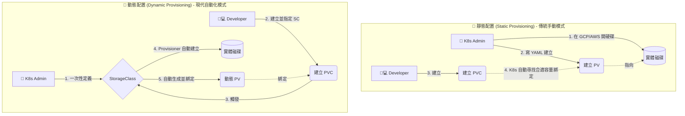

# 201. Storage Class (Storage Class)

## 📌 核心觀念
- **儲存資源隨選即用 (On-Demand)**：靜態配置 (Static Provisioning) 依賴管理員手動預先建立實體磁碟與 PV，缺乏彈性且管理成本高。動態配置 (Dynamic Provisioning) 則透過 Storage Class (SC) 作為中介，讓 K8s 能根據 PVC 的需求自動向底層雲端或儲存系統（如 GCP、AWS、NFS）請求並即時生成 PV 與實體磁碟。
- **維護成本極低**：相比傳統手動建立各種大小 PV 的方式，SC 讓管理員只需建立好「藍圖」，後續的儲存配置完全自動化。
- **精準計費**：磁碟只在開發者建立 PVC 時才去動態開啟，避免了在應用程式部署前就需要買好硬碟所造成的資源與資金浪費。

## 📊 動態與靜態配置工作流


## 🔑 知識點擷取：靜態配置 vs 動態配置

| 比較維度 | 🛑 靜態配置 (Static Provisioning) | 🚀 動態配置 (Dynamic Provisioning) |
| :--- | :--- | :--- |
| **維護成本** | **極高**。需隨時監控並預先建立各種大小的 PV 供開發者使用。 | **極低**。只需建立好 Storage Class，後續完全自動化。 |
| **磁碟建立時機** | **提早建立**。甚至在應用程式部署前就需要買好硬碟，可能浪費資源。 | **隨需建立 (On-Demand)**。建立 PVC 時才去開硬碟，精準計費。 |
| **PV 的來源** | **手動撰寫**。管理員撰寫 `kind: PersistentVolume` 的 YAML 建立。 | **自動生成**。由 Storage Class 的 Provisioner 自動生成。 |
| **適用場景** | 舊有系統地端硬碟、需精細控制單一特殊磁碟、NFS 傳統掛載。 | 公有雲環境 (GCP/AWS/Azure)、大型微服務叢集、需快速擴展的架構。 |

### 🧠 Storage Class (SC) 後半段進階說明
Storage Class 不只是一個標籤，它是 K8s 與底層儲存溝通的「藍圖」，以下是三個您必須掌握的 SC 核心設定檔屬性：
1. **Provisioner (配置器)**：決定「誰」來幫忙建立磁碟。例如 GCP 是 `kubernetes.io/gce-pd`，AWS 是 `kubernetes.io/aws-ebs`。現在主流推薦使用 CSI (Container Storage Interface) 驅動，如 `ebs.csi.aws.com`。
2. **Parameters (參數)**：傳遞給雲端供應商的具體硬碟規格。例如可以指定磁碟類型 `type: pd-ssd` (SSD) 或 `type: pd-standard` (傳統 HDD)，甚至指定 IOPS 與區域 (Zone)。
3. **VolumeBindingMode (綁定模式)** [🚨 考試超高頻考點]：
   - `Immediate` (預設值)：PVC 一建立，馬上開硬碟並綁定 PV。缺點是如果在多可用區 (Multi-AZ) 架構下，硬碟開在 Zone A，但 Pod 被排程器丟到 Zone B，就會導致掛載失敗。
   - `WaitForFirstConsumer`：延遲綁定。K8s 會暫停開硬碟的動作，直到有第一個 Pod 宣告要使用這個 PVC 且被成功排程到某個 Node 後，才在該 Node 所在的 Zone 開啟硬碟。

## 💻 必考實戰指令
```bash
# 1. 快速查看叢集內所有的 Storage Class
kubectl get sc

# 2. 查看特定 SC 的詳細設定 (檢查 Provisioner 與 BindingMode)
kubectl describe sc <sc-name>

# 3. 🎯 考場實用技巧：將指定的 SC 設為「叢集預設」(Default)
# 這樣建立 PVC 若不寫 storageClassName，就會預設用這個！
kubectl patch storageclass <sc-name> -p '{"metadata": {"annotations":{"storageclass.kubernetes.io/is-default-class":"true"}}}'

# 4. 忘記 YAML 怎麼寫？使用 explain 快速查找欄位結構
kubectl explain pvc.spec.storageClassName
```

## ⚠️ 實戰/最佳實踐 SOP 與 Troubleshooting

> [!TIP]
> **SOP：考試情境預測與避坑指南**
> - **情境 1**：考官要求您建立一個 PVC，並明確指定 `storageClassName: fast-disk`。**請不要自作聰明去建 PV**，只要建 PVC，K8s 就會動態幫您建出 PV。
> - **情境 2**：給定一個已經設定為 `WaitForFirstConsumer` 的 Storage Class。您建立 PVC 後發現狀態一直是 `Pending`，這是正常的！接著題目會要求您建立一個 Pod 來掛載這個 PVC，Pod 建好後，PVC 就會變為 `Bound`。
> - **名稱大小寫極度敏感**：PVC YAML 內的 `storageClassName` 必須跟 `kubectl get sc` 看到的名稱一模一樣，錯一個字母就不會觸發動態配置。

> [!WARNING]
> **Troubleshooting 技巧：PVC 一直處於 Pending 狀態**
> （排除 `WaitForFirstConsumer` 延遲綁定的因素後）：
> 1. 先下 `kubectl describe pvc <pvc-name>` 檢查 `Events`。
> 2. 如果出現 `storageclass.storage.k8s.io "xxx" not found` 👉 代表您 **SC 名字打錯了**。
> 3. 如果出現 `failed to provision volume...` 👉 通常是 K8s 與底層雲端 (GCP/AWS) **溝通的權限不足**，或是要求的硬碟容量超過了**雲端配額 (Quota)**。

## 📝 YAML 骨架 (Storage Class & PVC)

**StorageClass 範例：**
```yaml
apiVersion: storage.k8s.io/v1
kind: StorageClass
metadata:
  name: fast-disk
provisioner: ebs.csi.aws.com                # 指定由誰來配發磁碟 (CSI Driver)
parameters:
  type: gp3                                 # 傳遞給 Provisioner 的雲端硬碟參數
volumeBindingMode: WaitForFirstConsumer     # 🚨 關鍵：延遲綁定，避免跨可用區錯誤
```

**PVC 範例 (指定 SC)：**
```yaml
apiVersion: v1
kind: PersistentVolumeClaim
metadata:
  name: dynamic-pvc
spec:
  accessModes:
    - ReadWriteOnce
  resources:
    requests:
      storage: 5Gi
  storageClassName: fast-disk               # 關鍵：必須與 SC 名稱完全一致
```

## 🧠 自我測驗
<details><summary>我在多可用區 (Multi-AZ) 架構下，建立 PVC 時立刻配置了實體磁碟 (Immediate 模式)。但隨後部署的 Pod 卻一直無法成功掛載該磁碟，最可能的原因是什麼？該如何透過 Storage Class 解決？</summary>
最可能的原因是「可用區不匹配」。在 <code>Immediate</code> 模式下，硬碟可能已經在 Zone A 建立，但 K8s 的排程器卻將 Pod 分派到了 Zone B 上的節點，導致無法跨區掛載。
<br><br>
解決方法：將 Storage Class 的綁定模式改為 <code>volumeBindingMode: WaitForFirstConsumer</code>。這樣系統就會等到 Pod 確定被排程到特定的 Node 與 Zone 之後，才在該 Zone 建立對應的磁碟，確保兩者處於同一個可用區。
</details>
