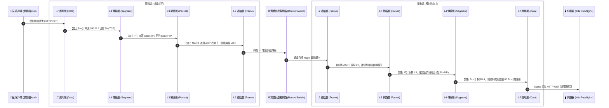

# 205-2. 網頁資料到主機過程：封包傳送流程與 OSI 七層協定對應

## 📌 核心觀念
- **封裝 (Encapsulation) 與解封裝 (Decapsulation)**：網頁資料的傳輸本質上是一個層層包裝與拆解的過程。這就像寄送跨國包裹：您的信件（L7 網頁資料）必須先放入標準信封寫上收件人（L4 通訊埠）、再裝入物流箱貼上地址（L3 IP）、最後裝進貨櫃打上標籤（L2 MAC），透過底層光纖（L1）送達目的地後，再反向一層層拆開，最終交給伺服器應用程式。
- **K8s 路由的底層縮影**：這套標準流程不僅是基礎網路知識，更是 Kubernetes 中從 **Ingress (L7)** ➡️ **Service (L4)** ➡️ **Pod (L3)** 路由機制的底層縮影。

## 📊 封包傳送與解封裝 U 型傳輸圖
請在腦海中牢記這張「U 型傳輸圖」，這有助於您在考場上精準定位網路的斷點：


## 🔑 知識點擷取 (Detailed Notes)
我們將 OSI 七層的封包變化，精確對應到 K8s 的實際維運與資源場景中：

- **L7 應用層 (Application Layer) - 資料 (Data)**
  - **行為**：使用者在瀏覽器輸入 URL，或執行 `curl` 產生 HTTP 請求。
  - **K8s 對應：`Ingress` 資源**。Ingress 就是在這一層拆開看 HTTP Header，根據您設定的網域 (host) 或路徑 (path) 來決定要把請求轉給哪個 Service。
- **L4 傳輸層 (Transport Layer) - 區段 (Segment)**
  - **行為**：將 HTTP 資料切塊，並加上來源 Port (隨機) 與目的 Port (如 80 或 443)，建立 TCP 連線。
  - **K8s 對應：`Service` 資源 (NodePort / ClusterIP)**。Service 利用 iptables 或 IPVS 規則，在 L4 攔截特定 IP+Port 的封包，並將其負載平衡轉發給後端的 Pod。
- **L3 網路層 (Network Layer) - 封包 (Packet)**
  - **行為**：加上來源 IP 與目的 IP。決定封包跨網段的路由方向。
  - **K8s 對應：`CNI` 外掛 (如 Flannel/Calico)**。CNI 確保每個 Pod 都有獨一無二的 L3 IP，並透過修改 Node 的 `ip route` 表確保封包能跨節點正確路由。
- **L2 資料連結層 (Data Link Layer) - 框架 (Frame)**
  - **行為**：加上來源 MAC 與目的 MAC。在同一個區域網路內，交換器 (Switch) 只看 MAC 位址來轉發資料。
  - **K8s 對應：虛擬網橋 (`cni0` 或 `docker0`)**。同一個 Node 內的 Pod 互連，就是在 L2 直接透過虛擬 Switch 交換，封包不需出實體網卡。

## 💻 必考實戰指令
當網頁打不開時，架構師的標準排錯姿勢是「由下往上 (L3 ➡️ L4 ➡️ L7)」層層測試：
```bash
# ==========================================
# 🛑 L3 排錯：確認「網路層 IP」是否可達
# ==========================================
# 1. 測試能否抵達該 Pod 或 Node 的 IP
ping <目標-IP>
# 2. 檢查封包經過了哪些路由節點 (如果跨網段不通時很有用)
traceroute <目標-IP>

# ==========================================
# 🛑 L4 排錯：確認「傳輸層 Port」是否有服務在監聽
# ==========================================
# 1. 🎯 考場神技：測試目標 IP 的特定 TCP Port 有沒有開
# (如果 ping 通但 nc 失敗，代表服務掛了或防火牆擋 Port)
nc -vz <目標-IP> 80

# 2. 在本機檢查 K8s Service (kube-proxy) 是否有正常監聽 Port
ss -tulnp | grep <NodePort>

# ==========================================
# 🛑 L7 排錯：確認「應用層 HTTP」是否回傳正確資料
# ==========================================
# 1. 模擬瀏覽器發送 HTTP 請求，並看詳細 Header 回應 (-I 代表只看標頭)
curl -I http://<目標-IP>:<Port>

# 2. 測試 Ingress 時，手動指定 Host 標頭欺騙路由
curl -H "Host: my-app.com" http://<Ingress-Controller-IP>
```

## ⚠️ 實戰/最佳實踐 SOP 與 Troubleshooting

> [!TIP]
> **SOP：考試情境預測與避坑指南**
> - **考點與思維**：題目若給定一個 Nginx Pod 與 Service，要求建立 Ingress 讓外部存取。您必須確保 L4 的 Service 選擇到了正確的 Pod (透過 Labels)，然後確保 L7 的 Ingress 規則正確指向了該 Service，兩者缺一不可。
> - **Port 與 TargetPort 混淆**：在 K8s Service 中，`port` 是 L4 攔截請求的進入點，而 `targetPort` 才是封包解封裝後，最終送到 L7 容器應用程式的真實 Port。設定錯誤會導致 L4 封包送到 Pod 後，容器進程拒絕接收 (`Connection Refused`)。
> - **不要用 ping 測 Ingress**：`ping` 是 L3 的 ICMP 協定，沒有 Port 也沒有 HTTP Header 的概念。要測試 L7 的 Ingress 規則是否生效，**只能使用 `curl`**，否則您永遠測不出 Ingress 的網域路由對不對。

> [!WARNING]
> **Troubleshooting 技巧：三大常見連線錯誤代碼解析**
> - **Connection Refused (連線被拒絕)**：封包成功走到 L3，也到了正確機器，但在 L4 被彈回來。原因通常是該 Port 根本沒有服務在跑，或是 Service 的 `targetPort` 設錯。
> - **Connection Timeout (連線逾時)**：封包通常在 L3 路由就迷路了，或者被中途的防火牆 (iptables L4 規則) 靜靜地丟棄 (Drop)。請檢查 CNI 狀態與 Node 的 `ip route`。
> - **502 Bad Gateway / 503 Service Unavailable**：封包成功解封裝到了 L7 (Ingress Controller 收到請求了)，但 Ingress 找不到後端的 Service，或是 Service 背後沒有活著的 Pod (Endpoints 為空)。請檢查 Pod 狀態與 Service 的 Selector。

## 📝 YAML 骨架 (L7 Ingress)
在 L7 應用層，Ingress 是最重要的 K8s 資源。考場上建立 Ingress 必須精準指定路由對應到哪一個 L4 Service：
```yaml
apiVersion: networking.k8s.io/v1
kind: Ingress
metadata:
  name: example-ingress
spec:
  rules:
  - host: internal.k8s.local        # L7：檢查 HTTP Request 的 Host Header
    http:
      paths:
      - path: /
        pathType: Prefix
        backend:
          service:
            name: my-nginx-service  # 轉發目標：L4 Service 的名稱
            port:
              number: 80            # 轉發目標：L4 Service 的 port (請注意不是 targetPort)
```

## 🧠 自我測驗
<details><summary>當我設定好 Ingress 並且用 <code>curl -I http://internal.k8s.local</code> 測試時，我收到 <code>503 Service Unavailable</code>。但如果我直接用 <code>ping</code> 測試 Ingress Controller 的 IP 卻是可以通的，請問這代表什麼？接下來我該檢查什麼？</summary>
這代表 <b>L3 (網路層) 與 L4 (傳輸層) 的連線都是正常的</b>，封包已經成功抵達並且被 Ingress Controller 接收到了。<br><br>
收到 <code>503 / 502</code> 這種 HTTP 狀態碼，表示問題發生在 <b>L7 (應用層) 或是 Ingress 尋找後端資源失敗</b>。
<br><br>
接下來正確的檢查步驟：
1. 檢查 Ingress YAML 中的 <code>backend.service.name</code> 是否拼寫正確。
2. 檢查該 Service 是否真實存在 (<code>kubectl get svc</code>)。
3. 檢查該 Service 背後是否有正常 <code>Running</code> 且 <code>Ready</code> 的 Pod (執行 <code>kubectl get endpoints</code> 確定有對應的 IP 列表)。
</details>
