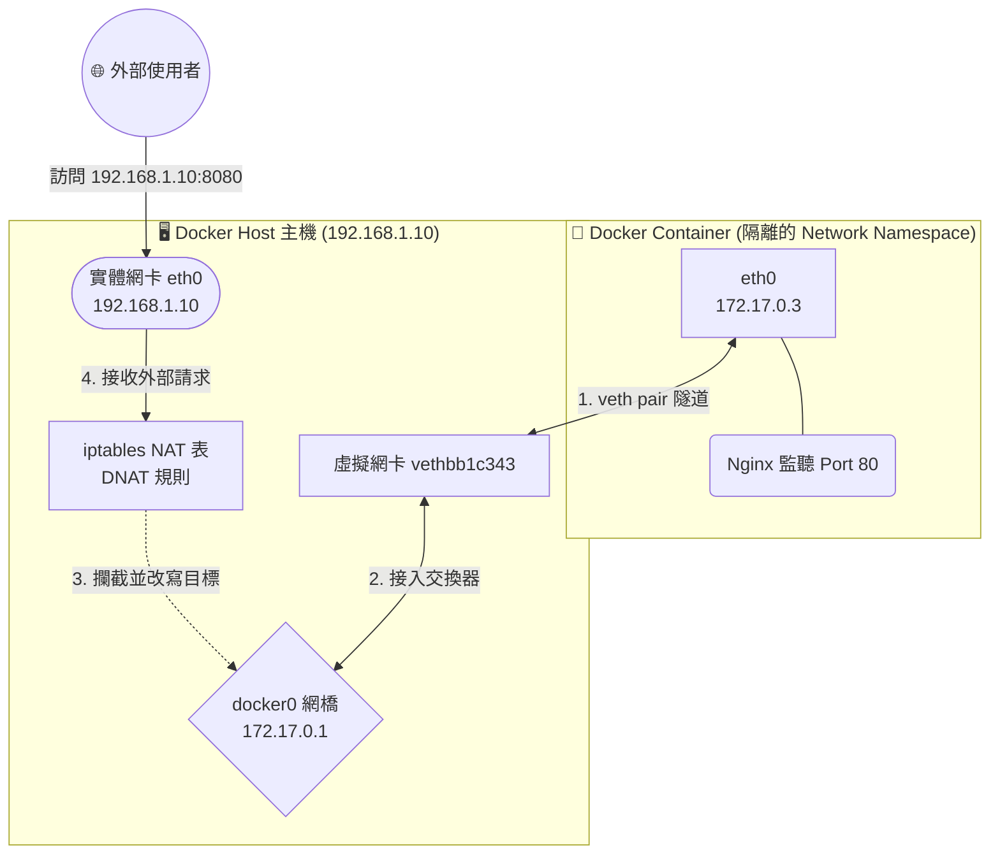

# 210. Prerequisite Docker Networking

## 📌 核心觀念
- **揭開魔法的面紗**：本節課程旨在揭開 Docker 預設 bridge 網路的神祕面紗。Docker 的網路魔法（如 Port Forwarding 與容器互連），其底層其實完全依賴 Linux 的 Network Namespace、虛擬網橋 (`docker0`) 以及 `iptables` 規則。
- **過渡到 CNI 的關鍵**：理解 Docker 這套原生機制的侷限性，是為了接下來學習 Kubernetes 為何要捨棄它，轉而實作「無 NAT 扁平化網路 (CNI)」的關鍵過渡。

## 📊 封包轉發透視圖 (Docker Port Mapping)
從下方流程圖中，我們可以清楚看到 Docker Port Mapping 的底層資料流。請將此圖與我們先前學習的 Linux 網路知識結合：


## 🔑 知識點擷取 (Detailed Notes)

- **docker0 虛擬網橋 (Bridge)**
  - **定義**：Docker Daemon 啟動時自動在 Linux 主機上建立的 L2 虛擬交換器。
  - **運作機制**：所有未特別指定網路的容器，都會透過 veth pair (虛擬網路線) 一端接在容器內，一端接在 `docker0` 上，藉此實現「同主機」容器間的互通。

- **Port Forwarding (通訊埠對應) 的真相**
  - **觸發機制**：當您執行 `docker run -p 8080:80` 時。
  - **底層變化**：Docker 會自動去主機的 iptables 寫入一條 **DNAT** (Destination NAT, 目的地 NAT) 規則。如架構圖所示：它會把打到主機 8080 port 的封包，強行將「目的地 IP 與 Port」改寫為容器內部的 `172.17.0.x:80`。

- **致命限制條件 (Limitations) - 🚨 為什麼 K8s 不用它？**
  - Docker 的預設 bridge 網路無法進行跨主機的直接 IP 通訊。如果您有多台主機，不同主機上的 Docker 容器 IP 極有可能會重複衝突。
  - Kubernetes 的核心網路原則是：「**所有 Pod 之間必須能夠不透過 NAT 直接以 IP 互相通訊**」。這就是為什麼 K8s 必須引入 CNI 外掛來取代 Docker 原生網路的原因。

## 💻 必考實戰指令
雖然 K8s (1.24+) 已經棄用 Docker 作為底層 Runtime，但在 CKA 考場上，排查 `kube-proxy` 建立的 Service 規則時，用的就是同一套 iptables 邏輯！
```bash
# 1. 🎯 查看主機上由 Docker (或 K8s kube-proxy) 建立的 NAT 轉發規則
# 這是用來找尋 Port Forwarding / Service NodePort 痕跡的關鍵指令
iptables -nvL -t nat

# 2. 檢查主機上所有的虛擬網橋
# 當您懷疑 CNI 沒有正確建立網橋時使用
ip link show type bridge
# 🚨 正常在 K8s 節點上，您應該會看到 cni0 而不是 docker0

# 3. 測試本機到容器/Pod 的 IP 是否通暢 (繞過 NAT 直接從主機內部測試)
curl http://172.17.0.3:80
```

## ⚠️ 實戰/最佳實踐 SOP 與 Troubleshooting

> [!TIP]
> **SOP：考試情境預測與避坑指南**
> - **考試情境**：CKA 考試不會考 `docker network` 指令，但考官非常喜歡考 Kubernetes 的 Service (特別是 `NodePort`)！
> - **觀念對接**：K8s 的 `NodePort` Service 底層原理，跟 Docker 的 `-p 8080:80` 是一模一樣的！都是透過 `kube-proxy` 去修改 Linux 的 `iptables` (或 IPVS) 來做 DNAT 轉發。
> - **不要在 K8s 節點上查 docker0**：很多新手在 K8s 網路出問題時，跑去看 docker0 網橋。請記住，在 K8s 叢集中，Pod 的網路是由 CNI (如 Flannel/Calico) 接管的，流量走的是 `cni0` 或其他專屬網卡，`docker0` 通常是閒置無用的。

> [!WARNING]
> **Troubleshooting 技巧：Service 外部無法存取**
> 情境：在 K8s 中建立了 NodePort Service，但外部無法透過 `http://<Node-IP>:<NodePort>` 連線。
> 1. **排查步驟 1 (確認本體存活)**：不要急著查防火牆。先在該 Node 上直接 `curl <Pod-IP>:<TargetPort>`，確認 Pod 本身活著且應用程式正常。
> 2. **排查步驟 2 (確認監聽狀態)**：執行 `ss -tulnp | grep <NodePort>` 確認 `kube-proxy` 確實有在主機上監聽該 Port。
> 3. **排查步驟 3 (確認 NAT 規則)**：使用 `iptables -t nat -L -n` 檢查 DNAT 規則是否正確生成。如果沒生成，通常代表 `kube-proxy` Pod 當機或是無法與 API Server 同步狀態。

## 📝 YAML 骨架 (NodePort Service)
文中提到的 Docker Port Forwarding 機制，在 Kubernetes 的等價對應就是 `NodePort Service`。考場上建立對外暴露的服務時，這是必備骨架：
```yaml
apiVersion: v1
kind: Service
metadata:
  name: example-nodeport
spec:
  type: NodePort             # 🚨 關鍵：透過 iptables DNAT 將實體 Node 的 Port 對應到 Pod 內部
  selector:
    app: my-app
  ports:
    - protocol: TCP
      port: 80               # Service 叢集內部通訊的 Port
      targetPort: 80         # 最終要丟給 Pod 容器應用程式的 Port
      nodePort: 30080        # 對應 docker run -p 30080:80，開放給外網存取的 Node 實體 Port
```

## 🧠 自我測驗
<details><summary>既然 Docker 原生就有 bridge 網路跟 <code>-p</code> 的 Port Forwarding 機制，為什麼 Kubernetes 要大費周章地放棄它，並要求必須安裝第三方的 CNI (Container Network Interface) 外掛？</summary>
因為 Docker 預設的橋接網路無法滿足 Kubernetes 的核心網路鐵律：「<b>所有 Pod 必須能在不依賴 NAT 的情況下互相通訊。</b>」<br><br>
在原生 Docker 中，跨主機容器通訊依賴 NAT 與 Port Mapping。這會導致以下兩個致命問題：
1. <b>IP 衝突</b>：多台主機上的 docker0 預設都會發放 <code>172.17.0.x</code>，跨主機時根本不知道誰是誰。
2. <b>來源 IP 遺失</b>：經過多次 NAT 轉換後，應用程式收到的封包來源 IP 都會變成路由器的 IP，這對於微服務的安全認證與日誌追蹤是一大災難。<br><br>
因此，K8s 必須藉由 CNI 外掛來建立覆蓋網路 (Overlay Network)，確保每個 Pod 都有獨一無二的 IP 且能直接進行 L3 路由通訊。
</details>
