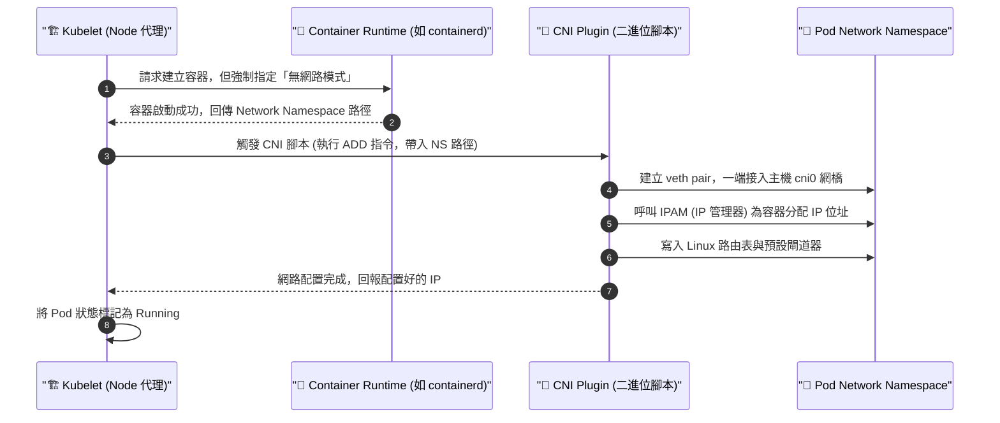

# 211. Prerequisite CNI

## 📌 核心觀念
- **解耦網路與容器**：CNI (Container Network Interface) 是 Kubernetes 為了擺脫單一容器引擎（如 Docker）網路綁定而制定的標準介面。
- **無網路啟動**：其底層運作目標是將「容器運行」與「網路配置」徹底解耦：Kubernetes 啟動容器時，只負責將其以「無網路 (`--network=none`)」的孤島狀態建立起來。
- **隨插即用的網路管線**：接著 Kubelet 呼叫標準化的 CNI 外掛程式，由外掛去負責拉虛擬網線、配發 IP 與設定路由，從而實現 K8s 要求的「無 NAT 跨節點互通」網路模型。

## 📊 Kubelet 與 CNI 互動工作流
在考場上排查 Pod 網路起不來的問題時，您必須清楚 Kubelet 是如何與 CNI 互動的：


## 🔑 知識點擷取 (Detailed Notes)

- **為什麼 K8s 要發明 CNI？ (Limitations of Docker)**
  - Docker 原生的 `docker0` 網橋與 Port Forwarding 模式，無法輕易達成 K8s 要求的「所有 Pod 跨節點直接以 IP 互通」。
  - 透過 CNI 標準，K8s 可以**隨插即用**各種第三方的網路解決方案（如 Calico 提供強大的 NetworkPolicy 控制，Flannel 提供極簡的 Overlay 網路）。

- **CNI 的觸發與運作機制**
  - **指令標準**：CNI 其實就是一堆放在 Node 上的**二進位執行檔（腳本）**。Kubelet 透過傳遞標準指令（如 `ADD` 建立網路、`DEL` 清理網路、`CHECK` 檢查狀態）來呼叫它們。
  - **分工合作**：`docker run --network=none nginx` 只是第一步；而後續的 `bridge add ...` 就是模擬 Kubelet 呼叫 CNI 腳本，將無網路的 Namespace 接入主機虛擬網橋的過程。

- **CNI 的兩大核心職責**
  1. **Network Setup (網路建設)**：建立虛擬網橋 (`cni0`)、建立 `veth pair`、設定 Linux 路由與 iptables 防火牆。
  2. **IPAM (IP Address Management, IP 管理)**：負責管理與配發不重複的 IP 給 Pod（實務上常見的 IPAM 外掛有 `host-local` 或 `dhcp`）。

## 💻 必考實戰指令
在 CKA 考場上，這兩個目錄是您檢查 Node 為什麼 `NotReady` 的尋寶地圖：
```bash
# 1. 🎯 檢查 CNI 設定檔目錄 
# Kubelet 會讀取這裡的 .conf 或 .conflist 來決定呼叫哪個 CNI 腳本
# 如果 Node NotReady，排錯第一步就是檢查這個資料夾是不是空的！
ls -l /etc/cni/net.d/

# 2. 檢查 CNI 執行檔 (二進位腳本) 存放位置
# Flannel, Calico, Weave 的二進位檔，以及基礎的 bridge, loopback, host-local 都在這裡
ls -l /opt/cni/bin/

# 3. 檢查 Kubelet 日誌中與 CNI 相關的錯誤 (Troubleshooting 必備)
# 當 Pod 卡在 ContainerCreating 時，這行指令能找出 CNI 的報錯細節
journalctl -u kubelet | grep cni
```

## ⚠️ 實戰/最佳實踐 SOP 與 Troubleshooting

> [!TIP]
> **SOP：考試情境預測與避坑指南**
> - **考場送分題**：考官提供一個用 `kubeadm` 剛初始化的叢集，並告訴您有幾個 Node 一直處於 `NotReady` 狀態。Node 初始化後預設就是 NotReady，因為尚未安裝 CNI。題目通常會給您一個 Weave 或 Flannel 的 YAML 檔案連結，您只需要執行 `kubectl apply -f <URL>`，稍等片刻，Node 就會變成 `Ready`。
> - **誤刪 CNI 設定檔**：實務上，`/etc/cni/net.d/` 裡面的設定檔，是由 CNI 的 DaemonSet (如 `calico-node` Pod) 啟動時自動掛載並生成的。**千萬不要手動去修改或建立裡面的設定檔**。如果網路壞了，應該去檢查 CNI DaemonSet 的日誌，而不是去改底層檔案。
> - **網段衝突 (CIDR Overlap)**：在 `kubeadm init --pod-network-cidr=10.244.0.0/16` 時指定的網段，**必須**與您後續安裝的 CNI YAML 內部定義的網段一致。如果不一致，CNI 會拒絕啟動或導致路由大亂。

> [!WARNING]
> **Troubleshooting 技巧：CNI 設定失敗導致 Pod 無法啟動**
> - **徵兆**：Pod 狀態一直卡在 `ContainerCreating`。
> - **診斷**：執行 `kubectl describe pod <pod-name>`。如果看到 `networkPlugin cni failed to set up pod "xxx" network: open /run/flannel/subnet.env: no such file or directory`。
> - **處理方式**：這代表 Kubelet 成功呼叫了 Flannel CNI，但 Flannel 在 Node 上找不到它的子網路設定檔。請檢查 `kube-system` 下面的 Flannel DaemonSet Pod 是否處於 `CrashLoopBackOff` 或是被防火牆阻擋通訊。

## 📝 YAML 骨架 (CNI 設定檔解析)
這是存在於 `/etc/cni/net.d/` 下的典型 CNI 設定檔結構 (通常由 CNI 外掛自動生成)。Kubelet 就是透過讀取這個檔案，決定要去 `/opt/cni/bin/` 呼叫哪個腳本，並將 JSON 內容當作參數傳遞給腳本：
```json
{
  "cniVersion": "0.4.0",
  "name": "cni0",
  "type": "bridge",         // 🚨 關鍵：告訴 Kubelet 去執行 /opt/cni/bin/bridge 腳本
  "bridge": "cni0",
  "isGateway": true,
  "ipMasq": true,           // 是否啟用 NAT 偽裝
  "ipam": {
    "type": "host-local",   // 🚨 關鍵：告訴 Kubelet 呼叫 host-local 腳本來配發 IP
    "subnet": "10.244.1.0/24",
    "routes": [
      { "dst": "0.0.0.0/0" }
    ]
  }
}
```

## 🧠 自我測驗
<details><summary>我在考場上遇到了一個全新的 Worker Node，當我將其加入叢集後，它的狀態一直顯示為 <code>NotReady</code>。我檢查了 kubelet 的服務是 active (running) 的。請問最可能的原因是什麼？我該去哪個資料夾確認我的猜想？</summary>
最可能的原因是該 Node <b>尚未安裝或未能成功設定 CNI 網路外掛</b>。<br><br>
在 Kubernetes 中，只要 Kubelet 沒有偵測到可用的網路配置設定檔，它就會為了安全起見，將該節點標記為 <code>NotReady</code>，並拒絕在其上啟動一般的 Pod。<br><br>
驗證方式：請 SSH 進入該 Worker Node，執行 <code>ls -l /etc/cni/net.d/</code>。如果資料夾是空的，就證實了 CNI 尚未安裝或設定檔未能成功生成。此時請回到 Control Plane，重新套用 CNI 的 YAML，或檢查對應的 CNI DaemonSet 是否有正確被部署在該節點上。
</details>
