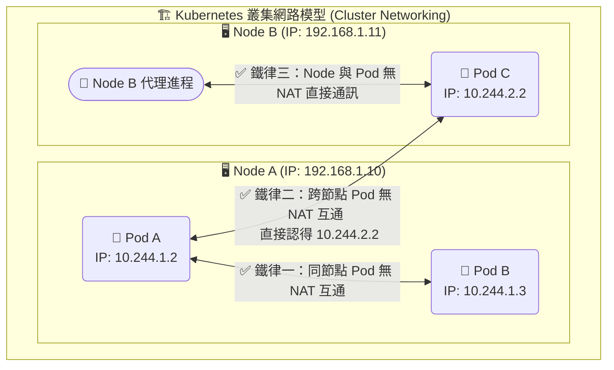

# 212. Cluster Networking (含 CKA 考試重要提醒)

## 📌 核心觀念
- **嚴格的扁平化網路**：Kubernetes 叢集網路 (Cluster Networking) 制定了一套極度嚴格的「扁平化、無 NAT 通訊模型」。
- **消弭底層複雜度**：它的終極目標是確保叢集中所有的 Pod 都擁有獨立的 IP，且無論身處哪一個 Node，Pod 之間都能直接透過真實 IP 互相溝通。這種設計將底層基礎設施（跨機房、跨網段）的複雜性徹底抹平。
- **巨型交換器錯覺**：這套模型讓應用程式開發者感覺所有服務都像是運行在同一台巨型的 L2 交換器上一樣單純。

## 📊 K8s 網路三大鐵律透視圖
在 CKA 考場上，請務必將這張「K8s 網路三大鐵律」的地圖刻在腦海裡：


## 🔑 知識點擷取 (Detailed Notes)

- **K8s 網路模型的三大鐵律 (The Fundamental Rules)**
  1. **Pod to Pod**：所有 Pod 都可以不透過 NAT 與其他任何 Pod 直接通訊。
  2. **Node to Pod**：所有 Node 上的代理程式 (如 Kubelet、kube-proxy) 都可以不透過 NAT 與該 Node 上的所有 Pod 直接通訊。
  3. **無偽裝原則**：Pod 自己看到的 IP，與叢集中其他人 (Pod 或 Node) 看到它的 IP，必須完全一致 (禁止來源 IP 偽裝)。

- **叢集網路的兩大 IP 網段 (CIDR)**
  - **Node Network (節點網路)**：實體機或 VM 的 IP 網段 (例如 `192.168.1.0/24`)，這是 Kubelet 與 API Server 溝通的基礎網路 (Underlay)。
  - **Pod Network (容器網路)**：由 CNI 配發給 Pod 的虛擬網段 (例如 `10.244.0.0/16`)。
  - 🚨 **極度重要**：這兩個網段**絕對不可以重疊 (Overlap)**，否則叢集內的路由會大混亂，封包永遠送不到目的地。

- **連接埠要求 (Port Requirements)**
  - 為了讓 Cluster Networking 正常運作，Node 之間的實體防火牆必須放行特定通訊埠。例如：Kubelet (`10250`)、API Server (`6443`)。
  - 如果使用特定的 CNI，還需額外開通專屬的 Port (例如 Weave 需開 TCP/UDP `6783`, Flannel 需開 UDP `8472` 以建立 VXLAN 隧道)。

## 💻 必考實戰指令
要驗證 Cluster Networking 是否健康，請在考場上熟練使用以下指令：
```bash
# 1. 查看所有 Node 的實體 IP (Internal-IP) 與網段
kubectl get nodes -o wide

# 2. 查看所有 Pod 的虛擬 IP 以及它們落在哪個 Node 上
# (用來驗證 Pod 是否都有成功拿到 IP，且沒有與 Node IP 發生衝突)
kubectl get pods -o wide -A

# 3. 🎯 考場神技：檢查 CNI 外掛是否正常運行
# Cluster Networking 完全依賴 CNI，如果下面的 Pod 處於 CrashLoopBackOff，網路絕對不通！
kubectl get pods -n kube-system -l k8s-app=kube-dns
kubectl get pods -n kube-system | grep -E 'weave|flannel|calico'
```

## ⚠️ 實戰/最佳實踐 SOP 與 Troubleshooting

> [!TIP]
> **SOP：官方聲明與 CKA 考場真相 (關於 CNI)**
> - **考場真相**：在真實的 CKA 考試中，由於環境被嚴格鎖定，您無法存取外部的 GitHub 或是第三方 CNI 供應商的官網。
> - **如何佈署 CNI**：考題如果要求您修復 `Node NotReady` 或佈署網路外掛，考試介面**必定會直接提供** CNI 的部署指令或 YAML 檔案的路徑 (例如直接告訴您執行 `kubectl apply -f https://.../weave-daemonset-k8s.yaml`)。**您不需要死背任何 CNI 的安裝網址！**
> - **忘記佈署 CNI 的後果**：如果您用 `kubeadm` 剛建好叢集，發現 Node 一直處於 `NotReady`，且 CoreDNS 的 Pod 一直卡在 `Pending` 狀態——不要慌張去查 Log，這 100% 是因為您**還沒套用 CNI 的 YAML**！

> [!WARNING]
> **Troubleshooting 技巧：跨節點網路斷線**
> 情境：Node B 上的 Pod 一直無法連線 Node A 上的 Pod。
> 1. **排查步驟 1 (檢查路由)**：在 Node B 主機上執行 `ip route`，檢查是否有一條指向 Node A Pod 網段的路由規則 (這通常是 CNI 負責寫入的)。
> 2. **排查步驟 2 (檢查防火牆)**：如果路由有寫，但 ping 不通，請檢查 Node 實體機層級的防火牆 (`iptables -L FORWARD` 或雲端服務商的 Security Group) 是否阻擋了 CNI 的通道埠 (如 UDP 8472 或 UDP 6783)。
> 3. **排查步驟 3 (檢查 kubeadm 參數)**：使用 `kubeadm init` 時，如果您預計使用 Flannel CNI，必須嚴格加上 `--pod-network-cidr=10.244.0.0/16`。如果參數沒加或網段打錯，Cluster Networking 會建立失敗。

## 📝 YAML 骨架 (kubeadm 初始化配置檔)
雖然 CKA 考場上常使用指令 `kubeadm init --pod-network-cidr=...` 來初始化叢集，但在實務上，若使用 YAML 配置檔，這就是宣告 Pod 網段 (Cluster Networking) 的正確位置：
```yaml
apiVersion: kubeadm.k8s.io/v1beta3
kind: ClusterConfiguration
kubernetesVersion: v1.28.0
networking:
  dnsDomain: cluster.local
  serviceSubnet: 10.96.0.0/12
  podSubnet: 10.244.0.0/16   # 🚨 關鍵考點：對應 --pod-network-cidr，設定整個叢集的 Pod 虛擬網段
```

## 🧠 自我測驗
<details><summary>我在考場上使用 <code>kubeadm init</code> 建立了一個新叢集，並依照題目給的網址套用了 Flannel CNI 的 YAML。結果發現 Node 變成了 Ready，但是不同 Node 上的 Pod 卻完全無法互相 Ping 通。請問在初始化時，我最可能犯了什麼錯？</summary>
最可能的原因是：<b>初始化叢集時未指定，或指定了錯誤的 Pod 網段 (Pod CIDR)</b>。<br><br>
Flannel CNI 預設強烈依賴 <code>10.244.0.0/16</code> 作為其內部路由分配的基礎。如果在執行 <code>kubeadm init</code> 時，沒有加上 <code>--pod-network-cidr=10.244.0.0/16</code> 這個參數，或者指定的網段與 Flannel 內部定義的網段不匹配：<br>
CNI 雖然表面上會啟動成功 (讓 Node 變為 Ready)，但底層的跨節點路由表將無法正確計算與建立，最終導致 Pod 的跨主機通訊徹底失效。
</details>
