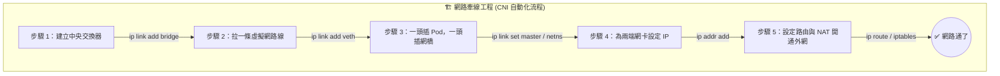

# 216-1. 手撕 CNI 底層指令：Pod Networking 快速記法與邏輯拆解

## 📌 核心觀念
- **消除對底層指令的恐懼**：不要把這些 Linux 指令看成無意義的字串！這其實就是 CNI 幫 Pod 建立網路的標準 SOP。
- **具象化的四大步驟**：只要將流程具象化為四個牽線工程步驟：「1. 買交換器 ➡️ 2. 製作網路線 ➡️ 3. 兩端插線並設定 IP ➡️ 4. 開通聯外道路」，您就能秒懂這些底層指令的因果關係。

## 📊 CNI 牽線工程邏輯圖
請搭配這個「牽線工程」的邏輯圖來記憶。只要順序對了，指令自然就浮現出來：


## 🔑 知識點擷取 (四大口訣)
將落落長的 10 行底層網路指令，濃縮為四大實用口訣：

1. **口訣一：建網橋 (Bridge) — 造出 Node 的內部交換器**
   - **邏輯**：先有實體設備（虛擬網橋），網路才能接通。必須先 `add` 建立，然後 `up` 啟動，最後 `addr` 給它一個 Gateway IP 讓它活起來。
2. **口訣二：拉網線 (Veth Pair) — 打破 Namespace 隔離**
   - **邏輯**：被隔離在 Namespace 內的 Pod 需要實體線路出來。使用 `type veth peer name` 創造一條「兩頭都有接頭」的虛擬網路線。
3. **口訣三：插線與配 IP (Attach & IPAM) — 兩端各就各位**
   - **邏輯**：把線的一頭丟進 Pod (`netns red`)，設定專屬 IP (IPAM) 並啟動。把線的另一頭插在剛剛建好的主機網橋上 (`master v-net-0`)。
4. **口訣四：找路與偽裝 (Route & NAT) — 讓封包出得去回得來**
   - **邏輯**：在 Pod 內部寫入路由表 (`ip route via ...`) 讓封包知道出門要找誰；在主機上寫入 NAT 規則 (`iptables MASQUERADE`) 讓封包去外網時能順利偽裝成主機的實體 IP。

## 💻 必考實戰指令 (底層指令解密)
這就是指令的「工程化」分類，請看註解來輔助記憶（再次強調，實戰中這些全部由 CNI 自動代勞）：
```bash
# ==========================================
# 🏗️ 步驟 1：建網橋 (買一台交換器並插電)
# ==========================================
ip link add v-net-0 type bridge               # 買交換器
ip link set dev v-net-0 up                    # 插電開機
ip addr add 192.168.15.5/24 dev v-net-0       # 設定這台交換器的 IP (也就是未來 Pod 的預設 Gateway)

# ==========================================
# 🔌 步驟 2：拉網線 (做一條兩頭的虛擬線)
# ==========================================
ip link add veth-red type veth peer name veth-red-br # 製作一條名為 veth-red 的線，另一頭叫 veth-red-br

# ==========================================
# 💻 步驟 3：插線與配 IP (一頭進 Pod，一頭接網橋)
# ==========================================
# -- 處理 Pod 端 (red Namespace) --
ip link set veth-red netns red                # 把這頭丟進名為 red 的 Namespace (Pod)
ip -n red addr add 192.168.15.1 dev veth-red  # 替 Pod 內的網卡設定專屬 IP
ip -n red link set veth-red up                # 啟動 Pod 內的網卡

# -- 處理網橋端 (主機) --
ip link set veth-red-br master v-net-0        # 把另一頭插到 v-net-0 這台剛買的交換器上

# ==========================================
# 🌐 步驟 4：找路與偽裝 (開通外網)
# ==========================================
# 告訴 Pod：想出門，請找 Gateway 192.168.15.5
ip netns exec red ip route add 192.168.1.0/24 via 192.168.15.5 

# 告訴主機：幫 15.0/24 網段的封包做 SNAT 偽裝，讓它們能順利上網
iptables -t nat -A POSTROUTING -s 192.168.15.0/24 -j MASQUERADE
```

## ⚠️ 實戰/最佳實踐 SOP 與 Troubleshooting

> [!TIP]
> **SOP：考點轉換與避坑指南**
> - **考點轉換**：在 CKA 中，您不需要默寫上述指令。但遇到「Pod 一直停在 `ContainerCreating`」的題目時，您腦中要立刻浮現這個「四大步驟」。Pod 建不起來，通常是因為某一步卡住了。例如：CNI 沒安裝（**步驟 1** 失敗）、或是 IP 池用光了（**步驟 3** 無法配發 IP）。
> - **不要被複雜的語法嚇到**：看到 `ip -n red ...` 只要知道這是「在特定的 Namespace 內執行指令」即可。在真實的 K8s 中，您可以用 `kubectl exec <pod-name> -- ip a` 來達到完全一樣的觀察效果，這才是考場上該用的優雅解法！

> [!WARNING]
> **Troubleshooting 技巧：網橋丟失 (步驟 1 失敗)**
> 如果您發現 Node 上的 Pod 彼此完全無法互相 ping 通，第一步就是去 Node 主機上執行 `ip link show type bridge`，看看 CNI 到底有沒有幫您把這台「中央交換器 (例如 `cni0` 或 `weave`)」給建出來，且狀態必須是 `UP`。如果沒有，請直接去檢查或重啟 CNI DaemonSet。

## 📝 YAML 骨架 (查看 Pod 內部網路狀態)
在考場上，我們不會使用繁瑣的 `ip netns`。遇到網路問題時，我們可以直接利用測試 Pod 來觀察 CNI 是否有幫我們走完「步驟 3 與步驟 4」：
```yaml
apiVersion: v1
kind: Pod
metadata:
  name: net-inspect-pod
spec:
  containers:
  - name: busybox
    image: busybox:1.28
    command: ["sleep", "3600"]
# 建立後執行，檢查步驟 3 (是否有拿到 IP)：kubectl exec net-inspect-pod -- ip a
# 建立後執行，檢查步驟 4 (是否有預設路由)：kubectl exec net-inspect-pod -- ip route
```

## 🧠 自我測驗
<details><summary>在排查網路問題時，我發現 Node A 上的 Pod A 能夠成功 Ping 通同一個 Node 上的 Pod B。但是當 Pod A 嘗試 Ping 外部網路 (如 8.8.8.8) 或是其他節點上的 Pod 時，封包卻一直 Timeout。請問根據「牽線工程四大口訣」，最可能是哪一個步驟的設定出了問題或遭到破壞？</summary>
最可能是 <b>步驟 4：找路與偽裝 (Route & NAT)</b> 出錯了。<br><br>
邏輯拆解：
- 既然同 Node 的 Pod 能互通，代表「步驟 1 (建網橋)」與「步驟 2 & 3 (拉網線、插線配 IP)」皆已完美運作，L2 內部交換完全沒問題。
- 無法連外網或跨節點，通常是因為 Pod 內部缺少了預設路由 (<code>ip route via gateway</code>)，或者是主機端的 <code>iptables</code> 轉發與偽裝規則 (<code>MASQUERADE</code>) 被意外清空，導致封包不知去向，或是去到外網後無法被送回。
</details>
