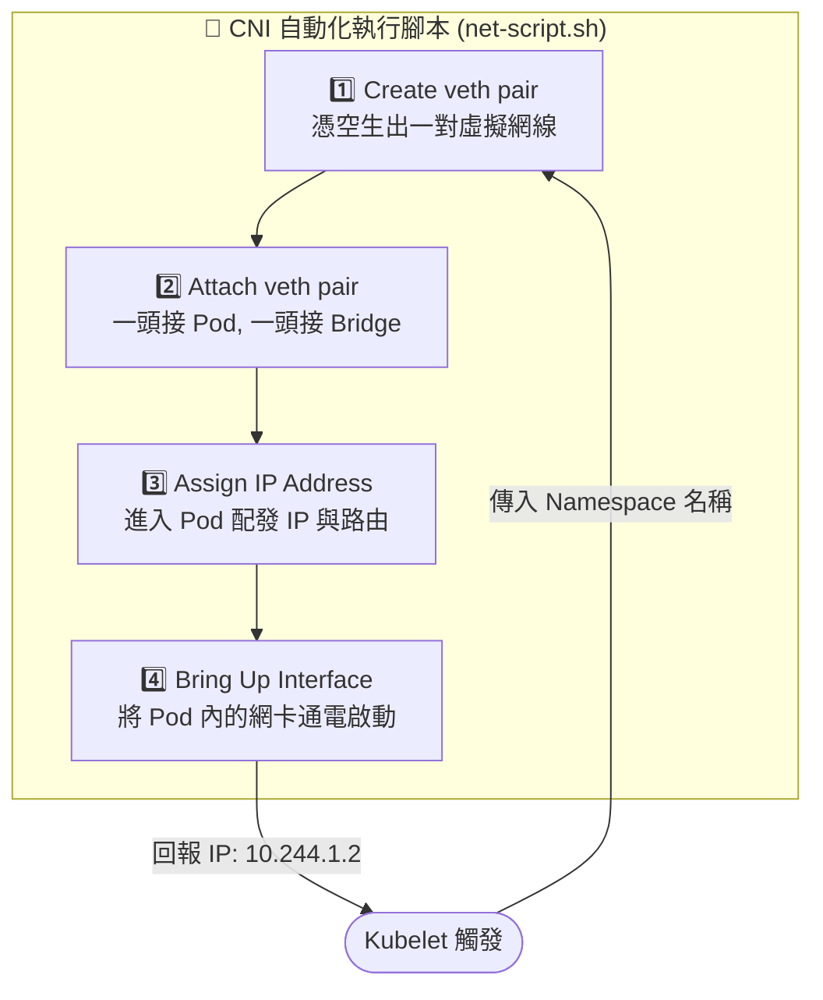

# 216-2. CNI 自動化腳本解析：Pod Networking 畫面指令速記

## 📌 核心觀念
- **完美的腳本詮釋**：這份教材完美詮釋了 CNI (Container Network Interface) 的核心職責。當 Kubelet 創建好一個「沒有網路的容器」後，就會將該容器的 Namespace 名稱當作參數，傳遞給 CNI 腳本。
- **標準化四步驟**：腳本會依序執行 「造網線 ➡️ 兩端接線 ➡️ 配發 IP 與路由 ➡️ 啟動網卡」 這四個標準化步驟，瞬間讓原本是孤島的 Pod 具備跨節點通訊的能力。

## 📊 CNI 標準生命週期圖
我們將畫面中 `net-script.sh` 的 4 個註解區塊，轉化為 CNI 運作的標準生命週期圖：


## 🔑 知識點擷取 (Detailed Notes)
針對畫面中被遮擋或未寫全的指令，我們進行「架構師級」的還原與邏輯速記：

1. **Create veth pair (製造網線)**
   - **速記邏輯**：`add ... type veth peer name ...`
   - **底層動作**：創造一條兩端都有接頭的虛擬實體線 (veth)，準備用來打破 Network Namespace 的隔離。
2. **Attach veth pair (兩端接線)**
   - **速記邏輯**：兩次 `set` 指令。
   - **底層動作**：第一行把 A 端丟進 Pod 的 `netns`；第二行把 B 端設為 `master` 並掛上主機的 `v-net-0` (網橋)。
3. **Assign IP Address (配發 IP 與路由)**
   - **速記邏輯**：利用 `ip -n <namespace>` 在容器內部下指令。
   - **底層動作**：先 `addr add` 給予 CNI IPAM 分配的專屬 IP (如圖中的 `10.244.1.2/24`)；再 `route add` 指定預設出口 (Gateway 通常指向網橋 `10.244.1.1`)。
4. **Bring Up Interface (啟動網卡)**
   - **速記邏輯**：`link set ... up`
   - **底層動作**：IP 設定好之後，網卡預設還是 `DOWN` (關閉) 的，必須將其通電轉為 `UP` 狀態，網路才算正式開通。

## 💻 必考實戰指令 (完整腳本還原)
在考場上您不需手寫這個 Script，但如果 CKA 考官要您「還原這個腳本在底層到底下了什麼指令」，請參考以下完整還原版（以截圖中第二個 Container 為例）：
```bash
#!/bin/bash
# 假設 Kubelet 傳入的 Namespace 變數為 $1 (例如：c2)

# 1️⃣ Create veth pair (製造網線)
ip link add veth-$1 type veth peer name veth-$1-br

# 2️⃣ Attach veth pair (一頭丟入 NS，一頭接上 v-net-0 網橋)
ip link set veth-$1 netns $1
ip link set veth-$1-br master v-net-0
ip link set veth-$1-br up # (網橋端通常會順便啟動)

# 3️⃣ Assign IP Address (進入 Namespace 配發 IP 與預設路由)
# 假設 CNI IPAM 模組分配了 10.244.1.2，Gateway 是 10.244.1.1
ip -n $1 addr add 10.244.1.2/24 dev veth-$1
ip -n $1 route add default via 10.244.1.1

# 4️⃣ Bring Up Interface (通電啟動 Pod 內的網卡)
ip -n $1 link set veth-$1 up
```

## ⚠️ 實戰/最佳實踐 SOP 與 Troubleshooting

> [!TIP]
> **SOP：考點轉換與避坑指南**
> - **考點預測**：考題可能會要您排查為何某個 Pod 無法獲得 IP，或者一直卡在 `ContainerCreating`。此時您的腦海中就要浮現這 4 個步驟。如果 CNI 的 IPAM 外掛 (負責分配 IP) 耗盡了 `10.244.1.0/24` 網段，腳本就會在 **第 3 步 (Assign IP Address)** 失敗報錯，導致 Kubelet 放棄啟動該 Pod。
> - **不要死背腳本語法**：了解 `ip -n <namespace>` 代表「在特定空間內執行」即可。實務上 K8s 為了安全，您往往無法輕易查閱或進入 Kubelet 建立的隱藏 Network Namespace，而是直接透過 `kubectl exec` 代替。

> [!WARNING]
> **Troubleshooting 技巧：網橋遺失報錯**
> 如果腳本在 **第 2 步** 失敗 (報錯找不到 Bridge `v-net-0` 或 `cni0`)，通常是因為 Node 初始化時，CNI 的 DaemonSet (如 Flannel/Calico) 發生崩潰，導致主機上根本沒有事先建好這台中央交換器。此時應優先檢查 `kube-system` 下的 CNI Pod 日誌。

## 📝 YAML 骨架 (IPAM 的幕後黑手)
在步驟 3 中，腳本內填寫的 IP (`10.244.1.2`) 是從哪裡來的？它其實是透過 Kubelet 讀取 `/etc/cni/net.d/` 內的設定檔，並呼叫 `IPAM` (IP Address Management) 模組來決定的：
```json
{
  "cniVersion": "0.3.1",
  "name": "cni-network",
  "type": "bridge",
  "bridge": "cni0",
  "ipam": {
    "type": "host-local",      // 🚨 IPAM 模組名稱 (通常會是一個執行檔)
    "subnet": "10.244.1.0/24", // 步驟 3 分配的 IP 網段範圍
    "routes": [
      { "dst": "0.0.0.0/0" }   // 步驟 3 分配的預設路由 (Gateway)
    ]
  }
}
```

## 🧠 自我測驗
<details><summary>當 Kubelet 在建立 Pod 的網路時，呼叫了這個自動化腳本。假設該 Node 上的 <code>10.244.1.0/24</code> 網段內 254 個 IP 都已經被其他 Pod 佔用了。請問在這個 4 步驟的生命週期中，腳本會在哪一個步驟噴出錯誤並終止？Kubelet 又會將這個 Pod 標記為什麼狀態？</summary>
腳本會在 <b>第 3 步 (Assign IP Address)</b> 發生錯誤並終止。<br><br>
邏輯拆解：
- 步驟 1 (造虛擬線) 與 步驟 2 (插線) 皆屬於 L2 的實體拓樸建立，不需要依賴 IP 分配，因此會順利通過。
- 當進入步驟 3，腳本呼叫 IPAM 模組索取 IP 時，因為資源池 (Subnet) 已耗盡，IPAM 會回傳錯誤。
- 腳本中斷後，Kubelet 收不到預期回傳的 IP 位址，就會放棄建立容器網路，此時 Pod 的狀態會一直卡在 <code>ContainerCreating</code>，並在 Event 紀錄中留下 <code>networkPlugin cni failed...</code> 等 IP 資源耗盡的報錯。
</details>
