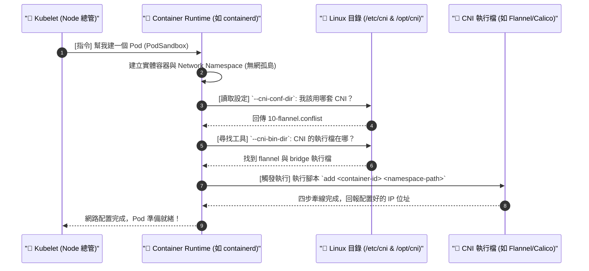

# 216-3. CNI 與 Container Runtime 的交響樂：底層呼叫機制解析

## 📌 核心觀念
- **完美的仲介者**：Container Runtime (容器執行環境，如 containerd 或 CRI-O) 是真正負責在 Node 上把實體容器跑起來的底層元件。
- **解耦的極致**：當 Kubelet 要求建立一個 Pod 時，Runtime 會先造出一個沒有網路的「孤島 (Network Namespace)」，接著它會**自動去指定目錄尋找 CNI 的設定檔與執行檔**，最後以標準化的參數 (`add <container> <namespace>`) 主動觸發 CNI 腳本，完成網路牽線。它就是串連「容器」與「網路」的完美仲介。

## 📊 Kubelet, Runtime 與 CNI 的三角關係
為了應付考場上的除錯，您必須清楚這三者之間的呼叫順序：


## 🔑 知識點擷取 (SOP 參數解析)
畫面中右側的三行關鍵參數，正是 Container Runtime 呼叫 CNI 時的「SOP 指南」：

- `--cni-conf-dir=/etc/cni/net.d` (尋找設計圖)
  - **定義**：這是 Runtime 去尋找 CNI 設定檔的預設目錄。
  - **運作機制**：當您套用 Flannel 或 Calico 的 YAML 時，它們的 DaemonSet 會在這個目錄下生成 `.conf` 或 `.conflist` 檔案。Runtime 透過讀取這個檔案，才知道叢集目前使用的是哪一套網路方案，以及 Pod 的 IP 網段是多大。
- `--cni-bin-dir=/opt/cni/bin` (尋找工具箱)
  - **架構師勘誤**：影片截圖寫 `/etc/cni/bin`，但在標準 Kubernetes 與 CKA 考場中，預設的二進位檔案路徑通常是 `/opt/cni/bin`。
  - **運作機制**：看完設定檔後，Runtime 會來這裡找對應的二進位執行工具（例如 `bridge`, `host-local`, `flannel`）。這就等同於上一堂課中那個 `net-script.sh` 實體存在的地方。
- `執行腳本 add <container> <namespace>` (正式下令)
  - **運作機制**：Runtime 湊齊了設計圖與工具後，正式向 CNI 發出的執行命令。它告訴 CNI：「這是我剛建好的容器 ID，以及它的隔離空間路徑，現在換你接手，執行**新增網路 (add)** 的牽線動作吧！」

## 💻 必考實戰指令
在 CKA 考場上，這兩個目錄是您檢查「Node 為什麼一直 `NotReady`」或「Pod 為什麼卡在 `ContainerCreating`」的終極查修點：
```bash
# 1. 🎯 考場神技：檢查 CNI 設定檔 (設計圖是否存在？)
# 如果這個目錄是空的，代表您根本還沒安裝 CNI，Node 絕對 NotReady！
ls -la /etc/cni/net.d/
# 正常情況下會看到類似 10-weave.conflist 或 10-calico.conflist 的檔案

# 2. 檢查 CNI 執行檔 (工具箱是否齊全？)
# 萬一 CNI 外掛安裝失敗，這裡可能會缺少對應的二進位檔
ls -la /opt/cni/bin/

# 3. 檢查 Container Runtime (如 containerd) 呼叫 CNI 的底層日誌
# 當 Pod 網路起不來，這裡會精準告訴您是找不到設定檔，還是 IP 枯竭
journalctl -u containerd | grep cni

# 4. 查看 Kubelet 的日誌 (Kubelet 是最終接收回報的人)
journalctl -u kubelet | grep cni
```

## ⚠️ 實戰/最佳實踐 SOP 與 Troubleshooting

> [!TIP]
> **SOP：考點預測與避坑指南**
> - **考點預測**：情境為剛用 `kubeadm init` 建立好叢集，接著用 `kubectl run nginx --image=nginx` 建立 Pod。結果發現 Pod 一直卡在 `Pending` 或 `ContainerCreating`。
> - **底層邏輯**：因為您還沒部署 CNI！此時 Container Runtime 在執行到 `--cni-conf-dir=/etc/cni/net.d` 時，發現裡面空無一物。它不知道該呼叫哪個腳本，於是放棄配置網路並報錯，Kubelet 就只能讓 Pod 卡住。
> - **絕對不要手動建檔**：絕對不要自己去 `/etc/cni/net.d/` 裡面手寫設定檔。這些檔案必須由官方的 CNI YAML (透過 InitContainer 或 DaemonSet) 在 Node 上自動生成，手寫極易出錯且無法應付叢集的動態更新。

> [!WARNING]
> **Troubleshooting 技巧：多個設定檔衝突**
> - **徵兆**：切換網路外掛後，Pod 無法啟動或拿到錯誤的網段 IP。
> - **排查重點**：檢查 `/etc/cni/net.d/` 是否有**多個** `.conf` 或 `.conflist` 檔案。Container Runtime 預設會讀取**字母順序最前面**的那一個 (例如 `10-calico.conflist` 會優先於 `87-podman.conflist`)。這在切換 CNI 時是常見的坑，舊的檔案沒刪乾淨會導致 Runtime 讀錯設定。

## 📝 YAML/TOML 骨架 (containerd 配置檔)
在實務上，Runtime 尋找 CNI 目錄的路徑，是寫死定義在 containerd 的配置檔中的 (`/etc/containerd/config.toml`)。如果您在考場發現 Runtime 報錯說找不到 CNI 目錄，這可能是考官動了手腳的地方：
```toml
# 擷取自 Node 上的 /etc/containerd/config.toml
[plugins."io.containerd.grpc.v1.cri".cni]
  bin_dir = "/opt/cni/bin"      # 🚨 Runtime 尋找 CNI 執行檔的絕對目錄
  conf_dir = "/etc/cni/net.d"   # 🚨 Runtime 尋找 CNI 設定檔的絕對目錄
  max_conf_num = 1
```

## 🧠 自我測驗
<details><summary>我在測試環境中原本安裝了 Flannel CNI，後來決定改用 Calico。我直接執行了 <code>kubectl apply -f calico.yaml</code>，但發現新建立的 Pod 網路行為非常怪異，有些拿不到 IP，有些拿錯網段。我用 <code>ls /etc/cni/net.d/</code> 發現裡面同時存在 <code>10-flannel.conflist</code> 和 <code>10-calico.conflist</code>。請問 Container Runtime 會怎麼處理這種情況？</summary>
Container Runtime 會<b>按照字母順序 (Alphabetical order)</b> 讀取設定檔，並且預設只會使用排序最前面的那一個來呼叫 CNI 腳本。<br><br>
在這個例子中，由於 <code>10-calico.conflist</code> 的字母順序優先於 <code>10-flannel.conflist</code>，Runtime 會嘗試使用 Calico 的配置去呼叫執行檔。然而，因為叢集中可能還殘留著 Flannel 遺留的路由表、網橋與 DaemonSet，這會導致底層網路設定嚴重衝突。<br><br>
解決方案：在切換 CNI 外掛時，除了刪除舊的 DaemonSet 之外，<b>務必要到每一台 Node 上，手動清除 <code>/etc/cni/net.d/</code> 目錄下的舊設定檔</b>，以防 Runtime 讀到錯誤的設計圖。
</details>
