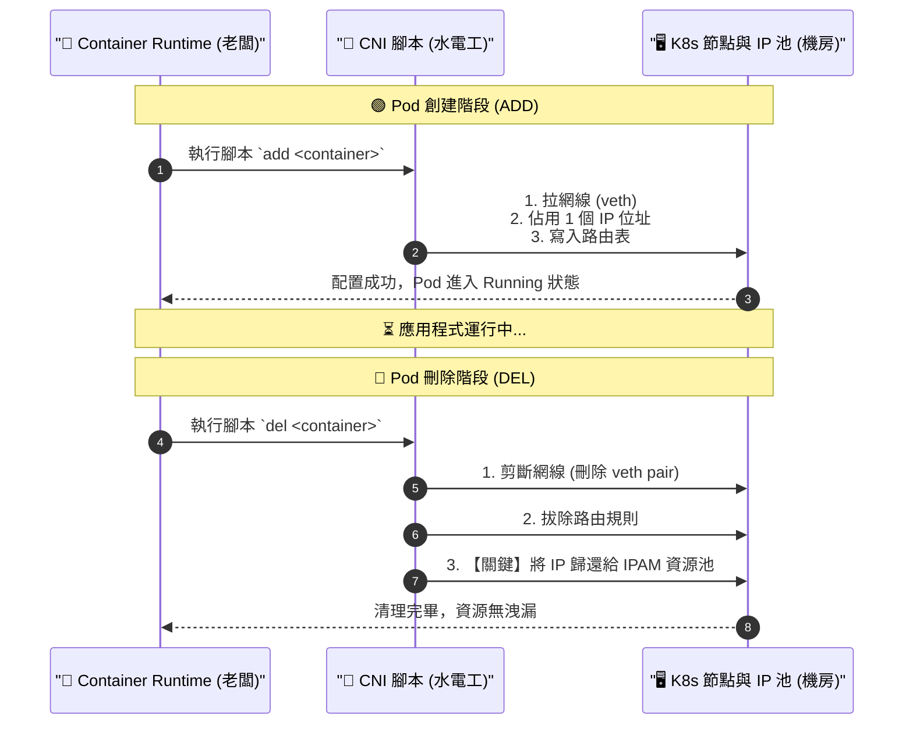

# 216-4. CNI 的完整生命週期 (ADD 與 DEL) 與排錯心法總結

## 📌 核心觀念
- **不只是建設，還要會拆除**：CNI (Container Network Interface) 的職責不僅是「建立網路 (ADD)」，更包含了至關重要的「資源回收 (DEL)」。
- **防堵資源洩漏**：當 Pod 被刪除時，Container Runtime 必須再次呼叫 CNI 腳本執行清理動作。唯有徹底理解從無到有、再從有到無的完整生命週期，您才能具備講師所說的「檢查叢集內聯網情況」的頂級排錯能力。

## 📊 CNI 完整生命週期與資源流動圖
在考場或生產環境中，Pod 的生與死是家常便飯。請將這張「CNI 完整生命週期與資源流動圖」印在腦海中：


## 🔑 知識點擷取 (DEL 區塊解析)

- **觸發時機**：當您執行 `kubectl delete pod` 時，Kubelet 會通知 Container Runtime，Runtime 接著帶入 `del` 參數呼叫 CNI 腳本。
- **Delete veth pair (剪斷網線)**：利用 `ip link del <veth-name>` 指令刪除虛擬網卡。在 Linux 中，刪除 veth pair 會連帶清空綁定在上面的 IP 與相關路由，非常乾脆。
- **IPAM 回收 (防止資源洩漏)**：雖然影片的示範腳本中省略了，但實務上 CNI 必須通知 IPAM 外掛：「這個 IP (`10.244.1.2`) 現在空出來了，請把它放回可用資源池 (Pool) 中」。
- **呼應字幕：為什麼懂這些就能「檢查聯網情況」？**
  - 當您知道 CNI 做了 **ADD**，如果網路不通，您就會去查網橋 (`cni0`)、查網線 (`veth`)、查路由 (`ip route`)。
  - 當您知道 CNI 做了 **DEL**，如果一直建不出新 Pod，您就會懷疑是不是上次的 DEL 失敗了，導致 IP 沒還回去（發生了 IP 枯竭）？

## 💻 必考實戰指令
當 Pod 處於 `Terminating` 刪除卡住，或是遇到「網路資源耗盡」的靈異現象時，這些指令能幫您找出底層問題：
```bash
# 1. 檢查主機上是否有「殭屍網線」
# 如果 Pod 已經刪除，但主機上還留著一大堆沒有綁定 Namespace 的 veth 網卡，代表 DEL 失敗了
ip link show type veth

# 2. 檢查 Pod 刪除或建立過程中的網路相關事件日誌
# 尋找 FailedToDestroyPodNetwork 或 FailedCreatePodSandBox 等關鍵字
kubectl get events --sort-by='.metadata.creationTimestamp' | grep -i network

# 3. 🎯 考場神技：強制刪除卡在 Terminating 的 Pod
# 當 CNI DEL 流程死鎖導致 Pod 刪不掉時，可以使用強制刪除 (⚠️ 但生產環境慎用)
kubectl delete pod <pod-name> --grace-period=0 --force

# 4. 檢查 CNI IPAM 狀態 (以 Flannel 的 host-local 為例，視安裝的 CNI 而定)
# 有時可以進到 CNI 資料夾看目前到底已經配發了哪些 IP 出去
ls -la /var/lib/cni/networks/
```

## ⚠️ 實戰/最佳實踐 SOP 與 Troubleshooting

> [!TIP]
> **SOP：考場情境預測與避坑指南**
> - **考場情境 (IP Exhaustion)**：您在一個 Node 上狂建了 300 個 Pod，接著全部刪除，然後再建。發現新的 Pod 全部卡在 `ContainerCreating`。這通常是發生了**IP 枯竭**。原因是先前的 DEL 流程可能因為 CNI DaemonSet 異常而沒有徹底完成，導致原本的 IP 沒有被歸還到 `/24` (256 個 IP) 的資源池中。
> - **不要隨便 rm CNI 檔案**：如果遇到網路問題，有些文章會教您直接刪除 `/var/lib/cni` 裡面的暫存檔。**在 CKA 考場千萬不要這麼做**，這會讓 Kubelet 完全失去對現有 Pod 網路狀態的掌握，導致嚴重的資料不一致與全面斷網。

> [!WARNING]
> **Troubleshooting 技巧：Pod 刪不掉 (卡在 Terminating)**
> - **徵兆**：Pod 刪除時一直卡在 `Terminating`，Kubelet 日誌 (`journalctl -u kubelet`) 顯示 `networkPlugin cni failed to teardown pod "xxx" network: error getting ClusterInformation`。
> - **排查步驟**：這代表 Container Runtime 在呼叫 `./net-script.sh del` 時失敗了。通常是因為叢集的 API Server 網路不穩，或者 CNI 外掛本身掛了。請先檢查該 Node 的 `kube-proxy` 與 CNI Pod (如 `calico-node`) 是否正常運作。**如果水電工當機了，自然沒人能執行拆除作業**。

## 📝 YAML 骨架 (模擬 IP 枯竭壓力測試)
在考場上，如果您懷疑某個節點的 IPAM 資源池有嚴重洩漏或枯竭的問題，可以使用這個 Deployment 骨架，快速生成大量 Pod 來驗證該節點的最大 IP 承載量：
```yaml
apiVersion: apps/v1
kind: Deployment
metadata:
  name: ip-exhaustion-test
spec:
  replicas: 100              # 🚨 快速建立大量 Pod 榨乾該 Node 的 IP 池
  selector:
    matchLabels:
      app: test
  template:
    metadata:
      labels:
        app: test
    spec:
      nodeName: worker-node-1 # 🚨 強制將這 100 個 Pod 塞入同一個節點
      containers:
      - name: busybox
        image: busybox:1.28
        command: ["sleep", "3600"]
```

## 🧠 自我測驗
<details><summary>我在刪除一個不需要的 Pod 時，發現它的狀態一直卡在 <code>Terminating</code>。我查看 Node 上的 Kubelet 日誌，發現了一行 <code>failed to teardown pod network</code>。為了快速讓 Namespace 乾淨，我直接下達了 <code>kubectl delete pod --force --grace-period=0</code> 把它強制刪除。請問這可能在底層留下什麼後遺症？</summary>
這可能會造成<b>「殭屍網卡 (Zombie veth)」</b>與<b>「IP 資源洩漏 (IP Leak)」</b>。<br><br>
強制刪除 (Force Delete) 只是單方面地從 etcd (Control Plane) 中把這筆資料抹除，K8s 就不再顯示這個 Pod。但是，底層的 Container Runtime 根本還沒來得及（或是失敗了）呼叫 CNI 腳本執行 <code>DEL</code> 的拆除步驟！<br><br>
這意味著：
1. 主機上還殘留著一條連向虛無的 <code>veth</code> 虛擬網線。
2. 該 Pod 原本佔用的 IP 沒有被還給 IPAM 資源池。<br><br>
如果經常這樣進行強制刪除，該 Node 的 IP 資源池很快就會被掏空，最終導致新的 Pod 完全建不起來，報出 <code>networkPlugin cni failed...</code> 等 IP 耗盡的致命錯誤。
</details>
