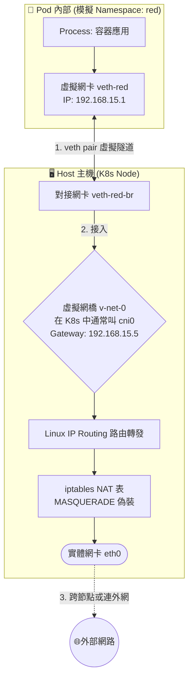

# 216. Pod Networking

## 📌 核心觀念
- **人肉模擬 CNI**：本節課將前面學過的底層 Linux 網路知識（Namespace, Bridge, Routing, NAT），正式套用到 Kubernetes 的 Pod 網路模型中。透過手動執行建立網橋、veth pair、分配 IP 與設定路由的指令，我們實際上是在「人肉模擬」CNI 外掛的工作流程。
- **揭開自動化的底層真相**：了解這些底層手動步驟，能幫助我們揭開 K8s 自動化網路配置的神祕面紗。在未來遇到網路卡死時，能夠跳脫 K8s 的表層，直擊 Linux 底層的問題核心。

## 📊 K8s Pod 網路底層建構圖
在 K8s 中，每當您 `kubectl run` 一個 Pod，Kubelet 底層就會呼叫 CNI 跑一次這個流程：


## 🔑 知識點擷取 (Detailed Notes)

- **手動構建 CNI 流程 (定義與觸發)**
  - **建立網橋 (Bridge)**：執行 `ip link add v-net-0 type bridge`，這扮演了同一個 Node 上所有 Pod 的中央交換器角色。
  - **打通隔離 (veth pair)**：建立一對虛擬網線，一端丟進 Pod 的 Namespace (如圖中的 red)，另一端接在主機的網橋上，讓 Pod 擁有對外溝通的物理（虛擬）路徑。
  - **配置 IP (IPAM)**：為 Pod 內的網卡設定專屬 IP (如 `192.168.15.1`)。在 K8s 的世界裡，這通常是由 CNI 附帶的 `host-local` 外掛負責自動分配，以確保同節點內的 Pod IP 絕不重複。

- **路由與 NAT 的限制條件 (Limitations)**
  - **同 Node 通訊**：只要接上同一個虛擬 Bridge，同 Node 上的 Pod 之間就能透過 L2 交換直接通訊。
  - **連外網 / 跨網段通訊**：必須在 Pod 內部寫入預設路由 (例如 `ip route add... via 192.168.15.5`)，將封包引導至主機的網橋；並且**主機必須開啟 IP 轉發與 NAT** (`iptables -t nat ... -j MASQUERADE`)，否則封包絕對會「出得去，但回不來」。

## 💻 必考實戰指令
在 CKA 考場上，您不需要手動敲打那些複雜的 `ip netns` 網路構建指令（因為 CNI 都幫您做好了），但您必須知道如何驗證 CNI 有沒有正確完成它的工作：
```bash
# 1. 檢查 Node 上由 CNI 自動建立的虛擬網橋 (在 K8s 實務中通常名為 cni0 或 weave)
ip link show type bridge

# 2. 檢查 Node 上的路由表，確認 CNI 是否正確寫入了通往「其他 Node 的 Pod 網段」的轉發規則
ip route

# 3. 🎯 考場神技：當懷疑 Pod 網路異常時，起一個臨時 Pod 進行雙向 ping 測試
# --rm 確保測試完自動刪除，--restart=Never 確保不產生 Deployment
kubectl run net-test --image=busybox:1.28 --rm -it --restart=Never -- sh
# 進入 shell 後，嘗試 ping 其他正常 Pod 的 IP，或 ping 8.8.8.8 測外網

# 4. 檢查 Node 是否允許封包轉發 (若為 0，所有跨節點 Pod 網路直接癱瘓)
cat /proc/sys/net/ipv4/ip_forward
```

## ⚠️ 實戰/最佳實踐 SOP 與 Troubleshooting

> [!TIP]
> **SOP：考試情境預測與避坑指南**
> - **考試情境**：CKA 絕對不會考您手刻這些底層 Linux 網路指令。但考試會給您一個「網路壞掉」的叢集，例如：新建的 Pod 一直卡在 `ContainerCreating` 狀態。這通常是因為 Node 上根本沒有安裝 CNI，導致 Kubelet 無法執行上述的這些步驟來給 Pod 配置網路。
> - **嚴禁清空 iptables**：在除錯時，千萬不要手癢執行 `iptables -F` 或 `iptables -t nat -F`！這會瞬間清空 CNI 與 `kube-proxy` 辛苦建立的所有 NAT 與轉發規則，直接導致該 Node 上的服務徹底斷網。

> [!WARNING]
> **Troubleshooting 技巧：Pod 網路配置失敗**
> 情境：Pod 無法成功啟動，使用 `kubectl describe pod` 看到報錯 `networkPlugin cni failed to set up pod...`。
> 1. **排查步驟 1 (檢查本體)**：確認 CNI 外掛本身的 DaemonSet Pod 是否存活 (`kubectl get pods -n kube-system`)。
> 2. **排查步驟 2 (檢查設定檔)**：檢查該 Node 的 CNI 設定檔是否存在且格式正確 (`ls -l /etc/cni/net.d/`)。
> 3. **排查步驟 3 (檢查系統日誌)**：使用 `journalctl -u kubelet | grep cni` 查看具體報錯。常見的底層原因為 **IP 資源池耗盡** (IPAM 滿載，無法再分配新 IP) 或是 CNI 的二進位執行檔遺失 (`/opt/cni/bin/`)。

## 📝 YAML 骨架 (網路排錯雙向測試 Pod)
在考場上遇到跨節點網路問題時，有時單靠一端的測試是不夠的。建議使用這種簡單的骨架，將測試 Pod 強制部署到疑似壞掉的 Node 上進行雙向 Ping：
```yaml
apiVersion: v1
kind: Pod
metadata:
  name: net-debug-pod
spec:
  nodeName: worker-node-2    # 🚨 考場神技：強制將測試 Pod 部署到疑似網路壞掉的節點上
  containers:
  - name: busybox
    image: busybox:1.28
    command: ['sleep', '3600']
```

## 🧠 自我測驗
<details><summary>當我在 CKA 考場上執行 <code>kubectl run test-pod --image=nginx</code>，卻發現狀態一直卡在 <code>ContainerCreating</code>。我透過 <code>describe pod</code> 發現錯誤訊息為 <code>networkPlugin cni failed to set up pod...</code>。請問底層發生了什麼事？我應該往哪三個方向去排查？</summary>
這段報錯代表 Kubelet 已經成功透過 Container Runtime (如 containerd) 建出了無網路的容器 Namespace，但在呼叫 CNI 腳本嘗試「接上虛擬網線 (veth pair)」與「配發 IP」時失敗了。<br><br>
正確的三大排查方向：
1. <b>檢查 CNI 元件</b>：前往 <code>kube-system</code> 檢查負責網路的 DaemonSet (如 Flannel/Calico) 是否崩潰或處於 CrashLoopBackOff。
2. <b>檢查設定檔與腳本路徑</b>：確認該 Node 上的 <code>/etc/cni/net.d/</code> 存在有效的設定檔，且 <code>/opt/cni/bin/</code> 內有正確的執行檔。
3. <b>檢查 IPAM 狀態</b>：查看 kubelet 的日誌 (<code>journalctl -u kubelet</code>)，確認是否因為該節點的 IP 池 (Subnet) 已經耗盡，導致無法再為新 Pod 配發出 IP。
</details>
