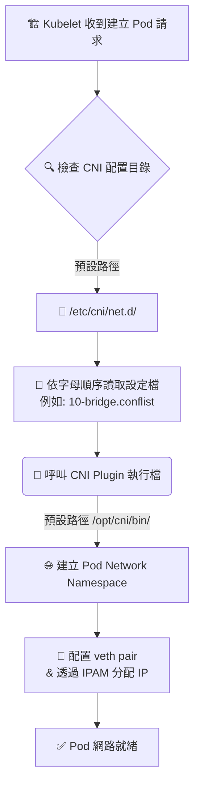

# 217. Viewing CNI Options (CNI in kubernetes)

## 1. 🏷️ 課程定位
- **章節編號與名稱**：第 9 節：Networking
- **影片標題**：Viewing CNI Options (對應講座 217. CNI in kubernetes)

## 2. 📌 核心概念摘要
CNI (Container Network Interface) 是 Kubernetes 處理叢集網路的核心標準介面，負責 Pod 的 IP 分配 (IPAM) 與跨節點通訊建立。在 Kubernetes 叢集中，kubelet 透過讀取 `/etc/cni/net.d/` 目錄下的配置檔，動態呼叫對應的 CNI 外掛程式（如 Weave, Flannel, Calico 等），這是確保 Pod 具備網路能力與叢集節點能達到 Ready 狀態的最底層關鍵。

## 3. 📊 流程圖與視覺化重現
以下為 Kubelet 如何與 CNI 互動為 Pod 建立網路的底層生命週期：



## 4. 🔑 知識點擷取 (Detailed Notes)
**CNI 目錄與載入順序：**
- **設定檔路徑**：`/etc/cni/net.d/`。
- **載入規則**：當存在多個配置檔時，kubelet 會嚴格按照字典（字母）順序讀取（例如 `10-weave.conflist` 會優先於 `99-loopback.conf` 被讀取並生效）。

**配置檔內容 (.conflist / .conf)：**
- 定義了網路插件的 `type`（如 bridge, weave-net, calico）。
- 定義子網域配置與 IPAM (IP Address Management) 方式。

**二進位執行檔路徑：**
- Kubelet 真正執行網路配置的腳本或編譯檔，預設存放於 `/opt/cni/bin/`（包含 bridge, dhcp, host-local 等基礎插件）。

**觸發機制與限制條件 (Limitations)：**
- K8s 本身不內建跨節點網路實作，如果沒有安裝任何 CNI，Node 的狀態會卡在 `NotReady`，且 Pod 狀態會停留在 `ContainerCreating`。

## 5. 💻 CKA 必備實作指令 (Imperative Commands)
在考場中排查 CNI 問題時，以下是必備的偵錯指令：

```bash
# 1. 檢查 CNI 配置檔 (查看目前叢集使用哪個 CNI 及其網路設定)
ls -la /etc/cni/net.d/
cat /etc/cni/net.d/10-bridge.conflist   # 根據上一行輸出的檔名進行查看

# 2. 檢查 CNI 的二進位執行檔是否存在
ls -la /opt/cni/bin/

# 3. 查看叢集 Node 狀態與 Pod 子網域分配 (非常實用)
kubectl get nodes -o wide

# 4. (進階排查) 如果懷疑 kubelet 指定了非預設的 CNI 路徑，可檢查其啟動參數
ps -aux | grep kubelet | grep cni
```

## 6. 🚀 CKA 考試延伸與 Troubleshooting
**🎯 考試情境預測：**
- **情境一（高頻）**：考題要求你找出某個叢集正在使用哪種 CNI Plugin，以及該 CNI 配置的 Pod Network CIDR 是多少。這時直接 `cat /etc/cni/net.d/*` 找 subnet 欄位是最快的解法。
- **情境二**：叢集中某個 Node 狀態顯示為 NotReady，且上面的 Pod 全部起不來。

**🛑 避坑指南：**
- 考場上如果需要安裝 CNI (例如 Weave 或 Flannel)，**絕對不要**自己手寫 YAML。請直接使用考題提供的 URL 執行 `kubectl apply -f <URL>`。
- **不要**在 `/etc/cni/net.d/` 裡留下備份檔但副檔名還是 `.conf` 或 `.conflist`，這會擾亂 kubelet 依字母順序載入的邏輯。

**🔧 Troubleshooting (當 Node NotReady 或 Pod 卡 ContainerCreating 時)：**
1. **先看事件**：`kubectl describe pod <pod-name>`
   (尋找 `network plugin is not ready: cni config uninitialized` 的報錯)。
2. **查節點日誌**：`journalctl -u kubelet -f`
   (觀察 kubelet 呼叫 CNI 時是否報錯找不到檔案，或 IP 已經耗盡)。
3. **直接進到該故障 Node**，檢查 `/etc/cni/net.d/` 是否為空，若為空代表該節點沒有被正確部屬 CNI DaemonSet。
