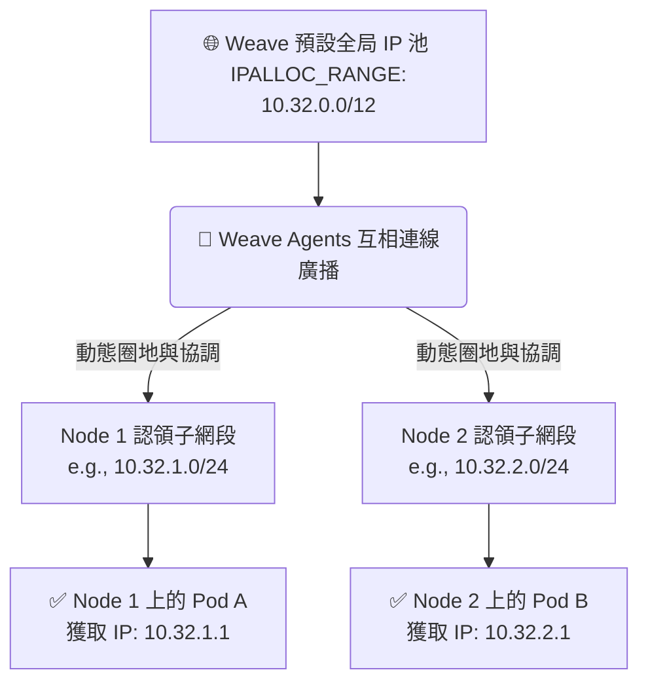

# 222. ipam weave

## 1. 🏷️ 課程定位
- **章節編號與名稱**：第 9 節：Networking
- **影片標題**：222. ipam weave

## 2. 📌 核心概念摘要
Weave Net 不依賴 K8s 預設的 host-local 靜態檔案來發放 IP，而是自帶了專屬的動態 IPAM 機制。它透過各節點代理程式之間的 Gossip (八卦) 協定互相溝通，將預設的超大 IP 池（如 `10.32.0.0/12`）動態切割並分配給各個節點，確保 IP 不衝突且能靈活應對叢集的自動擴縮容。

## 3. 📊 流程圖與視覺化重現
以下為 Weave 獨特的動態 IPAM 分配生命週期：



## 4. 🔑 知識點擷取 (Detailed Notes)
**專屬 IPAM 外掛 (weave-ipam)：**
- **定義**：Weave 不使用把帳本寫在硬碟的 host-local，而是將 IP 配置狀態保存在記憶體中，並透過網路與其他節點同步。

**預設網段與環境變數：**
- **觸發機制**：Weave 啟動時預設會霸佔 `10.32.0.0/12` 這個極大的網段。
- **自訂方式**：如果這個網段跟你們公司的實體網路有衝突，必須在部署 Weave 的 YAML 檔案中，透過設定 `IPALLOC_RANGE` 環境變數來覆寫。

**動態圈地 (Dynamic Allocation)：**
- **底層行為**：當有新節點加入 K8s 叢集時，該節點上的 Weave Agent 會向現有的叢集大喊：「給我一塊沒人用的 IP 網段！」。經過其他節點同意後，它才會開始發 IP。

**限制條件 (Limitations)：**
- 由於 IPAM 依賴節點間的即時通訊，如果節點間的 **TCP/UDP 6783 Port** 被防火牆阻擋，不僅跨節點網路不通，連 IP 發放都會陷入僵局，導致 Pod 無法建立。

## 5. 💻 CKA 必備實作指令 (Imperative Commands)
在考場中，如果你需要確認 Weave 的 IPAM 運作狀態或網段設定，請善用以下指令：

```bash
# 1. 快速查看叢集中所有 Pod 被分配到的 IP，藉此反推各節點的子網段
kubectl get pods -A -o wide

# 2. 深入 Weave 日誌，查看 IPALLOC_RANGE (IP池範圍) 的初始設定
# ⚠️ 加上 -c weave 指定要看主程式容器，而非網路策略容器
kubectl logs -n kube-system -l name=weave-net -c weave | grep ipalloc

# 3. 檢查 Weave Agent 是否成功與其他節點連線 (Gossip 同步)
kubectl logs -n kube-system -l name=weave-net -c weave | grep "supplied peer list"
```

## 6. 🚀 CKA 考試延伸與 Troubleshooting
**🎯 考試情境預測：**
- **配分重點**：考題要求你建置一個 K8s 叢集，並明確規定 "Pod Network CIDR 必須是 `192.168.0.0/16`"。考題會提供一個 Weave 的 YAML 連結。如果你直接 `kubectl apply -f` 貼上去就中計了！因為 Weave 預設是 `10.32.0.0/12`，你必須先下載 YAML，修改裡面的 `IPALLOC_RANGE` 環境變數，再 apply 才能拿到分數。

**🛑 避坑指南：**
- **不要**把 `kubeadm init --pod-network-cidr` 跟 Weave 的 `IPALLOC_RANGE` 搞混。kubeadm 的參數只是告訴 K8s 控制面預期的網段，但真正發 IP 的是 CNI，所以這兩邊的數字必須完全一致，否則網路一定會出狀況。

**🔧 Troubleshooting：**
- **現象**：Pod 一直處於 `ContainerCreating`。
- **排查**：下達 `kubectl describe pod <pod-name>`。如果你看到 `Failed to allocate address: No available addresses`，代表該節點的 IP 已經發光了，或是 Weave 節點互相通訊失敗導致無法索取新的 IP 網段。此時請立刻檢查 `weave-net` 的 Log 與實體主機的防火牆設定。
