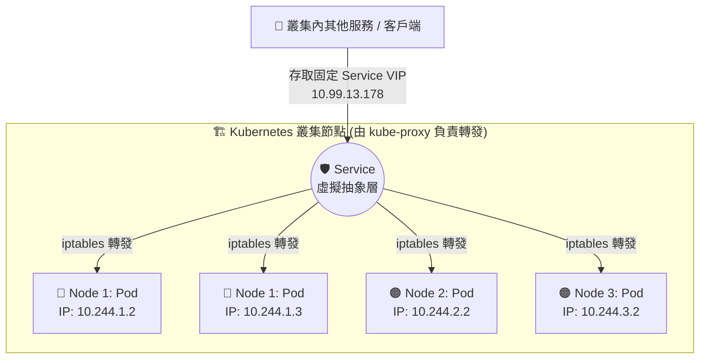

# 224. Service Networking

## 1. 🏷️ 課程定位
- **章節編號與名稱**：第 9 節：Networking
- **影片標題**：224. Service Networking

## 2. 📌 核心概念摘要
Service 在 Kubernetes 中扮演著「虛擬負載平衡器」的角色。它的底層運作目標是為生命週期短暫、IP 隨時變動的 Pod 們，提供一個永遠不會改變的虛擬 IP (ClusterIP) 與 DNS 名稱，藉由 kube-proxy 動態攔截並轉發流量，確保應用程式之間的網路連線高可用且不中斷。

## 3. 📊 流程圖與視覺化重現
根據您的課程畫面，Service 將流量負載平衡至跨節點 Pod 的底層拓樸如下：



## 4. 🔑 知識點擷取 (Detailed Notes)
- **定義與虛擬特性**：Service 是一個抽象概念，它的 IP (ClusterIP) 是假的，不存在於任何實體或虛擬網卡上，因此無法用 ping 指令測試 Service IP，只能透過指定的 Port 進行 TCP/UDP 連線。
- **底層對象變化 (Endpoints 的誕生)**：
  - 當你建立一個 Service 時，K8s 會在背景自動建立一個與之同名的 Endpoints (或 EndpointSlice) 物件。
  - Service 透過 selector (標籤選擇器) 去尋找帶有對應 Label 的 Pod。
- **觸發機制與自動更新**：
  - 只有當 Pod 的狀態變成 Ready 時，它的真實 IP 才會被加入到 Endpoints 清單中。
  - 一旦 Pod 當機或被刪除，Endpoints 控制器會「瞬間」將該 Pod IP 從清單中剔除，確保流量不會導向死掉的容器。
- **限制條件 (Limitations)**：
  - 預設的 Service 類型為 ClusterIP，這意味著該 IP 只能在 Kubernetes 叢集內部被存取。若要讓外部使用者連線，必須更改 Type 為 NodePort 或 LoadBalancer。

## 5. 💻 CKA 必備實作指令 (Imperative Commands)
在 CKA 考場上，自己手寫 Service YAML 太慢且容易出錯，請務必熟練以下 Imperative Commands (指令式操作)：

```bash
# 1. 考場神技：為現有的 Pod 或 Deployment 快速建立 Service (自動抓取 Label)
# 快速參數：--expose 會自動幫你處理 Selector 的配對，省下大量時間
kubectl expose pod front-end --name=front-end-svc --port=80 --target-port=8080

# 2. 生成 Service YAML 骨架但不立刻建立 (考場修改用)
kubectl create service clusterip my-svc --tcp=5678:8080 --dry-run=client -o yaml > svc.yaml

# 3. 排錯必備：檢查 Service 背後到底有沒有成功綁定到真實的 Pod IP
kubectl get endpoints <service-name>
```

## 6. 🚀 CKA 考試延伸與 Troubleshooting
- 🎯 **考試情境預測**：
  考題極高機率會要求你：「為名為 `web-app` 的 Deployment 建立一個 Service，並將其暴露在節點的某個特定 Port 上。」此時需使用 `kubectl expose deployment web-app --type=NodePort --port=80`，然後進 YAML 加上 `nodePort: 30080` 的設定。

- 🛑 **避坑指南 (致命細節)**：
  - **Port 與 TargetPort 搞混**：`port` 是 Service 自己對外開放的 Port；`targetPort` 則是容器 (Pod) 內部應用程式實際在聽的 Port。寫反了流量絕對通不了。
  - **Label 拼字錯誤**：Service 的 selector 只要跟 Pod 的 labels 差一個字母，Service 就會找不到 Pod。

- 🔧 **Troubleshooting**：
  - **現象**：連線 Service IP 失敗，出現 Connection Refused 或 Timeout。
  - **第一步動作**：立刻下達 `kubectl describe service <service-name>`，查看 Endpoints 欄位。
  - **診斷**：如果 Endpoints 顯示 `<none>`，代表 Service 找不到 Pod。這只有兩種可能：(1) Selector 標籤寫錯了。(2) 標籤對了，但是你的 Pod 還沒通過 Readiness Probe (尚未 Ready)，所以被擋在清單外。
