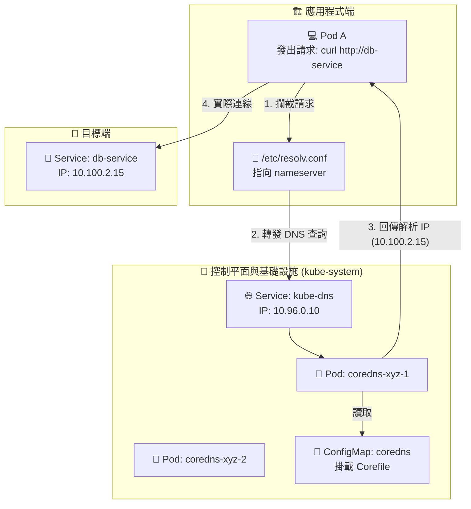

# 227 & 228: DNS & CoreDNS in Kubernetes

## 🧠 核心觀念：叢集的「靈魂大腦與電話簿」
- **服務發現 (Service Discovery)**：CoreDNS 就像是 K8s 叢集內的「自動更新電話簿」。當我們想連線給某個微服務時，不需要去記它隨時會變動的 IP 地址（就像不需要硬記同事的分機），只要呼叫它的「名字 (Service Name)」，CoreDNS 就會幫我們轉接到正確的號碼 (ClusterIP)。
- **動態適應與穩定溝通**：Pod 的生命週期極短，隨時會銷毀與重建。有了 CoreDNS，應用程式之間只要認得「職稱 (Service)」，就能保持穩定溝通，完全不受底層 Pod IP 變動的影響。
- **排障第一道防線**：在生產環境或 CKA 考試中，當微服務之間無法連線時，第一步往往就是確認 DNS 解析是否正常運作。

## 📊 CoreDNS 工作流與解析生命週期



## 🔑 核心知識點詳解

### 1. FQDN (Fully Qualified Domain Name) 全稱網域名稱
- **標準格式**：`[服務名稱].[命名空間].svc.cluster.local`
- **舉例說明**：如果有一個位於 `default` 命名空間名為 `web` 的 Service，其 FQDN 即為 `web.default.svc.cluster.local`。
- **同 Namespace 呼叫**：因為 Kubelet 自動注入的 `/etc/resolv.conf` 內含 `search` 欄位會幫忙補齊後綴，同 Namespace 內只需寫 `[服務名稱]` 即可。
- **跨 Namespace 呼叫**：**必須**加上 Namespace 成為 `[服務名稱].[命名空間]`，否則 CoreDNS 無法正確解析。

### 2. 底層控制中樞：Corefile (ConfigMap)
- CoreDNS 的行為準則完全由 `kube-system` 命名空間下名為 `coredns` 的 ConfigMap 控制。
- **⚠️ 熱重載限制**：修改 ConfigMap 中的 `Corefile` 後，預設情況下 CoreDNS 不會立即套用。實務上需要**手動重啟 CoreDNS Pod** 才能讓新設定生效。

### 3. Pod 的專屬 DNS 記錄 (少用但必知)
- **格式**：`[Pod-IP-以橫槓取代點].[命名空間].pod.cluster.local`
- **舉例說明**：IP 為 `10.244.1.5` 的 Pod，DNS 記錄為 `10-244-1-5.default.pod.cluster.local`。

## 💻 必考實戰指令 (Imperative Commands)

> [!IMPORTANT]
> **變更前務必備份！**
> 當考題要求你修改 API Server 或 CoreDNS 等關鍵組件配置時，請務必先匯出備份：
> `kubectl get configmap coredns -n kube-system -o yaml > /tmp/coredns-backup.yaml`

```bash
# 🎯 [必考] 建立暫時性測試 Pod 進行 DNS 查詢 (用完即刪，保持環境乾淨)
# 注意：考場推薦使用 busybox:1.28，因較新版 busybox 的 nslookup 偶有 Bug 解析失敗
kubectl run test-dns --image=busybox:1.28 --rm -it --restart=Never -- nslookup web-service.default.svc.cluster.local

# 🔍 查看 CoreDNS 的設定檔 (Corefile)
kubectl get configmap coredns -n kube-system -o yaml

# 🔄 修改 CoreDNS 設定檔 (考場若要求新增/修改外網轉發 plugins)
kubectl edit configmap coredns -n kube-system

# 🚀 快速重啟 CoreDNS 使新配置生效 (Rollout Restart 是最安全的做法)
kubectl rollout restart deployment coredns -n kube-system

# 📝 [急救] 快速生出 ConfigMap 範本 (若考題不慎將 coredns config 刪除需重建時)
kubectl create configmap coredns --from-file=Corefile=/path/to/Corefile -n kube-system --dry-run=client -o yaml > coredns.yaml
```

## 🔧 實戰 SOP 與 Troubleshooting (排障指南)

> [!TIP]
> **排障黃金 3 步**
> 1. **檢查 Pod 內的 DNS 配置**：`kubectl exec <pod-name> -- cat /etc/resolv.conf` (確認 nameserver 指向正確)。
> 2. **檢查 CoreDNS 本身日誌**：`kubectl logs -l k8s-app=kube-dns -n kube-system` (觀察是否有 Corefile 語法錯誤或外網解析錯誤)。
> 3. **檢查 DNS Service 狀態**：`kubectl get endpoints kube-dns -n kube-system` (確保 Endpoint 不為空，代表 DNS Service 有抓到後端 CoreDNS Pods)。

> [!WARNING]
> **避坑陷阱區**
> - **跨 Namespace 解析失敗**：這是最常見的錯誤。題目若說 App A 連不到 App B (在不同 Namespace)，通常是開發者在 Config 中只寫了 `db-service`。解法：改為完整的 `db-service.target-ns.svc.cluster.local`。
> - **Endpoints 空白陷阱**：有時候 `nslookup` 解析正常 (能回傳 IP)，但連線依然失敗！這時請立即檢查目標 Service 的 Endpoints (`kubectl get ep`)。若沒有 Endpoints，代表你的 Service Selector 標籤寫錯，**沒有選到任何 Pod，這不是 DNS 的錯！**

## 📝 YAML 骨架範例 (CoreDNS ConfigMap)

```yaml
apiVersion: v1
kind: ConfigMap
metadata:
  name: coredns
  namespace: kube-system
data:
  Corefile: |
    .:53 {
        errors
        health {
           lameduck 5s
        }
        ready
        # 關鍵字段落：負責 k8s 內部的 DNS 解析機制
        kubernetes cluster.local in-addr.arpa ip6.arpa {
           pods insecure
           fallthrough in-addr.arpa ip6.arpa
           ttl 30
        }
        prometheus :9153
        forward . /etc/resolv.conf {
           max_concurrent 1000
        }
        cache 30
        loop
        reload
        loadbalance
    }
```

## ❓ 自我測驗

<details>
<summary>如果在 default 命名空間的 Pod A，想要存取位於 backend 命名空間，名為 `auth-service` 的 Service，請問其 FQDN 應該寫什麼？</summary>

**解答：** 
應該使用：`auth-service.backend.svc.cluster.local`
（或者在相同叢集環境下可以簡化為 `auth-service.backend`）
</details>
