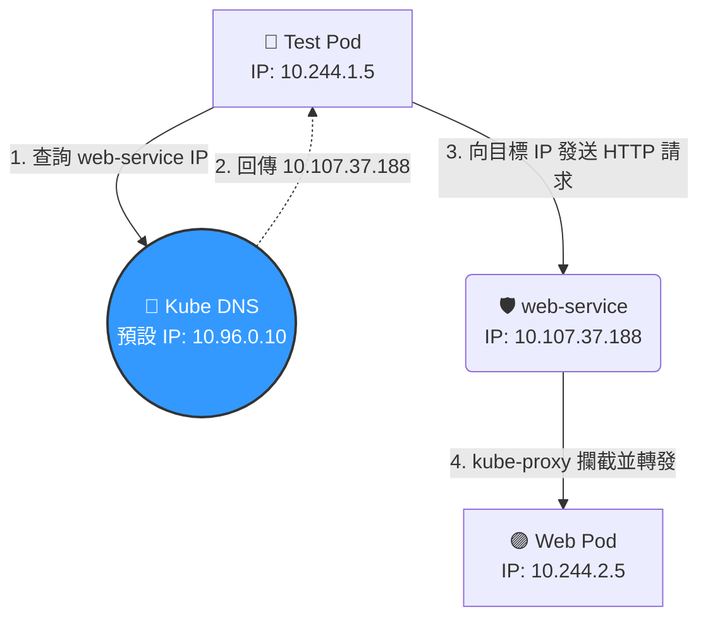

# 227. DNS in kubernetes

## 1. 🏷️ 課程定位
- **章節編號與名稱**：第 9 節：Networking
- **影片標題**：227. DNS in kubernetes

## 2. 📌 核心概念摘要
Kubernetes 內建的 DNS 服務（通常為 CoreDNS）負責為叢集內的 Service 與 Pod 自動註冊與解析名稱。它的底層運作目標是讓應用程式徹底擺脫對「動態且脆弱的 IP 位址」的依賴，轉而透過穩定、可預測的 FQDN (完整網域名稱) 進行跨節點與跨 Namespace 的通訊。

## 3. 📊 流程圖與視覺化重現
根據您截圖畫面的配置，Test Pod 呼叫 Web Service 的底層解析與轉發流程如下：



## 4. 🔑 知識點擷取 (Detailed Notes)
- **觸發機制 (Service 自動註冊)**：
  - 每當建立一個 Service 時，DNS 會自動建立一筆 A 紀錄 (A Record)。
  - FQDN 完整格式：`<service-name>.<namespace>.svc.cluster.local`。
- **Pod 的 DNS 註冊規則**：
  - Pod 其實也會獲得專屬的 DNS 紀錄，但格式是將其 IP 位址的 `.` 替換為 `-`。
  - 範例：影片中 IP 為 `10.244.2.5` 的 Pod，其 DNS 為 `10-244-2-5.default.pod.cluster.local`。（實務上極少直接使用，因為 Pod IP 會變，通常還是呼叫 Service）。
- **底層對象與設定 (`/etc/resolv.conf`)**：
  - Pod 啟動時，Kubelet 會自動將 `/etc/resolv.conf` 注入到容器中。
  - 其中的 `nameserver` 參數，絕對會指向叢集內部的 DNS Service IP（在 kubeadm 預設環境中通常是 `10.96.0.10`）。
- **限制條件 (Limitations)**：
  - 如果 CNI (網路外掛) 尚未安裝或運作異常，CoreDNS 的 Pod 會因為拿不到 IP 而卡在 Pending 或 ContainerCreating，此時全叢集的名稱解析將徹底癱瘓。

## 5. 💻 CKA 必備實作指令 (Imperative Commands)
在 CKA 考場中，驗證 DNS 最快的方法就是開一個免洗工具 Pod。請務必熟練以下起手式：

```bash
# 1. 考場神技：建立一個拋棄式的工具 Pod 來測試 DNS 解析
# --rm 參數會在退出時自動刪除 Pod，保持考場環境整潔
kubectl run test-dns --image=busybox:1.28 --rm -it --restart=Never -- nslookup web-service

# 2. 檢查目標 Pod 內部的 DNS 伺服器指向是否正確
kubectl exec -it <pod-name> -- cat /etc/resolv.conf

# 3. 檢查系統層級的 DNS 服務是否存活
kubectl get pods -n kube-system -l k8s-app=kube-dns
kubectl get svc kube-dns -n kube-system
```

## 6. 🚀 CKA 考試延伸與 Troubleshooting
- 🎯 **考試情境預測**：
  考題會要求你：「請找出 `marketing` namespace 中名為 `db-svc` 的 Service 的 FQDN，並使用 `nslookup` 查詢其 IP，將結果存入 `/opt/course/dns-result.txt`。」

- 🛑 **避坑指南 (致命細節！)**：
  - **Busybox 版本地雷**：在考場上測試 DNS 時，絕對不要只打 `--image=busybox` (會抓 latest)。較新版的 Busybox 在 `nslookup` 實作上有 bug，常常會解析失敗或超時。請強迫自己記憶並指定使用 `--image=busybox:1.28`，這能幫你省下考場上找不出錯誤的崩潰時間！

- 🔧 **Troubleshooting**：
  - **現象**：在 Pod 內執行 `nslookup` 發生 Timeout。
  - **排查步驟 1**：確認 CoreDNS 本身活著沒。`kubectl get pods -n kube-system`。
  - **排查步驟 2**：檢查 Service Endpoints 是否綁定成功。下達 `kubectl describe svc kube-dns -n kube-system`。如果 Endpoints 欄位顯示 `<none>`，代表 CoreDNS Pod 的 Label 被人惡意竄改了，導致 Service 找不到 Pod，請進去把 Label 改回來 (`k8s-app=kube-dns`)。
