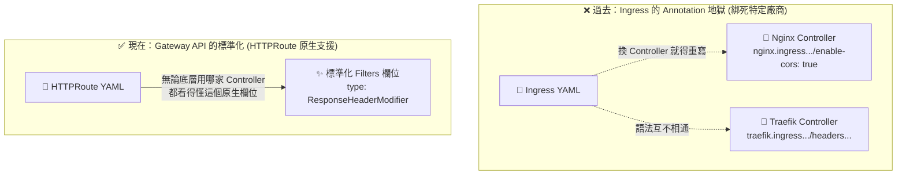

# 238. Introduction to Gateway API (2025 Updates)

## 🧠 核心觀念：告別註解地獄，擁抱標準化
- **新世代標準**：Gateway API 是 Kubernetes 為了徹底解決傳統 Ingress「高度依賴各家廠商 Annotation (註解)」等歷史業障而推出的進化版網路標準。
- **將特殊功能扶正**：它將進階路由功能（如修改 Header、CORS、流量權重分配）從非標準的 YAML 註解，轉化為 Kubernetes 原生的結構化 API 欄位 (Filters)。
- **真正的多租戶與角色拆分**：透過將資源拆分為基礎設施供應商 (GatewayClass)、叢集管理員 (Gateway) 與應用程式開發者 (HTTPRoute) 三層架構，實現了職責分離，讓路由設定不再互相干擾與衝突。

## 📊 演進史：Ingress vs Gateway API



## 🔑 核心知識點詳解

### 1. Ingress 的痛點與限制 (Limitations)
- **Annotation 氾濫**：Ingress 的原生 API 非常陽春（只能管 Host 和 Path）。為了實現 CORS（跨來源資源共用）或 Header 修改，工程師必須在 `metadata.annotations` 裡面塞滿特定廠商的指令（例如 Nginx 與 Traefik 的寫法完全不同）。
- **供應商鎖定 (Vendor Lock-in)**：這導致了 YAML 難以跨環境移植，一旦更換底層 Controller，所有的路由規則設定都要重新改寫。

### 2. Gateway API 的解法：標準化 Filters
- **一等公民 (First-class citizen)**：引入了 `HTTPRoute` 資源，將過去需要依靠 Annotation 才能做的事情變成了官方標準的 API 欄位。
- **無痛移植**：現在如果要加上 CORS Header，只需在 `spec.rules.filters` 宣告 `type: ResponseHeaderModifier` 並寫入標準 Key-Value。無論底層是 NGINX Gateway Fabric 還是 Envoy Gateway，只要支援 Gateway API 標準就能無痛運行。

### 3. 資源的三層架構 (Role-Oriented)
- **GatewayClass**：由**基礎設施供應商**定義（例如 AWS, GCP 或 NGINX）。
- **Gateway**：由**叢集管理員**建立，負責定義「實體監聽的 Port 與 TLS 憑證」。
- **HTTPRoute**：由**應用程式開發者**建立，負責定義「路徑、Header 匹配、過濾器 (Filters) 與流量轉發規則」，並透過 `parentRefs` 依附掛載到特定的 Gateway 上。

## 💻 必考實戰指令 (Imperative Commands)

由於 Gateway API 目前是作為 CRD (Custom Resource Definition) 引入的，`kubectl create` 的快速生成支援度不如傳統資源，考場上你必須熟練以下查詢與驗證指令：

```bash
# 🔍 檢查叢集中是否已經安裝了 Gateway API 的 CRDs
kubectl get crds | grep gateway.networking.k8s.io

# 🌐 查看叢集管理員建好的 Gateway (確認你要把 Route 掛在哪裡)
kubectl get gateway -A

# 🛣️ 查看現有的 HTTPRoute，並檢查它們的狀態
kubectl get httproute -A

# 🎯 [實戰排障] 深度檢查 HTTPRoute 為什麼沒有生效
# 考場上如果 HTTPRoute 無法導流，通常是沒有成功綁定到 Gateway
kubectl describe httproute <route-name> | grep -A 5 "Conditions"
```

## 🔧 實戰 SOP 與 Troubleshooting

> [!IMPORTANT]
> **考試情境預測 (2025 Updates)**
> 考題**不會**叫你從頭安裝 Gateway API 的 CRD，而是會提供一個現成環境。
> 題目可能會給你一個 Gateway 的名稱，要求你手寫一個 `HTTPRoute` YAML，將特定路徑 (`/api`) 的流量導向 `api-service`，並可能會要求你設定 HTTP Header 的修改或流量權重 (Weight)。

> [!WARNING]
> **避坑指南**
> - **忘記綁定 (`parentRefs`)**：寫 HTTPRoute 時，最容易忘記寫 `parentRefs` 欄位。如果沒有指定要掛載到哪一個 Gateway 上，你的路由規則就成了**沒有出口的孤兒**，完全不會生效。
> - **API Group 版本陷阱**：Gateway API 的 `apiVersion` 是 `gateway.networking.k8s.io/v1`（或 `v1beta1`），千萬不要跟傳統 Ingress 的 `networking.k8s.io/v1` 搞混了！

> [!TIP]
> **Troubleshooting：連線 404 或流量沒過去？**
> 1. 先檢查 Gateway 是否有接受你的 HTTPRoute：執行 `kubectl get httproute` 看 `STATUS` 欄位是否顯示為 `Accepted`。
> 2. 如果 Accepted 是 `False`，請立刻執行 `kubectl describe httproute <name>` 查看最下方的 Events。通常是因為所在的 Namespace 不被該 Gateway 允許存取，或者是 `parentRefs` 的 Gateway 名字拼寫錯誤。

## 📝 YAML 骨架範例 (HTTPRoute)

考場上手寫 HTTPRoute 時，請特別留意 `parentRefs` 與 `filters` 的層級配置：

```yaml
apiVersion: gateway.networking.k8s.io/v1
kind: HTTPRoute
metadata:
  name: my-route
  namespace: default
spec:
  # ⚠️ 關鍵：宣告這個路由規則要掛載到哪個 Gateway 上
  parentRefs:
  - name: my-gateway # 替換為題目提供的 Gateway 名稱
    namespace: gateway-system # 替換為題目要求的 Namespace
  rules:
  - matches:
    - path:
        type: PathPrefix
        value: /api
    # 透過原生欄位取代 Ingress 的 Annotation 地獄
    filters: 
    - type: ResponseHeaderModifier
      responseHeaderModifier:
        add:
        - name: my-custom-header
          value: "cka-exam-2025"
    backendRefs:
    - name: api-service
      port: 8080
```

## ❓ 自我測驗

<details>
<summary>在撰寫 Gateway API 的 <code>HTTPRoute</code> 時，如果忘記定義 <code>parentRefs</code> 欄位，這份路由規則會發生什麼事？</summary>

**解答：**
這份路由規則會變成「孤兒」，完全無法生效。
因為它沒有指定要依附在叢集內的哪一個實體 `Gateway`（入口點）上，外部流量自然無法透過 Gateway 被正確引導進入這個 HTTPRoute 所定義的後端服務中。
</details>
